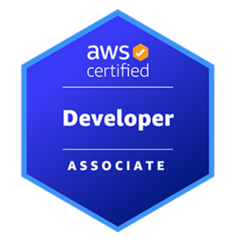

---

## Why AWS Certified Developer - Associate (DVA-C02)?
AWS Certified Developer - Associate showcases skills and knowledge in developing, optimizing, packaging, and deploying applications, using CI/CD workflows, and identifying and resolving application issues. This certification is a good starting point on the AWS Certification journey for individuals in IT or cloud developer job roles.

#### Official exam guide - essential: https://aws.amazon.com/certification/certified-developer-associate/  

--- 

## Study Notes

Welcome! This repository holds my study material, practice exam reflections, and final review resources in preparation for the **AWS Certified Developer – Associate (DVA-C02)** exam.

### Repository Structure

#### 📂 learning_notes/
These notes are grouped by service category (for example, `compute`, `storage`, `security`). Each file includes:
- Core facts and key definitions.
- Scenario-based notes (“if you see *X*, think *Y*”).
- Integration points and exam traps.

#### 📂 practice_exam_notes/
These folders contain my reflections from multiple practice exam sets:
- Questions I missed or found tricky.
- Why the correct answer is correct.
- Patterns I noticed (repeated themes).
- “Lessons learned” aimed at spotting exam-style tricks.

#### 📂 final_review/
This is my **cram zone**: the last-day review material.  
Contains:
- High-yield topics to revisit.
- A checklist to make sure nothing gets forgotten.
- Keywords and service associations I want fresh in my mind before the exam.

---

### 🎯 How I Used This Repo

1. **During learning**: Add or refine notes inside `learning_notes/`.
2. **After each practice exam**: Document mistakes, gotchas in `practice_exam_notes/`.
3. **Final days before the exam**: Shift focus entirely to `final_review/` and cycle through keywords, and traps.

---

## ℹ️ Disclaimer

These notes are **my personal study aid**. They are tailored to my style, not official AWS documentation, and may evolve.  
Feel free to use, fork, raise a pull request to improve the notes — but remember: your best preparation includes **hands-on experience** and **practice questions**.

---

If you’re reading this and also studying for DVA-C02, good luck — let’s leave no topic unchecked! 💪

