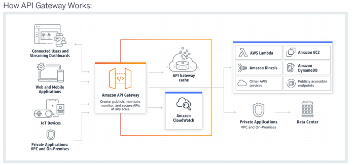
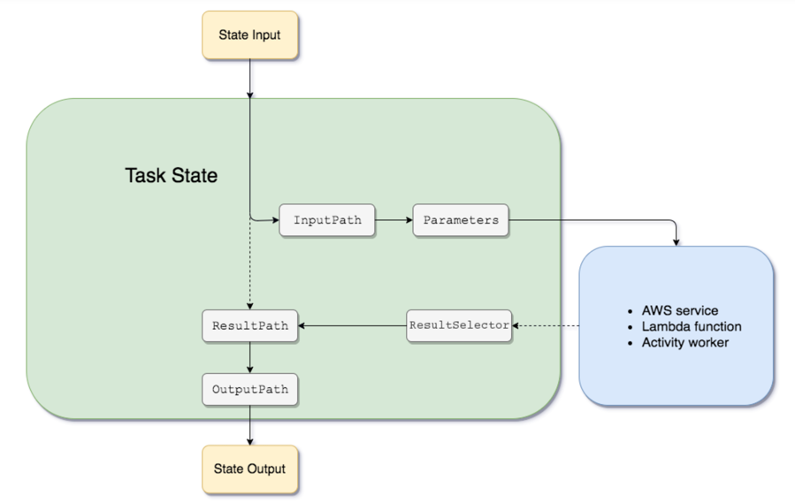

- CDK:
  - provides you with high-level components called constructs that preconfigure cloud resources with proven defaults
  - enables you to compose and share your own custom constructs that incorporate your organization's requirements, helping you start new projects faster
  - can be used with CodeDeploy for deployment
  - correct order of steps to be followed for creating an app using AWS CDK:
    - 1. Create the app from a template provided by AWS CDK -> run cdk init
    - 2. Add code to the app to create resources within stacks
    - 3. Build the app (optional) -> to check syntax errors
    - 4. Synthesize one or more stacks in the app  -> The synthesis step catches logical errors in defining your AWS resources
    - 5. Deploy stack(s) to your AWS account -> run cdk deploy
  - cdk diff: used to generate a difference report between the deployed and local stacks
  - NoSuchBucket error --> CDK is trying to access an S3 bucket that doesn't exist in the new AWS account.
    - run cdk bootstrap -> sets up the environment for CDK (provisions IAM roles and the S3 bucket that CDK uses for deployment)
  - AWS CDK has first-class support for TypeScript, JavaScript, Python, Java, and C#

- SAR (AWS Serverless Application Repository):
  - managed repository for serverless applications.
  - enables devs to store and share reusable applications, and easily assemble and deploy serverless architectures
  - using SAR you don't need to clone, build, package, or publish source code to AWS before deploying it

- SAM:
  - The AWS::Serverless transform, which is a macro hosted by AWS CloudFormation, takes an entire template written in the AWS SAM syntax and transforms and expands it into a compliant AWS CloudFormation template
  - SAM provides shorthand syntax to express functions, APIs, databases, and event source mappings. It supports the following resource types:
    - AWS::Serverless::Api -> REST API (API Gateway v1)
    - AWS::Serverless::HttpApi -> HTTP API (API Gateway v2) — a faster, cheaper, simpler alternative to REST APIs.
    - AWS::Serverless::Application -> Lets you nest another SAM or CloudFormation application.
    - AWS::Serverless::Function -> Lambda - Inline code or S3-deployed code packages
    - AWS::Serverless::LayerVersion -> Lambda Layer, which packages libraries, dependencies, or shared code.
    - AWS::Serverless::SimpleTable -> DynamoDB table with sensible defaults.
    - AWS::Serverless::StateMachine -> Step Functions state machine, optionally triggered by events (like S3 or EventBridge).
  - Mandatory sections of a SAM template: Transform and Resources
  - commands:
    - sam sync:
      - designed to enable rapid iteration by synchronizing local changes with the deployed serverless application on AWS. 
      - allows developers to quickly test incremental changes without the overhead of redeploying the entire stack
    - sam deploy - performs a full deployment of the application or updated resources:
      - zips your application artifacts, uploads them to Amazon Simple Storage Service (Amazon S3), and deploys your application to the AWS Cloud
      - AWS SAM uses AWS CloudFormation as the underlying deployment mechanism
  - SAM allows you to attach pre-built IAM policy templates to Lambda functions under the Policies: section of AWS::Serverless::Function:
    - If a Lambda reads data → ReadPolicy (S3ReadPolicy, DynamoDBReadPolicy)
    - If it writes or updates → CrudPolicy (S3CrudPolicy, DynamoDBCrudPolicy)
    - If it triggers another service → Invoke / Publish / Poller (LambdaInvokePolicy, CloudWatchPutMetricPolicy, SQSPollerPolicy)
  - When you see “AccessDenied while testing locally with SAM” in an exam question, remember:
    - Root cause - AM CLI runs your Lambda locally, but still uses AWS credentials for SDK calls → wrong or missing credentials = AccessDenied. Solution:
      - Use aws configure --profile to add credentials for the sandbox account
      - Run the function using sam local invoke with the --profile parameter
    - NOTE: 
      - Default profile is used if no --profile is specified. 
      - Using CLI profiles is the recommended way to handle multiple accounts or IAM roles in CLI automation. 
      - You may be asked about switching roles or credentials for dev/prod environments—the correct answer usually involves creating a new profile or using --profile.
  - Commands:
    - sam build -> to resolve dependencies and construct deployment artifacts for all functions and layers in the SAM template (especially important when the SAM template references local file paths, such as CodeUri pointing to local Lambda function codes)
    - sam package -> uploads artifacts to S3 (optional, since sam deploy can do it implicitly)
    - sam deploy -> allows the application to be deployed using AWS CloudFormation, ensuring that all resources defined in the SAM template are provisioned and configured correctly
      - Creates/updates resources using the packaged template from S3.
    - sam sync -> used for quick syncing of local changes to AWS and is more suitable for rapid development testing (in prod, sam deploy is better)

- CloudFormation:
  - Scenario: application will be deployed across multiple regions, you need to create a map of all the possible values for the base AMI:
    - !FindInMap [ MapName, TopLevelKey, SecondLevelKey ] -> TopLevelKey = region, SecondLevelKey = AMI value
  - Exported Output Values in CloudFormation must have unique names within a single Region
  - CFN template = JSON- or YAML-formatted text file that describes your AWS infrastructure. 
    - The "Resources" section is the only required section
  - Helper scripts:
    - cfn-init: Use to retrieve and interpret resource metadata, install packages, create files, and start services. 
    - cfn-signal: Use to signal with a CreationPolicy or WaitCondition, so you can synchronize other resources in the stack when the prerequisite resource or application is ready. 
    - cfn-get-metadata: Use to retrieve metadata for a resource or path to a specific key. 
    - cfn-hup: Use to check for updates to metadata and execute custom hooks when changes are detected.
  - Scenario: you must deploy resources to multiple AWS Regions to support the load testing of an API, without additional code:
    - Correct: Leverage the AWS CLI create-stack-set command:
      - Using an administrator account, you define and manage an AWS CloudFormation template
      - and then use the template as the basis for provisioning stacks into selected target accounts across specified AWS Regions.
  - StackSets:
    - enable you to create, update, or delete stacks across multiple accounts and regions with a single operation.
    - Using an administrator account, you define and manage an AWS CloudFormation template, and use the template as the basis for provisioning stacks into selected target accounts across specified regions.
  - Pseudo parameters = parameters that are predefined by AWS CloudFormation (Ex: AWS::AccountId, AWS::Region, AWS::StackName)
  - Template sections:
    - AwsTemplateFormatVersion, Description, Metadata, Parameters, Mappings, Conditions, Transform, Resources, Outputs
  - Parameter types:
    - Parameter types enable CloudFormation to validate inputs earlier in the stack creation process.
    - CloudFormation currently supports the following parameter types:
    ```  
        String – A literal string
        Number – An integer or float
        List<Number> – An array of integers or floats
        CommaDelimitedList – An array of literal strings that are separated by commas
        AWS::EC2::KeyPair::KeyName – An Amazon EC2 key pair name
        AWS::EC2::SecurityGroup::Id – A security group ID
        AWS::EC2::Subnet::Id – A subnet ID
        AWS::EC2::VPC::Id – A VPC ID
        List<AWS::EC2::VPC::Id> – An array of VPC IDs
        List<AWS::EC2::SecurityGroup::Id> – An array of security group IDs
        List<AWS::EC2::Subnet::Id> – An array of subnet IDs
    ```
  - Parameter AllowedValues:
    - refers to an array containing the list of values allowed for the parameter.
    - When applied to a parameter of type String, the parameter value must be one of the allowed values
    - When applied to a parameter of type CommaDelimitedList, each value in the list must be one of the specified allowed values.
  - To declare Lambda in CloudFormation (in the Code section):
    - INLINE: “Simple inline code” or “Hello World function” → Use ZipFile
    - MANUAL S3 UPLOAD: “Function uses third-party libraries” → Use S3 zip package 
    - S3 UPLOAD: “How to deploy updated Lambda code via CloudFormation?” → Use aws cloudformation package or sam package to upload to S3 automatically
  - asw cloudformation package:
    - Packages the local artifacts (local paths) that your AWS CloudFormation template references.
    - The command uploads local artifacts, such as source code for an AWS Lambda function or a Swagger file for an AWS API Gateway REST API, to an S3 bucket.
    - The command returns a copy of your template, replacing references to local artifacts with the S3 location where the command uploaded the artifacts.
    - After you package your template’s artifacts, run the aws cloudformation deploy command to deploy the returned template.
      - NOTE: aws cloudformation deploy uses S3 as the location artifacts --> if the code is only locally, you need to run package first!!
  - Built-in functions:
    - !GetATT - returns value of an attribute from a resource in the template: !GetAtt myELB.DNSName
    - !Sub - substitutes variables in an input string with values that you specify
    - !Ref - returns the value of the specified parameter or resource.
    - !FindInMap - returns the value corresponding to keys in a two-level map that is declared in the Mappings section
  - To create a cross-stack reference:
    - use the Export Output field to flag the value of a resource output for export. 
    - then, use the Fn::ImportValue intrinsic function to import the value.
  - Drift detection:
    - Compares a stack’s current state of resources with their expected state as defined in the CloudFormation template.
    - helpts with detecting unintended or unauthorized changes outside of CloudFormation.
  - Scenario: automating AMI ID updates in AWS CloudFormation templates to always use the latest
    - Solution: Use AWS Systems Manager Parameter Store with public parameters for AMIs.
    - Notes: 
      - By default, CloudFormation templates use static AMI IDs, which must be manually updated whenever new versions are released — not scalable for frequent deployments.
      - ```  
        Parameters:
          LatestAmiId:
          Type: 'AWS::SSM::Parameter::Value<AWS::EC2::Image::Id>'
          Default: '/aws/service/ami-amazon-linux-latest/al2023-ami-kernel-default-x86_64'
        Resources:
          MyInstance:
            Type: AWS::EC2::Instance
            Properties:
            ImageId: !Ref LatestAmiId
            InstanceType: t3.micro
        ```
      - The Parameters section in the output for Describe API will show an additional ‘ResolvedValue’ field that contains the resolved value of the Systems Manager parameter that was used for the last stack operation.
  - Dynamic references:
    - reference external values that are stored and managed in other services, such as the AWS Systems Manager Parameter Store or AWS Secrets Manager
    - ex: Password: '{{resolve:ssm-secure:IAMUserPassword:10}}' - version 10
  - Never make manual changes during synthesis; manage all updates through the deployment phase.
  - “Stack fails to delete due to resource in use” → Use DeletionPolicy: Retain, then delete manually.

- Security tools:
  - IAM Access Analyzer:
    - simplifies inspecting unused access to guide you toward least privilege
    - unused roles, unused access keys for IAM users, and unused passwords for IAM users. For active IAM roles and users, the findings provide visibility into unused services and actions.
  - AWS Trusted Advisor:
    - best practices on cost optimization, security, fault tolerance, service limits, and performance improvement
  - Amazon Inspector: 
    - assesses applications for exposure, vulnerabilities, and deviations from best practices.
  - AWS Security Hub:
    - assesses your AWS environment against security industry standards and best practices.
  - AWS Certificate Manager:
    - referred tool to provision, manage, and deploy server certificates
    - automatically renews certificates
    - NOTE: IAM can also be used as a Certificate manager if ACM not supported
  - AWS Private Certificate Authority (Private CA):
    - Create and manage your own private PKI inside AWS.
    - Works with AWS Certificate Manager (ACM) to issue private certs automatically.
    - Private CA is the issuer, ACM is the manager.
  - AWS Systems Manager:
    - unified user interface so you can view operational data from multiple AWS services
    - allows you to automate operational tasks such as running commands, managing patches, and configuring servers

  - AWS Secrets Manager:
    - enables you to easily rotate, manage, and retrieve database credentials, API keys
  - AWS SSM (Systems Manager Parameter Store):
    - Scenario: when and who has issued API calls against SSM Parameter Store?
      - Correct: Use AWS CloudTrail to get a record of actions taken by a user
    - provides secure, hierarchical storage for configuration data management and secrets management
    - SSM Parameter Store cannot be used to automatically rotate the secrets. -> For automatic rotation, use AWS Secrets Manager.
    - Parameter hierarchy example:
      - Dev/dbServer/MySQL/db-string
      - Prod/dbServer/MySQL/db-string
    - Secrets can be stored as SecureString in SSM Parameter store:
      - Parameter Store uses AWS KMS to encrypt and decrypt the parameter values of Secure String parameters.
    - Notes:
      - Standard tier – ✅ Free, basic parameters (no policies). ❌ No expiration or rotation policies. 
      - Advanced tier – 💰 Paid, supports parameter policies for automation and compliance:
        - Expiration → ExpirationDate: deletes or makes a parameter unusable after a specific date. 
        - ExpirationNotification → notifies before parameter expires. 
        - NoChangeNotification → notifies if parameter hasn’t changed for X days (used for rotation checks). 
      - Notifications → via EventBridge → SNS/email/Lambda. 
      - Rotation – Usually done manually or automated via Lambda or Secrets Manager. 
      - KMS encryption → Use for sensitive data.
      - NOTE: You can change a standard parameter to an advanced parameter at any time, but you can’t revert an advanced parameter to a standard parameter

- Security:
  - Scenario: Reuse SSH keys in your AWS Regions:
    - Correct:
      - 1. Generate a public SSH key (.pub) file from the private SSH key (.pem) file. 
      - 2. Set the AWS Region you wish to import to. 
      - 3. Import the public SSH key into the new Region.
      - Memory hook: Public key travels safely — private key stays local.
      - Incorrect: Encrypt the private SSH key and store it in the S3 bucket to be accessed from any AWS Region - Storing private key to Amazon S3 is possible. But, this will not make the key accessible for all AWS Regions
  - Scenario: You are not authorized to perform this operation. Encoded authorization failure message: 6h34GtpmGjJJUm946eDVBfzWQJk6z5....
    - Correct: Use AWS STS decode-authorization-message
      - To decode an authorization status message, a user must be granted permissions via an IAM policy to request the DecodeAuthorizationMessage (sts:DecodeAuthorizationMessage) action.
  - To enable HTTPS connections to your website or application in AWS, you need an SSL/TLS server certificate
    - ACM (AWS Certificate Manager) -> preferred tool to provision, manage, and deploy your server certificates + automatically renew them
    - IAM -> only when you must support HTTPS connections in a Region that is not supported by ACM, but you cannot upload an ACM certificate to IAM
  - Authenticate API requests to AWS services using HMAC-SHA256 signatures:
    - Create canonical request – method, URI, headers, payload hash. 
    - Create string to sign – includes date, region, and service. 
    - Calculate signature – HMAC with your secret key. 
    - Attach signature → either:
      - 🧾 Authorization header: Authorization: AWS4-HMAC-SHA256...
      - 🌐 Query parameter (pre-signed URL): X-Amz-Signature=<Signature>

- AWS CloudHSM:
  -  provides hardware security modules (HSM) in AWS Cloud.
  - HSM is a computing device that processes cryptographic operations and provides secure storage for cryptographic keys.
  - You should consider using AWS CloudHSM instead of AWS KMS if you require:
    - Keys stored in dedicated, third-party validated hardware security modules under your exclusive control. 
    - FIPS 140-2 compliance. 
    - Integration with applications using PKCS#11, Java JCE, or Microsoft CNG interfaces. 
    - High-performance in-VPC cryptographic acceleration (bulk crypto).

- AWS WAF:
  - Purpose: Filters HTTP/S traffic for CloudFront, ALB, API Gateway, AppSync. 
  - Modes:
    - ✅ Allow all except blocked – default; block bad requests (IP, SQLi, XSS)
    - 🚫 Block all except allowed – only let trusted traffic 
    - 🧮 Count – test rules safely 
  - Rule Types:
    - 🌍 Geo match → block by country 
    - ⚡ Rate-based → limit by IP 
    - 🧱 IP/string/regex match 
    - 🛡️ Managed rules → SQLi/XSS protection 
  - Exam Tips:
    - Attach Web ACL to CF/ALB/API Gateway/AppSync 
    - “Block by country/IP” → WAF 
    - “DDoS protection” → Shield

- AWS Shield:
  - Purpose: Protects against DDoS attacks (Layers 3 & 4). 
  - Versions:
    - Shield Standard – Free, automatic DDoS protection for CloudFront, Route 53, Global Accelerator. 
    - Shield Advanced – Paid; adds:
      - 24/7 DDoS Response Team (DRT)
      - Cost protection for scaling during attacks 
      - Detailed metrics & AWS WAF integration 
      - Protects ALB, EC2, EIP, plus Standard targets 
    - Exam Tips:
      - “Block by country/IP” → ❌ (That’s WAF)
      - “DDoS mitigation / cost protection” → ✅ Shield Advanced 
      - “Always-on DDoS protection” → ✅ Shield Standard

- KMS:
  - Simple encryption flow:
    - you create a CMK (customer master key) in KMS -> you never see the raw key — AWS manages it for you.
    - KMS uses the CMK to encrypt your data -> it returns the encrypted data -> use Encrypt API
  - Envelope encryption flow:
    - KMS creates a Data Key (a temporary key) - use **GenerateDataKey** to get the data key. 
    - Your app uses the plaintext Data Key to encrypt large data (e.g., a file). 
    - KMS only encrypts the Data Key with the CMK (top level key, the CMK is not encrypted). 
      - NOTE: you can encrypt the data key with another encryption key and so on...but eventually one key must be in plaintext to decrypt the keys and your data ---> this top-level plaintext key = MASTER KEY
    - You store:
      - Encrypted file (encrypted with Data Key). 
      - Encrypted Data Key (encrypted with CMK).
    - Later, to decrypt, you send the Encrypted Data Key to KMS → it gives you back the Data Key → you decrypt the file.
  - GenerateDataKeyWithoutPlaintext is identical to the GenerateDataKey operation except that returns only the encrypted copy of the data key
    - useful for systems that need to encrypt data at some point, but not immediately
    - When you need to encrypt the data, you call the Decrypt operation on the encrypted copy of the key
  - Scenario: over 1MB of data should be passed to a Lambda function and should be encrypted and decrypted at runtime.
    - Correct: Use Envelope Encryption and reference the data as file within the code
    - Incorrect: Use KMS direct encryption and store as file - You can only encrypt up to 4 kilobytes
    - Incorrect: Use Envelope Encryption and store as an environment variable - Environment variables must not exceed 4 KB
  - Data key caching:
    - When you encrypt or decrypt data, the AWS Encryption SDK looks for a matching data key in the cache
    - Data key caching is an optional feature of the AWS Encryption SDK that you should use cautiously
      - To create an instance of the local cache, use the LocalCryptoMaterialsCache constructor in Java and Python
  - You can perform the following key management functions in AWS KMS:
    - Create symmetric and asymmetric keys where the key material is only ever used within the service
    - Create symmetric keys where the key material is generated and used within a custom key store under your control.
    - Import your own symmetric key for use within the service.
    - Create both symmetric and asymmetric data key pairs for local use within your applications.
    - Define which IAM users and roles can manage keys.
    - Define which IAM users and roles can use keys to encrypt and decrypt data.
    - Choose to have keys that were generated by the service to be automatically rotated on an annual basis.
    - Temporarily disable keys so they cannot be used by anyone.
    - Re-enable disabled keys.
    - Schedule the deletion of keys that you no longer use.
    - Audit the use of keys by inspecting logs in AWS CloudTrail.

- CLI: Your default region is us-east-1. You want to execute a command to stop an EC2 instance in the us-east-2 region. You have permissions already:
  - Correct: Use the --region parameter -> otherwise the default region is used
  - Incorrect: override the default region by using aws configure -> not optimal as you will need to change it back

- AppConfig:
  - enables developers to create, manage, and deploy application configurations quickly and efficiently
  - provides the functionality to manage feature flags, a powerful technique that allows developers to test and control new features in live environments without affecting all users
    - developers can gradually introduce new features, control who can access them based on specific criteria such as user role or location, and easily update or revert features without deploying new code
    - helps developers seamlessly control the visibility and access of new features while keeping them hidden until they're ready for release.
  - you can define different environments (dev, rod)
  - you can also create configuration profiles and deployment strategies
  - AWS AppConfig will automatically encrypt data at rest using AWS owned keys and AWS Key Management Service (KMS). 
    - This layer cannot be disabled or altered by the customer. 
    - The customer can add a second layer of encryption protection that they can control and manage using customer managed keys.

- SQS:
  - You can't change the queue type after you create it -> if you want to change to FIFO, then delete + create
  - Visibility timeout = defaults to 30 seconds. Valid values are: An integer from 0 to 43,200 (12 hours)
  - Delay Seconds = The default (minimum) delay for a queue is 0 seconds. The maximum is 15 minutes => Delay queue
  - the DLQ must be the same type as the initial queue (standard or FIFO)
  - Queue tags are case-sensitive. 
    - A new tag with a key identical to that of an existing tag overwrites the existing tag. 
    - To be able to tag a queue on creation, you must have the sqs:CreateQueue and sqs:TagQueue permissions.
  - SQS API methods:
    - DeleteQueue = deletes queue + contents in max 60 seconds (you must wait at least 60 seconds before creating a queue with the same name.)
    - PurgeQueue - Deletes the messages in a queue
    - RemovePermission - Revokes any permissions in the queue policy that matches the specified Label parameter.
  - SQS is highly scalable and does not need any intervention to handle the expected high volumes:
    - For most standard queues - max of approx. 120,000 inflight messages (received from a queue by a consumer, but not yet deleted from the queue).
    - For FIFO queues - max of approx 20.000 inflight messages
  - Long polling:
    - set a wait time for the ReceiveMessage API >0  (max 20 sec)  
  - Amazon SQS Extended Client Library for Java - especially useful for storing and consuming messages up to 2 GB
  - SQS KMS encryption:
    - Server-side encryption (SSE) lets you transmit sensitive data in encrypted queues
    - When you use Amazon SQS with AWS KMS, the data keys that encrypt your message data are also encrypted and stored with the data they protect.
    - You can choose to have SQS encrypt messages stored in both Standard and FIFO queues using an encryption key provided by AWS Key Management Service (KMS).
  - The minimum message size is 1 byte (1 character). The maximum is 262,144 bytes (256 KB).
  - SQS FIFO:
    - MessageGroupId - tag that specifies that a message belongs to a specific message group => ORDERED
    - MessageDeduplicationId - If a message with a particular message deduplication ID is sent successfully, any messages sent with the same message deduplication ID are accepted successfully but aren't delivered during the 5-minute deduplication interval.
    - ReceiveRequestAttemptId - The token is used for deduplication of ReceiveMessage calls
  - You can specify max number of messages to retrieve = 10
  - NOT designed for real-time apps

- Kinesis DataStream:
  - Scenario: ProvisionedThroughputExceededException on a PutRecords API call to write multiple data records into a Kinesis data stream in a single call:
    - Correct options:
      - Reshard your stream to increase the number of shards in the stream. 
      - Reduce the frequency or size of your requests. 
      - Distribute read and write operations as evenly as possible across all the shards in Data Streams. 
      - Use an error retry and exponential backoff mechanism.
  - KDS can continuously capture gigabytes of data per second from hundreds of thousands of sources such as website clickstreams, database event streams, financial transactions, social media feeds, IT logs, and location-tracking events
  - Kinesis Data Streams enables real-time processing of streaming big data. It provides ordering of records, as well as the ability to read and/or replay records in the same order to multiple Amazon Kinesis Applications
  - Amazon Kinesis Client Library (KCL):
    - delivers all records for a given partition key to the same record processor
    - for example, to perform counting, aggregation, and filtering
  - Data Streams also provide greater flexibility in integrating downstream applications than Firehose
  - KDS provides the ability to consume records in the same order a few hours later
  - By default, records of a stream are accessible for up to 24 hours from the time they are added to the stream. You can raise this limit to a maximum of 365 days
  - Kinesis Agent:
    - lightweight software that helps send log and event data from on-premises servers to Amazon Kinesis Data Streams or Data Firehose. 
      - However, it’s not a service for data streaming itself. It is only used for pushing data to a stream or Firehose from local sources but does not provide the real-time stream processing capabilities that Kinesis Data Streams does
    - is a stand-alone Java software application that offers an easy way to collect and send data to Kinesis Data Streams
    - The agent continuously monitors a set of files and sends new data to your stream. 
    - the agent handles file rotation, checkpointing, and retry upon failures.
    - The agent can also pre-process the records parsed from monitored files before sending them to your stream
  - A Kinesis data stream is a set of shards:
    - A shard is a uniquely identified sequence of data records in a stream. A stream is composed of one or more shards, each of which provides a fixed unit of capacity.
    - The partition key is used by Kinesis Data Streams to distribute data across shards
  - API:
    - PutRecord -> one record, if you want ordering then use SequenceNumberForOrdering
    - PutRecords -> batch, does not guarantee order of records
  - Worker - shards ratio:
    - Fewer workers than shards → cost-efficient + high availability via KCL failover. 
    - More workers than shards → idle workers, no real gain in HA or throughput
  - Server-side encryption:
    - Amazon Kinesis Data Streams encrypts data before it's at rest by using an AWS KMS customer master key (CMK) you specify
    - Data is encrypted before it's written to the Kinesis stream storage layer and decrypted after it’s retrieved from storage

- Amazon Kinesis Data Firehose:
  - is a fully managed service for delivering real-time streaming data to destinations such as:
    - Amazon Simple Storage Service (Amazon S3), 
    - Amazon Redshift, 
    - Amazon Elasticsearch Service (Amazon ES), 
    - Splunk. 
  - fully managed service that automatically scales to match the throughput of your data and requires no ongoing administration.
    
- AWS Kinesis Data Analytics:
  - easiest way to analyze streaming data in real-time
  - enables you to easily and quickly build queries and sophisticated streaming applications in three simple steps: 
    - setup your streaming data sources, 
    - write your SQL queries or sophisticated streaming applications
    - and set up your destination for processed data

- Kinesis Adapter:
  - A library provided by AWS that allows DynamoDB Streams to be consumed using the Kinesis Client Library (KCL). 
  - Makes DynamoDB Streams behave like Kinesis Streams from an application’s perspective.
  - KCL + Kinesis Adapter abstracts shard iteration, checkpointing, and parallel processing.
  - Ideal for high-throughput, near real-time analytics.

- Elastic Beanstalk:
  - Scenario: After a test deployment in ElasticBeanstalk environment, a developer noticed that all accumulated Amazon EC2 burst balances were lost.
    - Burst balance is tied to the life of an individual EC2 instance. Any strategy that replaces the instance resets the balance, while updates that keep the same instance alive retain it.
    - Immutable updates and traffic splitting mode (Ex: canary) create NEW instances -> burst balance lost
    - All-at-once -> same instances UPDATED -> no burst balance lost
    - Rolling -> updated in batches -> some burst balance still kept
  - Configuration files:
    - .ebextensions/<mysettings>.config
    - YAML or JSON formatted documents with a .config file extension that you place in a folder named .ebextensions and deploy in your application source bundle.
  - Environment manifest:
    - env.yaml
    - Placed at the root of the application source bundle, defines:
      - Environment name 
      - Solution stack 
      - Environment links (dependencies between environments)
    - Commands:
      - eb deploy = the standard command for uploading new versions and triggering a deployment. 
      - aws elasticbeanstalk CLI commands  = are mostly for environment/config management, not direct deployments.
  - Scenario: You need to deploy a new version using Beanstalk while making sure that performance and availability are not affected (plus cost-effective).
    - Correct: Deploy using 'Rolling with additional batch' deployment policy
  - Environment categories:
    - Web server env:
      - Runs your app (usually behind load balancer, auto scaling). 
      - Handles HTTP(S) requests directly. 
      - Good for responsive APIs or websites.
    - Worker Environment 
      - Designed for asynchronous/background jobs. 
      - Connects to an Amazon SQS queue. 
      - When you make a worker environment in Elastic Beanstalk, AWS automatically:
        - Creates an SQS queue (unless you already have one). 
        - Runs a daemon (a small helper program) on each EC2 instance -> polls the SQS and calls a localhost endpoint you define to process the messages
      - Ideal for long-running tasks (e.g., video transcoding, report generation).
      - for a worker env, you need a cron.yaml file to define the jobs
  - You can deploy multiple environments when you need to run multiple versions of an application
  - the only way to recover the database data before it gets deleted by Elastic Beanstalk -> make a snapshot
  - Lifecycle policy:
    - Each time you upload a new version of your application, Elastic Beanstalk creates an application version.
    - A lifecycle policy tells Elastic Beanstalk to delete old application versions or to delete application versions when the total number of versions for an application exceeds a specified number
    - In the Retention section of the application version lifecycle settings, you can either choose to delete the source bundle in S3 or retain it
  - Scenario: EC2 instances are added into an ASG, each EC2 instance should be running 3 different Docker Containers simultaneously.
    - Correct: Docker multi-container platform
      - The multi-container Docker platform uses Amazon ECS (Elastic Container Service) under thex hood.
      - allows you to Run multiple containers per EC2 instance, and handle orchestration, logging, scaling
  - The simplest way to use HTTPS with an Elastic Beanstalk environment is to assign a server certificate to your environment's load balancer.
    - Example .ebextensions/securelistener-alb.config
  - Health check type must be ELB if you want automatic instance replacement for app-level failures.
    - Always use .ebextensions to persist environment-level settings (like scaling, health checks, instance types, etc.
    - EC2 health check (default) → checks instance status only (infra-level). 
    - ELB health check → checks app endpoint (HTTP 200). 
    - ✅ Use ELB for automatic replacement on app-level failure.
  - Scenario: migrate the Elastic Beanstalk environment from Team A's AWS account into Team B's AWS account
    - Correct: Create a saved configuration in Team A's account and download it to your local machine. Make the account-specific parameter changes and upload to the S3 bucket in Team B's account. From Elastic Beanstalk console, create an application from 'Saved Configurations'
      - A Saved Configuration captures the Elastic Beanstalk environment configuration (settings, option settings, scaling, health check, env vars, etc.) as a JSON file you can download.
      - Saved configuration is not a full account migration. It’s config only. You must move source bundles and external resources.
        - IAM roles: replace ARNs in JSON with roles created in Account B.
        - Secrets and credentials must be stored/rotated in Account B (don’t copy raw secrets). 
        - RDS data requires snapshot + sharing/restore across accounts.
    - Incorrect: use Export / Import -> no such options in beanstalk
  - Elastic Beanstalk + X-Ray:
    - Enable Active Tracing in EB console. 
    - Install X-Ray daemon via .ebextensions/xray-daemon.config 
    - Always remember: Application → sends trace → X-Ray daemon → AWS X-Ray console
  - Best practices:
    - Use external RDS for production → decouples DB lifecycle from EB. 
    - Always cleanup SG dependencies to avoid deletion issues. 
    - Security group configuration = critical step in blue/green deployments with external databases.
  - Deployment options: 
    - All at once, rolling, rolling with additional batch
    - Immutable
    - blue-green
  - Elastic Beanstalk provides a fully managed platform for deploying and running applications, including multicontainer Docker applications.
    - Compute: Choose EC2 instance type, OS (Amazon Linux / Windows). 
    - Load Balancing & Scaling: Auto-create ALB + Auto Scaling Group. 
    - Monitoring: Integrated CloudWatch metrics & alerts. 
    - Networking: Multi-AZ, HTTPS on ALB, VPC config. 
    - Environment Config: Set env vars, JVM options, and use .ebextensions. 
    - Logging: View logs via console or CloudWatch. 
    - Database: Attach or connect to RDS (prefer external for prod). 
    - Access: SSH to EC2 for troubleshooting. 
    - Deployment: Blue/green, rolling, or immutable updates.
    - Placement of containers across instances
      - Requires a config file named Dockerrun.aws.json placed on the same level as your app-> specific to Elastic beanstalk
      - NOTE: ECS and EKS give you more control over container orchestration, but you have to configure scaling, load balancing, and placement policies yourself.
  - Your source bundle must meet the following requirements:
    - Consist of a single ZIP file or WAR file (you can include multiple WAR files inside your ZIP file)
    - Not exceed 512 MB 
    - Not include a parent folder or top-level directory (subdirectories are fine)

- EC2:
  - T3, T3a, and T2 instances = Burstable performance instances -> t2.micro can be used for free in first 12 months
  - User data scripts:
    - By default, user data runs only during the boot cycle when you first launch an instance
    - By default, scripts entered as user data are executed with root user privileges
  - Reserved instances:
    - Regional reserved instance - discount applied to all AZs
    - Zonal reserved instance - discount applied to specified AZ ++++ capacity reservation possibility (extra confidence for critical apps)
  - Enable EC2 detailed monitoring:
    - to send metric data each 1-minute periods (instead of the standard 5 minutes)
    - Enable detailed monitoring for a running instance:
      - aws ec2 monitor-instances --instance-ids i-1234567890abcdef0
    - Enable detailed monitoring when launching an instance:
      - aws ec2 run-instances --image-id ami-09092360 --monitoring Enabled=true
  - Cloudwatch monitoring:
    - By default, Amazon CloudWatch provides a limited set of EC2 instance metrics — things like:
      - CPUUtilization 
      - DiskReadOps, DiskWriteOps 
      - NetworkIn, NetworkOut 
      - StatusCheckFailed
      - But memory (RAM) usage is NOT included in the standard EC2 metrics.
  - You cannot attach an IAM role directly to an EC2 instance — you must attach an Instance Profile, which contains the role. 
    - The Instance Profile delivers temporary, automatically rotated credentials to your EC2 instance via the Instance Metadata Service (IMDS).
  - CloudWatchAgentServerPolicy:
    - AWS-managed policy that grants the Amazon CloudWatch agent the necessary permission to collect and publish metrics from EC2 instances to CloudWatch
    - Attaching this policy to an IAM role associated with your EC2 instances ensures that the CloudWatch agent has the required effective permissions.
  - On prem with Cloudwatch:
    - Install the CloudWatch agent on the on-premises servers and specify IAM credentials with permissions to CloudWatch.
    - NOTE: You cannot specify a role with an on-premises server so you must use access keys instead.
  - Static credentials always take precedence over instance profile roles. 
    - If an EC2 instance has access/secret keys, removing the old role is not enough — you must also remove or rotate the keys.
  - Instance metadata:
    - provides information about the running EC2 instance, including:
      - Public IP address 
      - Private IP address 
      - Instance ID, AMI ID, security groups, etc. 
    - The endpoint is always accessible from within the instance at http://169.254.169.254/latest/meta-data/.
    - User data endpoint (/latest/user-data/): Only contains user-specified startup scripts, not IP info.
  - AMIs are regional ---> can be copied and used in another region

- ASG (Auto scaling groups):
  - An Auto Scaling group can contain EC2 instances in one or more Availability Zones within the same Region
  - Auto Scaling groups are regional -> cannot span across multiple Regions.
  - Amazon EC2 Auto Scaling attempts to distribute instances evenly between the Availability Zones that are enabled for your Auto Scaling group
  - For Auto Scaling groups in a VPC, the EC2 instances are launched in subnets
  - Auto Scaling groups can be configured to launch an instance to replace an instance that is undergoing maintenance
    - In the absence of Auto Scaling Group, an ALB cannot launch instances by itself
  - For EC2 Auto Scaling Groups that need both Spot and On-Demand instances::
    - Use Launch Templates (not Launch Configurations) -> supports Spot + On-Demand mix.
    - Use User Data to bootstrap configuration (install agents, dependencies, etc.).
  - Amazon EC2 Auto Scaling works with:
    - Application Load Balancers (Layer 7 (HTTP/HTTPS)) 
    - Network Load Balancers (Layer 4 (TCP/UDP))
    - Classic Load Balancer (legacy).
  - Auto Scaling can do its own EC2 status checks, independent of any Load Balancer. 
    - It replaces instances that fail EC2 system or instance status checks.
  - When creating an ASG from an existing instance, you can choose to launch from the instance’s configuration (launch template or configuration), but AWS does not automatically create a new AMI
    - If the question mentions custom configuration that must persist → create a custom AMI first.
  - !!! you can only specify one launch template for an Auto Scaling group at a time, and you can’t modify a launch template after you’ve created it. 
    - To change the launch template for an Auto Scaling group, you must create a launch template and then update your Auto Scaling group with it.

- ELB:
  - Cross zone load balancing:
    - enabled => each load balancer node distributes traffic across the registered targets in all enabled Availability Zones
    - disabled => each load balancer node distributes traffic only across the registered targets in its Availability Zone
    - With ALB, cross-zone load balancing is always ENABLED
    - EX Scenario: AZ1 has two instances and AZ2 has 8 instances:
      - Cross zone enabled -> each instance = 10%
      - Cross zone disabled -> each instance in AZ1 = 25%, each instance in AZ2 = 6.25%
  - ELB characteristics:
    - Separate public traffic from private traffic -> Load balancers route requests to your targets using private IP addresses
    - Build a highly available system -> automatically balances traffic across targets – EC2 instances, containers, IP addresses, and Lambda functions – in multiple AZ while ensuring only healthy targets receive traffic.
    - A Load Balancer can target EC2 instances only within an AWS Region.
  - ALB access logs:
    - information such as the time the request was received, the client's IP address, latencies, request paths, and server responses
    - Access logging is an optional feature of Elastic Load Balancing that is disabled by default.
  - ALB request tracing - You can use request tracing to track HTTP requests. The load balancer adds a header with a trace identifier to each request it receives
  - Scenario: ELB marked all the EC2 instances in the target group as unhealthy, but they work fine:
    - Possible issue: the security group of the EC2 instance does not allow for traffic from the security group of the Application Load Balancer
    - Possible issue: The route for the health check is misconfigured
  - Port mapping to support multiple tasks from a single service on the same container instance:
    - Classic Load balancer -> does not allow you to run multiple copies of a task on the same instance -> you must statically map port numbers on a container instance
    - Application Load balancer -> uses dynamic port mapping to run multiple tasks from a single service on the same container instance
  - Scenario: ELB routes more traffic to one instance or AZ than others (although configured to route equally):
    - Sticky sessions are enabled for the load balancer
    - Instances of a specific capacity type aren’t equally distributed across Availability Zones
      - A Classic Load Balancer with HTTP or HTTPS listeners might route more traffic to higher-capacity instance types
  - ALB routing options:
    - | Condition Type          | Field                   | Config Object               | Example                                                                   |
      | ----------------------- | ----------------------- | --------------------------- | ------------------------------------------------------------------------- |
      | **Host header**         | `"host-header"`         | `"HostHeaderConfig"`        | `"Values": ["example.com", "*.example.org"]`                              |
      | **Path pattern**        | `"path-pattern"`        | `"PathPatternConfig"`       | `"Values": ["/api/*", "/img/*"]`                                          |
      | **Query string**        | `"query-string"`        | `"QueryStringConfig"`       | `"Values": [ {"Key": "version", "Value": "v1"}, {"Value": "*example*"} ]` |
      | **HTTP header**         | `"http-header"`         | `"HttpHeaderConfig"`        | `"HttpHeaderName": "User-Agent", "Values": ["*Chrome*"]`                  |
      | **HTTP request method** | `"http-request-method"` | `"HttpRequestMethodConfig"` | `"Values": ["GET", "POST"]`                                               |
      | **Source IP**           | `"source-ip"`           | `"SourceIpConfig"`          | `"Values": ["203.0.113.0/24"]`                                            |
    - In ALB rule configurations:
      - Conditions use "Field" and a config object (e.g., "QueryStringConfig", "PathPatternConfig", "HostHeaderConfig"). 
      - Actions use "Type" (like forward, redirect, or fixed-response).
  - ALB target types (when creating a target group):
    - Instance - The targets are specified by instance ID 
    - IP - The targets are IP addresses -> only from CIDR blocks, You can't specify publicly routable IP addresses
    - Lambda - The target is a Lambda function
  - The Load Balancer generates the HTTP 503: Service unavailable error when the target groups for the load balancer have no registered targets.
  - Scenario: Beanstalk env wants to export HTTP and HTTPS endpoints. HTTPS should be used to get in-flight encryption
    - Assign an SSL certificate to the Load Balancer - This ensures that the Load Balancer can expose an HTTPS endpoint.
    - Open up port 80 (HTTP) & port 443 (HTTPS)
  - Scenario: EC2 servers running on high CPU - root cause: handling HTTPS encryption / decryption:
    - Solution:
      - Configure an SSL/TLS certificate on an Application Load Balancer via AWS Certificate Manager (ACM)
        - To use an HTTPS listener, you must deploy at least one SSL/TLS server certificate on your load balancer.
      - Create an HTTPS listener on the Application Load Balancer with SSL termination
        - the load balancer will use the server certificate to terminate the front-end connection and then decrypt requests from clients before sending them to the EC2 instances
    - Incorrect: Create an HTTPS listener on the Application Load Balancer with SSL pass-through
      - If you use an HTTPS listener with SSL pass-through, then the EC2 instances would continue to be under heavy CPU load as they would still need to decrypt the secure traffic
  - Errors:
    - HTTP 503 indicates 'Service unavailable' error. This error in ALB is an indicator of the target groups for the load balancer having no registered targets.
    - HTTP 500 - HTTP 500 indicates 'Internal server' error. There are several reasons for their error: A client submitted a request without an HTTP protocol, and the load balancer was unable to generate a redirect URL, there was an error executing the web ACL rules.
    - HTTP 504 - HTTP 504 is 'Gateway timeout' error. Several reasons for this error, to quote a few: The load balancer failed to establish a connection to the target before the connection timeout expired, The load balancer established a connection to the target but the target did not respond before the idle timeout period elapsed.
    - HTTP 403 - HTTP 403 is 'Forbidden' error. You configured an AWS  web access control list (web ACL) to monitor requests to your Application Load Balancer and it blocked a request.
  - Multi-value headers for Lambda:
    - applies for headers and query params
    - ?name=foo&name=bar ->> ‘name’: [‘foo’, ‘bar’]
  - Application Load Balancer (ALB) supports OIDC and Cognito authentication natively:
    - You can configure the listener rule’s default action to authenticate users with an OIDC IdP. 
    - The ALB handles all authentication before traffic reaches your app, so your existing code stays untouched. 
    - Authentication occurs at HTTPS (port 443) — mandatory for secure login redirects.

NLB:
  - functions at the 4th layer (Transport) of the Open Systems Interconnection (OSI) model
    - Layers: 1. Physical → 2. Data Link → 3. Network → 4. Transport → 5. Session → 6. Presentation → 7. Application
    - CLB is both 4 and 7
    - ALB is layer 7
  - It can handle millions of requests per second
  - It deals with IP addresses and TCP/UDP ports
  - It forwards the raw connection (packets) to backend targets without inspecting application data (like HTTP headers or URLs).
  - The client’s original source IP address and port are preserved all the way to the backend.
    - Your app doesn’t need to read an X-Forwarded-For header (which ALB adds to preserve the client IP in HTTP). 
    - You can directly see the client’s IP in the TCP connection itself.
  - ❌ Does not support OIDC authentication — only forwards TCP traffic.

- EBS:
  - EBS volumes are AZ locked
    - When you create an EBS volume, it is automatically replicated within its Availability Zone to prevent data loss
    - You can attach an EBS volume to an EC2 instance in the same Availability Zone
  -  General Purpose SSD (gp2) volumes -> max IOPs hit at 5.3 TiB volume size
  - Quick recap:
    - gp2 maxes out at ~5.3 TiB → 16k IOPS cap. 
    - gp3 always 3,000 IOPS baseline, up to 16k configurable. 
    - io1/io2 = provisioned IOPS, up to 50 IOPS per GiB, max 64k/256k. 
      - So, for a 200 GiB volume size, max IOPS possible is 200*50 = 10000 IOPS.
    - Only SSD (gp2, gp3, io1, io2) can be boot volumes. 
    - st1/sc1 never boot volumes.
  - EBS volumes support both in-flight encryption and encryption at rest using KMS
    - When you create an encrypted EBS volume and attach it to a supported instance type, the following types of data are encrypted:
      - Data at rest inside the volume
      - All data moving between the volume and the instance
      - All snapshots created from the volume
      - All volumes created from those snapshots
  - Encryption:
    - not encrypted by default
    - by default is a Region-specific setting. If you enable it for a Region, you cannot disable it for individual volumes or snapshots in that Region
      -  A volume restored from an encrypted snapshot, or a copy of an encrypted snapshot, is always encrypted:
        - By default, the CMK that you selected when creating a volume encrypts the snapshots that you make from the volume
  - AWS CloudTrail event logs for 'CreateVolume' aren't available for EBS volumes created during an Amazon EC2 launch
  - DeleteOnTermination - determines whether to preserve or delete the EBS volume when EC2 instance terminates
    - Default: TRUE for root volume, FALSE for all other volume types
    - If the instance is already running, you can set DeleteOnTermination to False using the command line.
  - Detach volumes:
    - Root volume → Stop instance first, then detach. (AWS automatically handles unmounting for the root device when the instance stops.)
    - Non-root volume → Unmount first, then detach (no need to stop the instance).

- EFS:
  - Elastic, shared file system for Linux-based workloads — automatically scales storage capacity.
  - Scales automatically up/down with usage.
  - Multi-AZ, highly available (Regional).
  - Supports concurrent access from multiple EC2, ECS, and Lambda.
  - Integrates with IAM, KMS, and security groups for access control.
  - Ex: “Shared, scalable file system for EC2 + Lambda” → ✅ EFS

- RDS:
  - Scenario: application has RDS for PostgreSQL with read-heavy workloads. how to refactor the code to achieve optimum read performance for SQL queries?
    - Correct: Set up Amazon RDS with one or more read replicas. Refactor the application code so that the queries use the endpoint for the read replicas
  - Scenario: App that uses RDS as main data storage and ElastiCache for user session storage. Deployed using Elastic Beanstalk -> every new deployment should allow the appto reuse the RDS database, but data stored in ElastiCache can be re-created for every deployment.
    - Correct: 
      - RDS database defined externally and referenced through environment variables => To decouple your database instance from your environment
      - ElastiCache defined in .ebextensions/ => Any resources created as part of your .ebextensions is part of your Elastic Beanstalk template and will get deleted if the environment is terminated.
  - Scenario: monthly RDS automatic database backups must be retained for the duration of the contract
    - Correct: Create a cron event in CloudWatch, which triggers an AWS Lambda function that triggers the database snapshot
      - create a CloudWatch Rule and select “Schedule” as the Event Source
      - select “Lambda Function” as the Target
    - Incorrect: Enable RDS automatic backups - You can enable automatic backups but as of 2020, the retention period is 0 to 35 days.
  - Scenario: RDS - prepare for database disaster recovery:
    - Correct: Use cross-Region Read Replicas:
      - If the source DB instance fails, you can promote your Read Replica to a standalone source server
    - Correct: Enable the automated backup feature of Amazon RDS in a multi-AZ deployment that creates backups in a single AWS Region
      - The automated backup feature of Amazon RDS enables point-in-time recovery for your database instance
      - Automated backups are limited to a single AWS Region
      - manual snapshots and Read Replicas are supported across multiple Regions.
  - Scenario: you want to reshard your RDS database
    - add a read replica and promote it to master status
    - then, from each of the resulting DB Instances, delete the data that belongs to the other shard
  -  Enable storage auto-scaling for RDS MySQL:
    - Amazon RDS detects that you are running out of free database space it automatically scales up your storage
  - RDS Multi-AZ:
    - Amazon RDS automatically initiates a failover to the standby, in case primary database fails for any reason
    - RDS applies OS updates by performing maintenance on the standby, then promoting the standby to primary and finally performing maintenance on the old primary, which becomes the new standby
    - A Multi-AZ standby cannot serve read requests -> only used for HA
    - Updates to your DB Instance are synchronously replicated across the Availability Zone to the standby in order to keep both in sync
  - RDS Proxy:
    - helps you manage a large number of connections from Lambda to an RDS database by establishing a warm connection pool
    - This allows your Lambda applications to reuse existing connections, rather than creating new connections for every function invocation.
  - Amazon RDS Enhanced Monitoring:
    - This goes beyond standard CloudWatch metrics, which are aggregated at the instance level.
    - Monitors per-process metrics, such as:
      - %CPU used by each process 
      - Memory consumption per process 
      - File system and disk I/O stats 
    - Provides granularity down to 1-second intervals. 
    - Metrics are available in the RDS console and can also be pushed to CloudWatch Logs.
  - Security:
    - RDS Storage-Level Encryption (KMS)
      - Encrypts EBS volumes, snapshots, backups, and read replicas. 
      - Uses AWS KMS keys (managed or customer-managed). 
      - Transparent to the database engine; no changes needed in the database itself. 
      - Cannot be disabled after creating an encrypted DB (must create a new encrypted DB to change). 
    - Transparent Data Encryption (TDE) – Database-Level 
      - SQL Server & Oracle only (RDS managed). 
      - Encrypts actual database data (data files, log files) before writing to storage. 
      - Automatically decrypts data when read. 
      - Works in conjunction with RDS storage encryption for added security. 
      - Requires enabling at the database engine level, not automatically done.
    - Key Exam Notes 
      - “Encrypt database automatically at rest” → TDE 
      - “Encrypt storage, backups, snapshots” → RDS KMS encryption 
      - Can use both for maximum security. 
      - TDE is engine feature; RDS encryption is AWS feature.

- Aurora:
  - MySQL/PostgreSQL–compatible, 5× faster than RDS, fully managed. 
  - 6 copies of data across 3 AZs, auto-healing, auto-scaling storage (to 128 TB). 
    - you can configure the scaling events to happen based on target metric (Ex: Average connections of Aurora Replicas)
  - Up to 15 read replicas (Auto Scaling by CPU/connections). 
  - Aurora Serverless v2 → auto-scales compute (pay per second). 
  - Global Database → cross-region reads & DR:
    - to scale reads across regions: Create a separate Aurora MySQL cluster and configure binlog replication
  - Built-in Multi-AZ failover (<30 s), continuous S3 backups.
  - Parameters:
    - max_connections → total DB connections (fix “Too many connections”). 
    - max_user_connections → limit per-user connections. 
    - max_allowed_packet → size of queries/BLOBs (fix “packet too large”). 
    - wait_timeout → idle connection timeout. 
    - innodb_buffer_pool_size → memory for caching data/indexes (boost performance). 
    - max_join_size → limits rows scanned in joins (protect from heavy queries).

- Elasticache:
  - Scenario: highly reliable fully-managed caching layer has to be configured in front of RDS.
    - Correct: Implement Amazon ElastiCache Redis in Cluster Mode
      - Cluster mode comes with the primary benefit of horizontal scaling of your Redis cluster
      - Cluster Mode can scale to very large amounts of storage (potentially 100s of terabytes) across up to 90 shards, whereas a single node can only store as much data in memory as the instance type has capacity for.
    - Incorrect: Implement Amazon ElastiCache Memcached:
      - Memcached is designed for simplicity while Redis offers a rich set of features that make it effective for a wide range of use cases
      - Memcached does not offer snapshots, replication, transactions
  - Redis:
    - All the nodes in a Redis cluster (cluster mode enabled / disabled) must reside in the same region
    - While using Redis with cluster mode enabled, there are some limitations:
      - You cannot manually promote any of the replica nodes to primary.
      - Multi-AZ is required.
      - You can only change the structure of a cluster, the node type, and the number of nodes by restoring from a backup.
  - ElastiCache is a popular choice for real-time use cases like Caching, Session Stores, Gaming, Geospatial Services, Real-Time Analytics, and Queuing.
    - Ex: “Externalize session state + lowest latency” → ElastiCache Redis
  - Scenario: cache frequently accessed data and adding the ability to sort or rank the cached datasets?
    - Correct: Redis:
      - In addition to strings, Redis supports lists, sets, sorted sets, hashes, bit arrays, and hyperlog logs
      - For example, you can use Redis Sorted Sets to easily implement a game leaderboard that keeps a list of players sorted by their rank.
    - Incorrect: Memcached - Memcached is designed for simplicity and it does not offer support for advanced data structures and operations such as sort or rank
  - Two types of strategies:
    - Lazy Loading - loads data in cache only when necessary
    - Write-Through
  - You can choose Memcached over Redis if you have the following requirements:
    - You need the simplest model possible.
    - You need to run large nodes with multiple cores or threads -> MULTITHREADING
    - You need the ability to scale out and in, adding and removing nodes as demand on your system increases and decreases
    - You need to cache objects, such as a database.


- DynamoDB:
  - Scenario: Lambda based REST App with a unique ID per API request. In case of throttling, need to address duplicate requests if retried:
    - Correct: Persist the unique identifier for each request in a DynamoDB table. Change the Lambda function to check the table for the identifier before processing the request
    - Incorrect: Memcached is used for simple purposes, does not offer replication and can lead to data loss
    - Incorrect: RDS does not have the same performance as DynamoDB
  - Scenario: how to backup a particular DynamoDB table data on Amazon S3, so you can download the S3 backup locally?
    - Correct: Use AWS Data Pipeline to export your table to an S3 bucket in the account of your choice and download locally -> ata Pipeline uses Amazon EMR to create the backup, and the scripting is done for you
    - Correct: Use Hive with Amazon EMR to export your data to an S3 bucket and download locally -> more control than the Data Pipeline method.
    - Correct: Use AWS Glue to copy your table to Amazon S3 and download locally -> best practice to use if you want automated, continuous backups that you can also use in another service, such as Amazon Athena.
    - Incorrect: Use the DynamoDB on-demand backup capability to write to Amazon S3 and download locally --> DynamoDB has two built-in backup methods (On-demand, Point-in-time recovery) that write to Amazon S3, but you will not have access to the S3 buckets that are used for these backups.
  - UpdateItem -> edits an existing item's attributes or adds a new item to the table if it does not already exist
  - To return number of WCU consumed by PutItem, UpdateItem, DeleteItem:
    - set the ReturnConsumedCapacity parameter to one of the following:
      - TOTAL — returns the total number of write capacity units consumed. 
      - INDEXES — returns the total number of write capacity units consumed ++++ subtotals for the table and any secondary indexes that were affected by the operation. 
      - NONE — no write capacity details are returned. (This is the default.)
  - Time To Live (TTL) for DynamoDB:
    - allows you to define when items in a table expire so that they can be automatically deleted from the database
    - no extra cost
    - will appear as an event in DynamoDB Streams
  - DynamoDB Streams:
    - captures a time-ordered sequence of item-level modifications (create, update, delete) in any DynamoDB table
    - stores this info in a log for up to 24h
    - StreamViewType determines what information are written to the stream for this table. Valid values for StreamViewType are KEYS_ONLY, NEW_IMAGE, OLD_IMAGE, and NEW_AND_OLD_IMAGES.
  - easiest way to empty a table -> DELETE + recreate
  - Scan operations:
    - By default, the Scan operation processes data sequentially
    - DynamoDB returns data to the application in 1 MB increments
    - Parallel scan -> multiple worker threads that scan different partitions of a table:
      - NOTE: be careful that your scan doesn’t consume your table’s provisioned throughput and cause the critical parts of your application to be throttled. 
        - ====> To avoid throttling, you need to rate-limit your client application.
    - How to minimize impact of scan operations on throughput:
      - Reduce page size (using LIMIT) -> Each Query or Scan request that has a smaller page size uses fewer read operations and creates a “pause” between each request
      - Isolate scan operations -> you want to perform scans on a table that is not taking “mission-critical” traffic (ex: performing every write on two tables: a “mission-critical” table, and a “shadow” table.)
  - DynamoDB Accelerator (DAX):
    - is a fully managed, highly available, in-memory cache for Amazon DynamoDB that delivers up to a 10 times performance improvement
    - DAX is tightly integrated with DynamoDB—you simply provision a DAX cluster, use the DAX client SDK to point your existing DynamoDB API calls at the DAX cluster, and let DAX handle the rest
  - Secondary indexes:
    - LSI: 
      - Shares the same partition key as the base table. 
      - Uses the same provisioned throughput (RCUs/WCUs). 
      - Indexes are updated whenever the base table is updated.
    - GSI:
      - Has its own partition key and sort key (independent of base table). 
      - Has its own provisioned throughput (separate RCUs and WCUs). =>> you must provision separate capacity
      - Is updated asynchronously from the base table. => if the GSI's provisioned capacity is too low, it can get throttled
  - --project-expression -> to get only a part of attributes
  - --filter-expression -> to filter the Query results
  - --page-size -> to get smaller nr of items per API call
  - --max-items -> total items to return (even across multiple pages)
    - ex: --page-size 50 --max-items 100 ==> 50 items per call, 2 API calls
  - Tips to reduce latency:
    - Consider using Global tables if your application is accessed by globally distributed users
    - Use eventually consistent reads in place of strongly consistent reads whenever possible
    - When you're not making requests, consider having the client send dummy traffic to a DynamoDB table. Alternatively, you can reuse client connections or use connection pooling. All of these techniques keep internal caches warm, which helps keep latency low
  - You can use the UpdateItem operation to implement an atomic counter => incremented, unconditionally, without interfering with other write requests
    - For example, you might use an atomic counter to keep track of the number of visitors to a website
  - To avoid potential throttling, the provisioned WCU for a global secondary index should be equal or greater than the WCU of the base table since new updates will write to both the base table and global secondary index.
  - Optimistic Locking in DynamoDB 
    - Add @DynamoDBVersionAttribute to a field in your model class. 
    - DynamoDBMapper automatically:
      - Creates a version attribute in the table. 
      - Increments version on each update. 
      - Rejects updates if the version on the server ≠ version on client.
  - Best practice: DynamoDB Stream → Kinesis Adapter → Kinesis Client Library → Process data like Kinesis
  - Batch operations -> are essentially wrappers around multiple read or write requests
    - if a BatchGetItem request contains five items, DynamoDB performs five GetItem operations on your behalf. 
    - Similarly, if a BatchWriteItem request contains two put requests and four delete requests, DynamoDB performs two PutItem and four DeleteItem requests.
    - NOTE: fewer network calls + DynamoDB executes requests in parallel → faster than sequential individual calls.
    - NOTE: How to handle UnprocessedKeys in case of errors:
      - Implement an exponential backoff algorithm with a randomized delay between retries of the batch request.
      - AWS SDKs (Boto3, etc.) to batch requests - already handle retries, pagination, exponential backoff, and automatic re-submission of UnprocessedKeys — more reliable than manual low-level API calls.
  - Transactional operations:
    - TransactGetItems
    - TransactWriteItems - max 25 write actions (put, update, delete, conditioncheck)
  - Consistency reads:
    - LSI - both eventual and strong consistency
    - GSI - only eventual consistency (Because the GSI is asynchronously updated, so it might not reflect the latest changes immediately)
  - Scenario: restrict access to specific items in the table based on User Id which is the partition key
    - Correct: dynamodb:LeadingKeys condition key to the IAM policy associated with the Identity provider’s role.
  - to use strongly consistent reads: Set the ConsistentRead parameter to true when calling GetItem.
  - Cloudwatch metrics:
    - for provisioned capacity: ProvisionedReadCapacityUnits / ProvisionedWriteCapacityUnits
    - for actual used capacity: ConsumedReadCapacityUnits / ConsumedWriteCapacityUnits
    - for throttling: ReadThrottleEvents / WriteThrottleEvents
  - DynamoDB Encryption Client (SDK extension):
    - Your app encrypts data before writing, and decrypts after reading.
    - Uses AWS KMS keys to manage encryption materials securely.
    - NOTES:
      - “Encrypt before sending to DynamoDB” → ✅ DynamoDB Encryption Client (client-side)
      - “Encrypt automatically at rest” → ✅ Server-side encryption (SSE-KMS or SSE-DynamoDB)
      - “Encrypt in transit” → ✅ TLS/HTTPS (default for DynamoDB API)

- S3: 
  - Scenario: PutObject API must encrypt objects at rest by using server-side encryption with Amazon S3-managed keys (SSE-S3)
    - Correct:  set the x-amz-server-side-encryption header as AES256. Use an S3 bucket policy to deny permission to upload an object unless the request has this header
  - S3 bucket uses server-side encryption with AWS KMS managed keys (SSE-KMS) -> Error access denied on PutObject API (although having IAM permission):
    - Correct: Correct the policy of the IAM user to allow the kms:GenerateDataKey action:
      - This permission is required for buckets that use default encryption with a custom AWS KMS key.
  - Scenario: make publicly accessible S3 buckets private, and enable access to objects with a time-bound constraint
    - Correct: Share pre-signed URLs with resources that need access
      - When you create a pre-signed URL for your object, you must provide your security credentials, specify a bucket name, an object key, specify the HTTP method (GET to download the object), and expiration date and time
  - NEVER push S3 access logs about a bucket to the same bucket -> INFINITE LOOP
  - CORS:
    - defines a way for client web applications that are loaded in one domain to interact with resources in a different domain
    - To configure your bucket to allow cross-origin requests, you create a CORS configuration, which is an XML document with:
      - rules that identify the origins that you will allow to access your bucket 
      - and the operations (HTTP methods) that will support for each origin
    - A CORS config can have max 100 rules. A rule has the following tags:
      - AllowedOrigin – domain origins that you allow to make cross-domain requests. 
      - AllowedMethod –  (GET, PUT, POST, DELETE, HEAD)
      - AllowedHeader – Specifies the headers allowed in a preflight request. 
      - Below are some of the CORSRule elements:
        - MaxAgeSeconds  – Specifies the amount of time in seconds (in this example, 3000) that the browser caches an Amazon S3 response to a preflight OPTIONS request for the specified resource. 
          - By caching the response, the browser does not have to send preflight requests to Amazon S3 if the original request will be repeated. 
        - ExposeHeader  – Identifies the response headers (in this example, x-amz-server-side-encryption, x-amz-request-id, and x-amz-id-2) that customers are able to access from their applications (for example, from a JavaScript XMLHttpRequest object).
    - NOTE: CORS can also be configured on API Gateway if the requests are going TO the API Gateway
      - EX: A developer is hosting a static website from an S3 bucket. The website makes requests to an API Gateway endpoint
  - S3 Object Ownership:
    -  S3 bucket setting that you can use to control ownership of new objects that are uploaded to your buckets
    - By default, when other AWS accounts upload objects to your bucket, the objects remain owned by the uploading account
    - Has two settings:
      - 1. Object writer – The uploading account will own the object
      - 2. Bucket owner preferred – The bucket owner will own the object if the object is uploaded with the bucket-owner-full-control canned ACL:
        - Without this setting and canned ACL, the object is uploaded and remains owned by the uploading account.
  - Mechanisms to control access to S3 resources:
    - Identity and Access Management (IAM) policies, 
    - bucket policies
    - Access Control Lists (ACLs) -> specific permissions (READ, WRITE, FULL_CONTROL) to specific users for a bucket / object
    - and Query String Authentication -> presigned URL
  - S3 Replication:
    - Same-Region Replication (SRR) and Cross-Region Replication (CRR) can be configured at the S3 bucket level, a shared prefix level, or an object level using S3 object tags
      - You add a replication configuration on your source bucket by specifying a destination bucket in the same or different AWS region for replication.
      - S3 lifecycle actions are not replicated with S3 replication
      - Replication only replicates the objects added to the bucket after replication is enabled on the bucket
      - You can use replication to make copies of your objects that retain all metadata, such as the original object creation time and version IDs
    - Cross region replication rules:
      - The source and destination buckets must have versioning enabled. 
      - The source and destination buckets must be in different AWS Regions. 
      - Amazon S3 must have permissions to replicate objects from that source bucket to the destination bucket on your behalf.
  - Ways to share S3 buckets across accounts:
    - Same Partition (ex: both in aws standard commercial:
      - Use IAM roles (best for console + programmatic):
        - Finance creates role with S3 permission + trusts HR account to assume it
      - Use bucket policies:
        - Finance bucket policy allows HR account's IAM users / roles
      - ACLs:
        - Finance can grant access to HR's user ID
    - Different partition (ex: aws standard and aws-us-gov):
      - ❌ Not possible at all
  - Scenario: you want to insert vendor records into an Amazon DynamoDB table as soon as the vendor uploads a new file into an Amazon S3 bucket.
    - Correct: Create an S3 event to invoke a Lambda function that inserts records into DynamoDB
  - Using HTTP vs HTTPS with encryption:
    - SSE-C: Amazon S3 will reject any requests made over HTTP when using SSE-C
    - SSE-KMS: not mandatory to use HTTPS
    - SSE-S3: not mandatory to use HTTPS
    - Client side encryption: not mandatory to use HTTPS
  - | SSE Type                           | Purpose                                                      | Required Headers                                                                                                                                                                                | Notes                                                       |
    | ---------------------------------- | ------------------------------------------------------------ | ----------------------------------------------------------------------------------------------------------------------------------------------------------------------------------------------- | ----------------------------------------------------------- |
    | **SSE-S3 (AWS-managed keys)**      | S3 manages encryption/decryption                             | `x-amz-server-side-encryption: AES256`                                                                                                                                                          | No key management required.                                 |
    | **SSE-KMS (AWS KMS-managed keys)** | S3 encrypts with KMS key                                     | `x-amz-server-side-encryption: aws:kms`<br>`x-amz-server-side-encryption-aws-kms-key-id: <KMS-Key-ID>` (optional if using default CMK)                                                          | Can use customer-managed CMK or default AWS CMK.            |
    | **SSE-C (Customer-provided keys)** | You provide encryption key; S3 handles encryption/decryption | `x-amz-server-side-encryption-customer-algorithm: AES256`<br>`x-amz-server-side-encryption-customer-key: <base64-encoded-key>`<br>`x-amz-server-side-encryption-customer-key-MD5: <MD5-of-key>` | Key **not stored in AWS**; must provide with every request. |
  - NOTE: SSE-C -  Amazon S3 does not store the encryption key you provide. 
    - Instead, it is stored in a randomly salted HMAC value of the encryption key in order to validate future requests. 
    - The salted HMAC value cannot be used to derive the value of the encryption key or to decrypt the contents of the encrypted object. 
    - That means, if you lose the encryption key, you lose the object.
  - Fastest way to upload large files: Multipart upload with S3 transfer acceleration
    - Transfer Acceleration takes advantage of Amazon CloudFront’s globally distributed edge locations
    - Multipart upload:
      - allows you to upload a single object as a set of parts.
      - You can upload these object parts independently and in any order.
      - If transmission of any part fails, you can retransmit that part without affecting other parts
      - After all parts of your object are uploaded, Amazon S3 assembles these parts and creates the object
  - Create a Static website hosting:
    - 1. Create an S3 Bucket -> name it as your domain name (required for Route 53)
    - 2. Upload index.html, error.html (optional), and any static assets (CSS, JS, images) with case-sensitive name -> at the root level of the bucket
    - 3. Enable Static website hosting -> you'll get an endpoint URL to use in Route 53
    - 4. Configure permissions (by default S3 buckets block all public access):
         - Disable block public access
         - add public read bucket policy
    - 5. Set up custom domain with Route 53 - create an A record (Alias): www.mycompany.com → s3-website-eu-west-1.amazonaws.com
    - Optional: add HTTPS via Cloudfront:
        - Create a distribution with Origin = S3 website and Viewer Protocol policy = Redirect HTTP->HTTPS
        - Request a SSL / TLS certificate from ACM and attach it to Cloudfront distribution
  - S3 Select - enables applications to retrieve only a subset of data from an object by using simple SQL expressions
  - S3 Inventory - to help manage your storage, audit on the replication and encryption status of your objects
  - S3 Analytics - to help analyze storage patterns (when to move from STANDARD to STANDARD IA for example)
  - S3 Access Logs - detailed records for the requests that are made to a bucket
  - Pagination:
    - --max-items - How many items you want to show (for user pagination)
    - --page-size - how many items to request from AWS per API call -> for fine-tuning, not for user pagination
    - --starting-token - which page to start from (bookmark)
    - If: max-items > page-size =>> you’ll get more pages fetched behind the scenes until your desired total is reached. 
    - If max-items < page-size =>> you’ll get only one partial page.
  - S3 delivers strong read-after-write consistency automatically:
    - all S3 GET, PUT, and LIST operations, as well as operations that change object tags, ACLs, or metadata, are strongly consistent
    - What you write is what you will read, and the results of a LIST will be an accurate reflection of what’s in the bucket.
    - NOTE: Bucket configurations have an eventual consistency model. If you delete a bucket and immediately list all buckets, the deleted bucket might still appear in the list.
  - S3 events:
    - If two writes are made to a single non-versioned object at the same time, it is possible that only a single event notification will be sent
    - With versioning, every successful write will create a new version of your object and will also send event notification.
  - x-amz-server-side-encryption header requesting server-side encryption with SSE-KMS:
    - When you upload an object, you can specify the KMS key using the x-amz-server-side-encryption-aws-kms-key-id header which you can use to require a specific KMS key for object encryption. 
    - If the header is not present in the request, Amazon S3 assumes the default KMS key.
  - S3 Object Lambda:
    - allows you to add your own code to S3 GET requests to modify and process data as it’s being returned to an application
    - use cases where data needs to be transformed on-the-fly without the need to store a transformed copy of the data: redacting PII data, resize images etc
    - S3 Object Lambda + Access Points allow you to transform or redact S3 data per role or per request — all while keeping one master copy of the object.
  - Scenario: S3 with SSE-KMS. Small files upload fine, large files (100GB) fail with Access denied
    - Small files → single PUT → works with just kms:Encrypt
    - Large files -> multipart upload → each part is encrypted separately:
      - kms:Decrypt -> needed so S3 can read / decrypt files during upload 
      - kms:GenerateDataKey* -> needed to generate encryption keys for each part
  - Prevent hotlinking:
    - Hotlinking = someone uses your hosted files (e.g. S3 images) on their site → you pay for it.
    - Solution: Use CloudFront signed URLs or cookies → Only valid users with signed access can load the content
    - Solution 2: Restrict S3 bucket access → Only allow requests through CloudFront (via OAI or OAC).
  - aws:SecureTransport -> you are mandating that all interactions with the bucket must be encrypted in transit using SSL/TLS.
  - Limits:
    - 3,500 PUT/COPY/POST/DELETE requests per second per prefix in an Amazon S3 bucket
    - 5,500 GET/HEAD requests per second per prefix in an Amazon S3 bucket.

- Athena:
  - uses partitions to speed up queries by scanning only relevant subsets of data in S3 (instead of the entire dataset).
  - partitioning must be designed carefully — both over-partitioning and uneven partitioning can ruin performance:
    - Segmenting data too finely -> increases metadata lookups, too many partitions
    - Skewing data heavily to one partition value -> hot partition
  - Key Points 
    - Tables are EXTERNAL (data remains in S3). 
    - Hive-style partitions (e.g., s3://bucket/year=2025/month=11/). 
    - Columnar formats: Use Parquet or ORC (compress + columnar).
    - Compression: Use Snappy or GZIP to reduce data scanned.
    - Use MSCK REPAIR TABLE to sync metadata with new partitions (when Athena queries time our or miss data). 
    - For new partitions:
      - Few partitions → ALTER TABLE ADD PARTITION 
      - Many partitions → MSCK REPAIR TABLE
  - AWS Glue Data Catalog - Stores metadata (schemas, partitions).

- API Gateway:
  - Stages: used to manage and optimize a particular deployment (you can configure stage settings to enable caching, customize request throttling, configure logging, define stage variables, or attach a canary release)
    - Handle multiple stages (dev, prod) -> use stage variables to configure different settings for each stage API
    - NOTE:
      - Stage Variables are the correct and easiest way to pass stage-dependent configuration to a Lambda function.
      - Environment variables are static per function version and won’t change automatically per API stage.
    - A stage is a logical reference to a lifecycle state of your API (for example, dev, prod, beta, v2). 
    - API stages are identified by the API ID and stage name. 
    - They’re included in the URL that you use to invoke the API. 
    - Each stage is a named reference to an API deployment and is made available for client applications to call.
  - Scenario: how to improve the performance of a popular API service?
    - Correct: Enable API caching in API Gateway
    - Incorrect: Set up usage plans and API keys in API Gateway -> to allow customers to access selected APIs, and send throttling requests to those APIs based on defined limits and quotas
    - Incorrect: Configure API Gateway to use Elasticache for Memcached -> Elasticache for Memcached cannot be used with API Gateway
    - Incorrect: Configure API Gateway to use Gateway VPC Endpoint -> provide reliable connectivity to Amazon S3 and DynamoDB without requiring an internet gateway or a NAT device for your VPC
  - Format the response from an API Gateway REST API? -> Use API Gateway Mapping Templates
  - Mechanisms for controlling access:
    - Resource policies - allow / deny access to the API from specified IP addresses or VPC endpoints
    - Standard AWS IAM roles and policies - controls who can create, manage, invoke the API
    - IAM tags - used with IAM policies
    - Endpoint policies for interface VPC endpoints - improve security of private APIs
    - Lambda authorizers - control access to REST API using bearer token auth
    - Amazon Cognito user pools
    - NOTE: As an alternative to using IAM roles and policies or Lambda Authorizers (formerly known as custom authorizers), you can use an Amazon Cognito User Pool to control who can access your API in Amazon API Gateway.
      - Create an Amazon Cognito User Pool. 
        - This handles user registration, login, and JWT token generation. 
      - On the API Gateway Console, create an authorizer using the Cognito User Pool ID 
        - This tells API Gateway to verify JWT tokens against your Cognito User Pool.
        - User pool ID = unique identifier
      - Set the header name as token source (typically “Authorization”)
        - When creating the authorizer in API Gateway, you MUST specify where the token will come from (e.g., Authorization header).
  - Scenario: application needs to send real-time alerts and notifications based on any updates from the backend services
    - Correct: WebSocket APIs:
      - WebSocket API use cases: 
        - Chat applications 
        - Real-time dashboards such as stock tickers 
        - Real-time alerts and notifications
      - API Gateway provides WebSocket API management functionality such as the following:
        - Monitoring and throttling of connections and messages
        - Using AWS X-Ray to trace messages as they travel through the APIs to backend services
        - Easy integration with HTTP/HTTPS endpoints
      - Tips:
        - Route based on payload key → $request.body.<key>
        - Handle unknown routes → $default 
        - Use connection ID to reply via callback URL (@connections endpoint). 
        - WebSocket APIs support stages, IAM auth, and CloudWatch logging.
  - MOCK integration:
    - useful for API testing because it can be used to test the integration setup without incurring charges for using the backend
    - It is also used to return CORS-related headers to ensure that the API method permits CORS access. In fact, the API Gateway console integrates the OPTIONS method to support CORS with a mock integration.
  - API Gateway does not use security groups but uses resource policies, which are JSON policy documents that you attach to an API to control whether a specified principal (typically an IAM user or role) can invoke the API
    - You can restrict IP address using this, the downside being, an IP address can be changed by the accessing user
  - API Gateway Caching:
    - The default TTL value for API caching is 300 seconds
    - The maximum TTL value is 3600 seconds. 
    - TTL=0 means caching is disabled.
    - Invalidate cache: request with Header Cache-Control: max-age=0
    - Ticking the Require authorization checkbox ensures that not every client can invalidate the API cache. If most or all of the clients invalidate the API cache, this could significantly increase the latency of your API.
  - Scenario: You integrated API Gateway → Lambda, and now you want to enable CloudWatch logging at the method level to troubleshoot errors.
    - 1️⃣ STS (AWS Security Token Service) must be enabled - API Gateway uses AWS STS to obtain temporary credentials that allow it to write logs to CloudWatch Logs.
    - 2️⃣ You must provide an IAM role ARN with the correct trust relationship - API Gateway does not automatically create permissions to write to CloudWatch Logs.
  - Metrics provided by API Gateway to Cloudwatch:
    - Monitor the IntegrationLatency metrics to measure the responsiveness of the backend. 
    - Monitor the Latency metrics to measure the overall responsiveness of your API calls. 
    - Monitor the CacheHitCount and CacheMissCount metrics to optimize cache capacities to achieve a desired performance. -> only when caching is enabled
    - Monitor 4XXError and 5XXError to see client and server side errors
    - Monitor Count -> total nr of requests
  - API Gateway supports two types of logging via Amazon CloudWatch Logs:
    - Access Logs (Who & How)
      - Caller identity (IAM user, Cognito, etc.)
      - Request path, method, IP, user agent 
      - Response status code and latency
      - Enable via: API Gateway Stage settings → Access logging → CloudWatch Log group
    - Execution Logs (What Happened Internally):
      - Integration latency and backend responses 
      - Errors, mapping templates, and Lambda authorizer debug inf
      - Enable via: Stage → Detailed CloudWatch execution logging
  - High IntegrationLatency → your Lambda or backend is the bottleneck. 
  - High Latency but normal IntegrationLatency → API Gateway is delaying before/after calling the backend (throttling, mapping templates, etc.
  - API Keys:
    - In Amazon API Gateway, API keys by themselves do not grant access to execute an API. They need to be associated with a usage plan, and that usage plan then determines which API stages and methods the API key can access.
    - If the API key is not associated with a usage plan, it will not have permission to access any of the resources, which will result in a “403 Forbidden” error.
      - => after generating an API key, it must be added to a usage plan by calling the CreateUsagePlanKey method.
  - Integration types:
    - | Integration Type             | Backend                                           | Request/Response Mapping                                              | Use Case / Exam Tip                                                                                      |
      | ---------------------------- | ------------------------------------------------- | --------------------------------------------------------------------- | -------------------------------------------------------------------------------------------------------- |
      | **HTTP**                     | Custom HTTP microservice (EC2, ECS, external API) | ✅ Supports **custom mapping templates** for both request and response | Use when you need to transform data between API Gateway and your backend.                                |
      | **HTTP_PROXY**               | Custom HTTP microservice                          | ❌ No mapping (passes everything as-is)                                | Use when backend handles all request/response logic. Fast setup, no transformations.                     |
      | **AWS**                      | AWS service (Lambda, SQS, DynamoDB, etc.)         | ✅ Supports **custom mapping templates**                               | Use when you need fine-grained control over request/response mapping to AWS services.                    |
      | **AWS_PROXY (Lambda Proxy)** | Lambda function                                   | ❌ No mapping (entire request passed as event)                         | Use when Lambda handles parsing and response formatting. Quick, no transformations at API Gateway level. |
  - Flow for HTTP and AWS integration types:
    - Client -----> Method request -----> Integration request -----> Lambda ----->  Integration response -----> Method response -----> Client
  - Scenario: API Gateway invokes Lambda ---> AWS Lambda Integration
  - Scenario: Analysts from a separate AWS account must interact with your REST API through an IAM role. The IAM role already has a policy that grants permission to invoke the API.
    - Set Method Authorization to AWS_IAM 
      - API Gateway will require requests to be signed with IAM credentials (SigV4). 
      - No custom authorizer or Cognito needed. 
    - Attach a Resource Policy to the API 
      - Grant execute-api:Invoke permission to the cross-account IAM role.
  - | **Status Code**                 | **Meaning**                                | **Root Cause / Common Scenario**                                                          | **Fix / What to Know for the Exam**                                                             |
    | ------------------------------- | ------------------------------------------ | ----------------------------------------------------------------------------------------- | ----------------------------------------------------------------------------------------------- |
    | **400 – Bad Request**           | The client sent a malformed request.       | Missing or invalid parameters, bad JSON body, wrong input mapping.                        | Fix the request or integration mapping template.                                                |
    | **403 – Forbidden**             | Access denied.                             | Missing or invalid API key, Cognito user not authorized, or IAM policy denies access.     | Check authorizers (Cognito, IAM, Lambda) or API key settings.                                   |
    | **429 – Too Many Requests**     | Throttling limit reached.                  | You hit the **rate or burst limit** on API Gateway.                                       | Use throttling or increase limits via usage plan.                                               |
    | **500 – Internal Server Error** | Backend failed unexpectedly.               | Lambda function threw an exception or integration returned invalid JSON.                  | Check **CloudWatch Logs** for Lambda or integration responses.                                  |
    | **502 – Bad Gateway**           | Invalid response from backend integration. | Lambda didn’t return the expected JSON format or missing `statusCode`.                    | Fix Lambda integration response template or output format.                                      |
    | **503 – Service Unavailable**   | Backend temporarily unavailable.           | Target service (VPC link, HTTP endpoint, or private integration) is down or overloaded.   | Check the **integration endpoint health**; retry later or add retries with exponential backoff. |
    | **504 – Gateway Timeout**       | Integration didn’t respond in time.        | Backend (e.g., Lambda, HTTP service, VPC target) took too long (> 29 seconds for Lambda). | Optimize backend performance or use **asynchronous processing** (SNS, SQS, Step Functions).     |
  - Gateway response types which are associated with the HTTP 504 error in API Gateway:
    - INTEGRATION_FAILURE – The gateway response for an integration failed error. => Lambda does not work at all
    - INTEGRATION_TIMEOUT – The gateway response for an integration timed-out error (>29sec). If the response type is unspecified, this response defaults to the DEFAULT_5XX type.
  - API Gateway Import API feature:
    - import a REST API from an external definition file into API Gateway
    - You can paste a Swagger API definition in the AWS Console to create a new API and populate it with the resources and methods from your Swagger or OpenAPI definition
    - You can also import your Swagger definition through the AWS CLI and SDKs.
  - API Gateway only supports HTTPS, not HTTP.:
    - HTTPS is automatically enabled with an Amazon-managed certificate when you deploy your API.
    - Endpoint format: https://{restapi_id}.execute-api.{region}.amazonaws.com/{stage_name}/

  

- Lambda:
  - Scenario: Lambda invoked via API Gateway that anyone can access. How can you control access using 3rd party auth mechanism?
    - Correct: Lambda authorizer - uses bearer token authentication strategies, such as OAuth or SAML
    - Incorrect: Cognito User Pools - managed by AWS so it does not meet the scenario criteria
  - Lambda authorizer:
    - Two types:
      - Token based -> receives the caller’s identity in a bearer token - JWT or OAUTH
      - Request parameter-based -> receives the caller’s identity in a combination of headers, query string parameters, stageVariables, and $context variables.
    - Cross-Account Lambda Authorizer -> to use an AWS Lambda function from an AWS account that is different from the one in which you created your Lambda authorizer function
  - Scenario: how to deploy an AWS Lambda function that requires significant CPU utilization?
    - Correct: Deploy the function with its memory allocation set to the maximum amount => Lambda allocates CPU power in proportion to the amount of memory configured
  - Scenario: BIG sale incoming - how to make sure your application's Lambda function does not hit latency bottlenecks as a result of the traffic spike?
    - Correct: Configure Application Auto Scaling to manage Lambda provisioned concurrency on a schedule
      - Due to a spike in traffic, when Lambda functions scale, this causes the portion of requests that are served by new instances to have higher latency than the rest
      - To enable your function to scale without fluctuations in latency, use provisioned concurrency
      - By allocating provisioned concurrency before an increase in invocations, you can ensure that all requests are served by initialized instances with very low latency.
      - Two ways for the App auto scaling to manage provisioned concurrency:
        - based on a schedule -> when you know the peak traffic period
        - based on usage -> use the Application Auto Scaling API to register a target and create a scaling policy
  - Reserved concurrency:
    - When a function has reserved concurrency, no other function can use that concurrency. 
    - More importantly, reserved concurrency also limits the maximum concurrency for the function, and applies to the function as a whole, including versions and aliases.
    - You cannot configure Application Auto Scaling to manage Lambda reserved concurrency on a schedule.
  - Provisioned concurrency:
    - Lambda functions configured with provisioned concurrency run with consistent start-up latency, making them ideal for building interactive mobile or web backends, latency-sensitive microservices, and synchronously invoked APIs.
    - Provisioned Concurrency cannot be used with the $LATEST version, only with published versions and aliases of a function
  - Lambda cannot directly handle RESTful API requests. You can invoke a Lambda function over HTTPS by defining a custom RESTful API using Amazon API Gateway
  - best practices:
    - initialize SDK clients and database connections outside of the function handler
    - cache static assets locally in the /tmp directory (512MB temporary space)
    - don’t use the execution context to store user data, events, or other information with security implications.
  - Debugging lambda code: The developers should insert logging statements in the Lambda function code which are then available via CloudWatch logs
  - Environment variables:
    - pair of strings that are stored in a function's version-specific configuration
    - available at runtime
    - the total size of all env variables must be < 4KB
    - there is no limit on the nr of variables that can be used
  - The maximum amount of memory available to the Lambda function at runtime is 10,240 MB
  - API Gateway ---> Lambda:
    - The API Gateway must have permissions to invoke the lambda - two possible ways:
      - Option 1 – Update Lambda Resource-Based Policy (Most Common)
      - Option 2 – Use an IAM Role for API Gateway to Assume
  - A deployment package is a ZIP archive that contains your function code and dependencies
  - In the Invoke API, you have 3 options to choose from for the InvocationType:
    - RequestResponse (default) – synchronously. Keep the connection open until the function returns a response or times out. The API response includes the function response and additional data. 
    - Event – asynchronously. Send events that fail multiple times to the function’s dead-letter queue (if it’s configured). The API response only includes a status code. 
    - DryRun – Validate parameter values and verify that the user or role has permission to invoke the function.
  - Concurrency calculation:
    - Event-driven concurrency (e.g., API Gateway, S3, direct invokes) -> Lambda scales based on incoming requests.
      - Scenario: Lambda function takes a maximum of 50 seconds for every execution with 10 requests per second
        - = (10 events per second) x (50 seconds average execution duration) = 500 concurrent executions -> well within the default concurrency limit, so Lambda will scale automatically without any intervention
      - Scenario: Lambda function takes an average of 100 seconds for every execution with 50 requests per second:
        - = (50 events per second) x (100 seconds average execution duration) =  5,000 concurrent executions -> request for AWS to increase the limit of your concurrent executions.
    - Stream-based concurrency (e.g., Kinesis, DynamoDB Streams) -> Different rule! Here concurrency is limited by shards (each shard = ONE active Lambda invocation)
      - Scenario: 100 shards -> At most 100 concurrent Lambda executions, regardless of event rate. (Lambda processes data sequentially per shard to preserve order)
  - Whenever you see InvalidParameterValueException in a Lambda create-function or update-function-configuration question → immediately check the IAM role’s trust policy or role ARN — that’s almost always the root cause
  - Lambda in VPC needs internet access:
    - add a NAT gateway to your VPC. 
    - ensure that the associated security group of the Lambda function allows outbound connections.
  - By default, AWS Lambda runs in an isolated AWS-managed environment, not in your VPC.
    - If your Lambda function needs to access private resources (like RDS, EC2, or ElastiCache) that are inside your VPC, you must configure it to connect to your VPC.
    - When you attach a Lambda function to a VPC:
      - Lambda creates an Elastic Network Interface (ENI) in your VPC’s subnets. 
      - his ENI is used for network connectivity between your function and VPC resources (e.g., RDS, EC2). 
      - The ENI is associated with a private IP address, not a public one. 
      - Lambda uses that ENI whenever your function runs — it’s how it talks securely to your private VPC.
  - Traffic shifting:
    - sending a percentage of invocations to the new version gradually.
    - This is built into Lambda Aliases using CodeDeploy integration.
    - Automatic rollback if metrics cross thresholds.
    - you can implement the routing-config parameter of the Lambda alias that allows you to point to two different versions of the Lambda function and dictate what percentage of incoming traffic is sent to each version.
  - Lambda layers:
    - Layers reduce duplicate code and deployment size.
    - Each function version includes the specific layer versions it references — updating a layer does not automatically update old Lambda versions. 
    - You can share layers securely using resource-based policies. 
    - /opt is the key directory
    - The total unzipped size of the function and all layers can’t exceed the unzipped deployment package size limit of 250 MB.
  - Lambda DLQ:
    - DLQs apply only to asynchronous invocations (e.g., from S3, SNS, EventBridge). 
      -  DeadLetterConfig:
          - TargetArn: arn:aws:sqs:us-east-1:123456789012:MyDLQ
    - Retries: Lambda retries async events twice (for a total of 3 attempts). 
    - If still failing → event goes to DLQ (SQS or SNS). 
    - The target (DLQ) must grant permissions to Lambda to send messages.
  - Scenario: create Lambda using C++
    - Correct: Create a new layer which contains the Lambda Custom Runtime for C++ and then launch a Lambda function which uses that runtime.
    - A custom runtime lets you modify how Lambda runs your function’s setup code and how it reads invocation events from the Lambda Runtime API. 
    - You provide an executable file named bootstrap in the runtime that interacts directly with the Lambda Runtime API.
  - NOTE: AWS Lambda natively supports Java, Go, PowerShell, Node.js, C#, Python, and Ruby code
  - Below are some of the best practices in working with AWS Lambda Functions:
    - Separate the Lambda handler (entry point) from your core logic. 
    - Take advantage of Execution Context reuse to improve the performance of your function 
    - Use AWS Lambda Environment Variables to pass operational parameters to your function. 
    - Control the dependencies in your function’s deployment package. 
    - Minimize your deployment package size to its runtime necessities. 
    - Reduce the time it takes Lambda to unpack deployment packages 
    - Minimize the complexity of your dependencies 
    - Avoid using recursive code
  - The concurrent execution limit is enforced against the sum of the concurrent executions of all functions.
    - f one function consumes most of the concurrency, others might throttle. 
    - Important for performance tuning and avoiding throttling errors (429).
  - Reduce cold start time:
    - Less is more -> less dependencies etc
    - Reduce the deployment package’s size by including only the needed modules from the AWS SDK for Java. 
    - Increase the memory allocation setting for the Lambda function.
  - ModuleNotFoundError and Module cannot be loaded error:
    - These errors are usually due to an incorrect folder structure or file permissions with the deployment package .zip file. 
    - To fix this error:
      - Install all dependency modules local to the function project. 
      - Build the deployment package by zipping up the project folder for deployment to Lambda. 
      - Upload the deployment package.
    - NOTE: The modules and your Lambda code must be under the same directory level before packaging them into a ZIP file.
  - Cloudwatch for Lambda:
    - Lambda ---> Cloudwatch needs the managed policy AWSLambdaBasicExecutionRole giving permissions:
      - logs:CreateLogGroup 
      - logs:CreateLogStream 
      - logs:PutLogEvents
    - CloudWatch Embedded Metric Format (EMF):
      - allows your Lambda function to write logs that include custom metrics directly ===> CloudWatch automatically extracts these metrics from the logs and makes them available in CloudWatch Metrics.
      - ✔ No need to call PutMetricData manually → faster and cheaper 
      - ✔ Works natively with Lambda + CloudWatch Logs 
      - ✔ Supports high-cardinality & structured log data 
      - ✔ Can set CloudWatch Alarms for anomalies in near real-time 
      - ✔ Ideal for serverless + Step Functions monitoring
    - The ConcurrentExecutions metric in Amazon CloudWatch explicitly measures the number of instances of a Lambda function that are running at the same time
  - Scenario: Lambda function to return the corresponding log location of an invocation request:
    -  Correct: Extract the log stream name from the Context object of the handler function. (context.log_stream_name)
  - Lambda function URL:
    - simple way to configure an HTTPS endpoint in front of your Lambda function without having to learn and configure additional services
    - There are two types of authorization available for Lambda function URLs:
      - AWS_IAM  - the function URL can only be invoked by an IAM user or role with the necessary permissions. 
      - NONE - anyone can invoke the Lambda function using the URL. 
        - "lambda:FunctionUrlAuthType": "NONE"
  - Scenario: Test Lambda defined in CDK along other services locally:
    - sam local invoke - test AWS Lambda functions locally by emulating the Lambda execution environment
    - however, to test resources defined in AWS CDK, you must first convert the CDK constructs into a format that SAM can understand. 
      - cdk synth command -> synthesizes or "compiles" your CDK application into an AWS CloudFormation template.
  - Handle throttling issues:
    - Configure reserved concurrency
    - Use exponential backoff in your app
    - Use a dead-letter queue -> if using S3 and EvendBridge
    - Request a service quota increase - you can reach AWS support to request for a higher service quota for concurrent executions.
  - AWS SDKs are preinstalled in the Lambda runtime (e.g., boto3 for Python, aws-sdk for Node.js). 
    - You don’t need to package them unless:
      - You need a newer version than what AWS provides. 
      - You’re using a custom runtime.
  - Invocation types:
    - Sync: API Gateway, ALB, Lambda@Edge, SDK/CLI.
    - Async: S3, SNS, CloudWatch Events, SES. ----> Note: 🧠 At-least-once delivery → make idempotent.
    - Stream: DynamoDB Streams, Kinesis, SQS, MSK. ----> Note: 🧠 Retries until success, preserves order.
      - DynamoDB streams: Each time records are available, Lambda synchronously invokes your function with a batch of stream records.
  - To keep Lambda environment variable secrets hidden even from console/API output → ✅ Encrypt client-side before upload using AWS encryption helpers.

- Route53:
  - Scenario: Route www.mydomain.com to an application hosted by a 3rd party and exposed at yourapp.3rdparty.com
    - Correct: create a CNAME record
    - Note: You cannot create a CNAME record for example.com, but you can create CNAME records for www.example.com, newproduct.example.com, and so on.
    - Note: Alias records let you route traffic to selected AWS resources, such as CloudFront distributions and Amazon S3 buckets
  - Route 53 performs health checks at regular intervals (e.g., every 30 seconds).
    - Each check returns healthy or unhealthy. 
    - failure threshold -> defines how many consecutive failed checks must occur before Route 53 marks the endpoint as unhealthy.
    - Route 53 dashboard -> visually displays this information — no CloudWatch alarm needed.
      - You can later integrate with CloudWatch + SNS for automated notifications.
  - Record types:
    - A record → maps domain → IPv4  ----> 🟢 Use Elastic IP for static EC2 public IPs. 
    - AAAA record → maps domain → IPv6 
    - CNAME record → alias to another domain name ---> ❌ Not allowed for root domain (zone apex)
    - ALIAS record → AWS-only extension 
      - ✅ Can point to CloudFront, ALB, S3 website, API Gateway 
      - ✅ Works at root domain 
      - ✅ No extra DNS query cost 
  - Zones:
    - Public hosted zone → use public IPs or ALIAS 
    - Private hosted zone → for internal VPC DNS (uses private IPs)
  - Exam tips:
    - Static EC2 public IP → Elastic IP + A record 
    - Point root domain to ALB/CloudFront → ALIAS 
    - CNAME for subdomains only (e.g., app.example.com)
    - Health checks + failover → Route 53 can trigger DNS failover based on endpoint health.

- VPC:
  - Security Groups are stateful, so allowing inbound traffic to the necessary ports enables the connection. 
  - Network ACLs are stateless, so you must allow both inbound and outbound traffic
  - To enable the connection to a service running on an instance, the associated network ACL must allow both: 
    - 1. Inbound traffic on the port that the service is listening on 
    - 2. Outbound traffic to ephemeral ports (When a client connects to a server, a random port from the ephemeral port range (1024-65535) becomes the client's source port)
  - VPC Flow Logs: 
    - capture information about the IP traffic going to and from network interfaces in your VPC
    - Flow log data can be published to Amazon CloudWatch Logs or Amazon S3
    - You can create a flow log for a VPC, a subnet, or a network interface. 
      - If you create a flow log for a subnet or VPC, each network interface in that subnet or VPC is monitored
    - To create a flow log, you specify:
      - The resource for which to create the flow log 
      - The type of traffic to capture (accepted traffic, rejected traffic, or all traffic)
      - The destinations to which you want to publish the flow log data
  - Scenario: providing communication between EC2 instances and DynamoDB without using the public internet?
    - Correct: Configure VPC endpoints for DynamoDB that will provide required internal access without using public internet
    - Incorrect: Create a NAT Gateway -> You can use a network address translation (NAT) gateway to enable instances in a private subnet to connect to the internet or other AWS services, but prevent the internet from initiating a connection with those instances
  - Scenario: Amazon EC2 instance is unable to connect to the Internet using the Internet Gateway
    - The network ACLs associated with the subnet must have rules to allow inbound and outbound traffic
    - The route table in the instance’s subnet should have a route to an Internet Gateway
  - VPC Endpoint types:

  -  | Endpoint Type          | Description                                                                   | Traffic Direction                                 | Example Use                                                  |
     | ---------------------- | ----------------------------------------------------------------------------- | ------------------------------------------------- | ------------------------------------------------------------ |
     | **Gateway Endpoint**   | A gateway target that you attach to a **route table** for supported services. | Traffic goes directly from VPC → AWS service      | ✅ **S3** and **DynamoDB**                                    |
     | **Interface Endpoint** | An **Elastic Network Interface (ENI)** with a private IP inside your subnet.  | Traffic goes through a **private IP + DNS entry** | ✅ Many services (e.g., SSM, CloudWatch, SNS, SQS, KMS, etc.) |
  - Note: S3 supports both
  - Elastic IP = static IP address for high availability 
    - Used when you must replace or failover instances without DNS propagation delay.

- CloudFront:
  - Key pairs:
    - used to create signed URLs for private content, such as when you want to distribute restricted content that someone paid for
    - To create signed URLs or signed cookies, you need a signer:
      - A signer is either a trusted key group that you create in CloudFront (recommended), or an AWS account that contains a CloudFront key pair
    - IAM users can't create CloudFront key pairs. You must log in using root credentials to create key pairs.
    - When you create a signer, the public key is with CloudFront and private key is used to sign a portion of URL:
      - The signer uses its private key to sign the URL or cookies, and CloudFront uses the public key to verify the signature.
    - you can only have up to two active CloudFront key pairs per AWS account
  - Scenario: EC2 instances via CloudFront. A file has to be shared with a team that is spread across the world.
    - Correct: Use CloudFront signed URL feature to control access to the file
    - Incorrect: Use CloudFront signed cookies:
      - CloudFront signed cookies allow you to control who can access your content when you don't want to change your current URLs or when you want to provide access to multiple restricted files
      - Signed URLs take precedence over signed cookies
  - Scenario: static content hosted on the EC2 instances takes too long to load
    - Correct:
      - 1. Transfer the application’s static content hosted on EC2 instances to Amazon S3
      - 2. Set up an Amazon CloudFront distribution to cache the static content with Amazon S3 configured as the origin
  - You can configure a single CloudFront web distribution to serve different types of requests from multiple origins.
  - Global Accelerator:
    - With Global Accelerator, you are provided two global static public IPs that act as a fixed entry point to your application, improving availability
    - Global Accelerator automatically re-routes your traffic to your nearest healthy available endpoint to mitigate endpoint failure.
    - is a good fit for non-HTTP use cases, such as gaming (UDP), IoT (MQTT), or Voice over IP, as well as for HTTP use cases that specifically require static IP addresses or deterministic, fast regional failover.
  - Origin groups - used for origin failure scenarios and not for request routing.
  - Scenario: website supports multiple languages via query string — e.g. ?lang=en, ?lang=fr.
    - We need CloudFront to cache different versions of the same path (/index.html) based on the lang query string.
    - Solution:
      - Create a new cache policy that includes query strings, and
      - Attach it to your CloudFront distribution’s behavior.
    - CloudFront caches by path by default. To serve different versions (language, user type, etc.), you must explicitly tell CloudFront what parameters to include in the cache key:
      - Query Strings → use Whitelist or All 
      - Headers → choose specific ones (e.g., Accept-Language)
      - Cookies → whitelist if needed
  - Cache behavior:
    - describes how CloudFront processes requests
    - You must create at least as many cache behaviors (including the default cache behavior) as you have origins
    - The pattern (for example, images/*.jpg) specifies which requests to apply the behavior to
      - When CloudFront receives a viewer request, the requested path is compared with path patterns in the order in which cache behaviors are listed in the distribution
    - The path pattern for the default cache behavior is * and cannot be changed
  - Scenario: add auth to EC2 server fleet running behind an Application Load Balancer where the traffic is fronted by a CloudFront distribution
    - Correct: Use Cognito Authentication via Cognito User Pools for your Application Load Balancer
      - Note: make sure CloudFront does not cache responses for authenticated requests
      - Note: ensure CloudFront forwards all auth cookies to the load balancer
      - Note: You CANNOT directly integrate Cognito User Pools with CloudFront distribution as you have to create a separate Lambda@Edge function to accomplish the authentication
  - Scenario: CloudFront domain serves stale content after S3 files were updated:
    - Correct: Invoke an Amazon CloudFront invalidation for the changed paths
      - You can target just the files you updated or use wildcards (e.g., /images/, /app/.js) to invalidate a whole folder or a set of files sharing a pattern
      - This approach forces updates to appear right away, independent of the objects’ cache TTLs
  - CloudFront with Origin Failover, also called Origin Groups, to achieve high availability (HA):
    - You configure:
      - Primary origin (main source of content, e.g., S3 bucket or EC2 web server)
      - Secondary origin (backup if the primary fails)
    - CloudFront routes all incoming requests to the primary origin, even when a previous request failed over to the secondary origin.
    - CloudFront Origin failover is designed for read operations only (GET, HEAD, OPTIONS) — not for write requests.
      - Why? Because failover could cause data inconsistency or duplicate writes, so CloudFront limits it to safe read-type requests.
    - If there’s a cache hit, CloudFront doesn’t contact any origin at all. It simply serves the cached object directly from the edge location.
  - Scenario: When there’s a cache miss, automatically redirect users to the nearest regional S3 bucket to reduce latency.
    - Correct: 
      - Use Lambda@Edge - Lambda@Edge runs at CloudFront edge locations — closest to your users.
      - Use the CloudFront-Viewer-Country header - user’s 2-letter country code
      - Attach the function to the Origin Request event: - Why “Origin Request” event? x
        - “Viewer request” runs before cache lookup. 
        - “Origin request” runs after CloudFront determines it needs to fetch content from the origin (i.e., cache miss). 
        - You only want to reroute the origin fetch, not every viewer request.
  - You can configure CloudFront to add specific HTTP headers to the requests that CloudFront receives from viewers and forwards to your origin or edge function:
    - The headers provide information about the viewer’s device type, IP address, geographic location, request protocol (HTTP or HTTPS), HTTP version, TLS connection details, and JA3 fingerprint.
    - By using a CloudFront function triggered on “Viewer request” events, you can assess and act upon incoming requests even before they reach the origin or CloudFront retrieves a cached response.
  - When CloudFront + HTTPS questions mention:
    - Secure communication between viewers and CloudFront → Always think:
      - ACM certificate in us-east-1 from AWS Certificate Manager (ACM).
      - Viewer Protocol Policy = Redirect HTTP to HTTPS or HTTPS Only 
    - Secure communication between CloudFront and origin (e.g., ALB, S3, API Gateway) → Use Origin Protocol Policy = HTTPS Only or Match Viewer.
  - | **Event Type**      | **CloudFront Function** | **Lambda@Edge** | **Typical Use Case**                                                     |
    | ------------------- | ----------------------- | --------------- | ------------------------------------------------------------------------ |
    | **Viewer Request**  | ✅ Yes                   | ✅ Yes           | Auth (JWT validation), URL rewrite, redirects, header normalization      |
    | **Origin Request**  | ❌ No                    | ✅ Yes           | Modify request before sending to origin, add auth tokens, custom headers |
    | **Origin Response** | ❌ No                    | ✅ Yes           | Process data from origin, manipulate response body before caching        |
    | **Viewer Response** | ✅ Yes                   | ✅ Yes           | Add security headers, modify response headers, small response generation |
  - NOTES:
    - CloudFront Functions can only see headers and URL, not body, is very fast, no network access to call other services. 
    - Lambda@Edge can read and modify body, but costs more and is slower, can call APIs, DynamoDB etc
    - “Where must Lambda@Edge functions be created?” → ✅ us-east-1 (N. Virginia)
    - “Where do they run?” → 🌎 At CloudFront edge locations globally.
  - Scenario: Update files when using Cloudfront to reflect immediately:
    - When using CloudFront with S3, objects are cached in edge locations. If you update a file in S3 that has the same name (e.g., banner.jpg), CloudFront will continue serving the old cached version until it expires or is invalidated.
    - Option 1: Invalidate objects -> costly, not ideal for frequent updates
    - Option 2: Versioned file names (image_v2.jpg or image.jpg?version=2) -> CloudFront instantly fetches the updated image from S3


- ECS:
  - Scenario: API hosted in ECS. App processes messages using SQS. ApproximateNumberOfMessagesVisible metric spikes but all other metrics are ok.
    - Correct: Use backlog per instance metric with target tracking scaling policy
      - the other metrics are fine (CPU, etc) => the problem isn’t that the API servers are busy, it’s that there aren’t enough workers to process the messages in SQS fast enough during spikes
      - Backlog per instance = “messages per worker (container)”
      - Target tracking scaling policy = “each ECS task should ideally process 50 messages at a time.” => Cloudwatch automatically adds / removes ECS tasks
  - Scenario: ECS Fargate container tasks need persistent cross-AZ shared access to the data volumes configured for the container tasks:
    - Correct: Amazon EFS volumes:
      - EFS storage capacity is elastic, growing and shrinking automatically as you add and remove files. 
      - EFS volumes are supported for tasks hosted on Fargate or Amazon EC2 instances.
      - You can use EFS file systems with Amazon ECS to export file system data across your fleet of container instances, so other instances can use it
  - ECS Task definition:
    - Blueprint for your application - specifies various parameters for your application. 
      - Ex: which containers to use, which launch type to use, which ports should be opened for your application, and what data volumes should be used
    - The task definition is a text file, in JSON format, that describes one or more containers, up to a maximum of ten, that form your application
    - Environment variables specified in the task definition are readable by all users and roles that are allowed the DescribeTaskDefinition action for the task definition
  - Terminating a container in STOPPED state -> NOT automatically removed from the cluster
  - Terminating a container in RUNNING state -> automatically removed from the cluster
  - ecs.config file:
    - agent configuration data
    - you have to configure ECS_CLUSTER='cluster' name to register the container instance with a cluster
  - Script to create a service where at least ten instances of a task definition are kept running under the default cluster:
    - aws ecs create-service --service-name ecs-simple-service --task-definition ecs-demo --desired-count 10
  - ConfigS:
    - ECS_ENABLE_TASK_IAM_ROLE - used to enable IAM roles for tasks for containers with the bridge and default network modes
    - ECS_ENGINE_AUTH_DATA - authentication data within a Docker configuration file
    - ECS_AVAILABLE_LOGGING_DRIVERS - the ECS container agent running on a container instance must register the logging drivers available on that instance with this variable
    - ECS_CLUSTER - refers to the ECS cluster that the ECS agent should check into
  - When an ECS container (via the awslogs driver) sends logs to CloudWatch Logs, the client typically:
    - Ensure the log group exists — may call CreateLogGroup (if you allow it). 
    - Check whether a log stream exists within that group — that requires DescribeLogStreams. 
    - If the stream does not exist, call CreateLogStream. 
    - Send log events with PutLogEvents.
  - Task placement strategy (EC2):
    - binpack – Place tasks based on the least available amount of CPU or memory. This minimizes the number of instances in use. 
    - random – Place tasks randomly. 
    - spread – Place tasks evenly based on the specified "field" value. Accepted values are attribute key-value pairs, instanceId, or host:
      - ex: "field": "attribute:ecs.availability-zone"
    - NOTE: AWS automatically spreads Fargate tasks across Availability Zones.
  - Task placement contraints:
    - distinctInstance - Place each task on a different container instance.
    - memberOf
  - To use X-Ray:
    - create a Docker image that runs the X-Ray daemon, upload it to a Docker image repository, and then deploy it to your Amazon ECS cluster
    - use port mappings and network mode settings in your task definition file to allow your application to communicate with the daemon container.
    - The AWS X-Ray daemon is a software application that listens for traffic on UDP port 2000
  - ECS Launch types and IAM roles:
    - Fargate launch type 
      - AWS manages the underlying compute. 
      - There are no EC2 instances that you manage. 
      - Each task needs its own IAM role (called a Task Role) to access AWS resources. 
    - EC2 launch type 
      - You manage EC2 instances (container hosts). 
      - You assign an IAM role to the EC2 instance (called a Container Instance Role). 
      - All containers running on that instance inherit the instance role’s permissions.
  - Deployment with CodeDeploy:
    - The only required properties in AppSpec.yml under Resources:
      - TaskDefinition  – This is the task definition for the Amazon ECS service to deploy. It is specified with the ARN of the task definition. 
      - ContainerName – This is the name of the Amazon ECS container that contains your Amazon ECS application. It must be a container specified in your Amazon ECS task definition. 
      - ContainerPort – This is the port on the container where traffic will be routed.
  - Cluster Queries Language (CQL)
    - Definition: Expressions that allow you to group container instances based on attributes. 
    - Use Case: Filter or target tasks to specific instances when launching manually. 
    - Example: Group by Availability Zone, instance type, or custom metadata. 
  - Container Instance Attributes 
    - Built-in Attributes: Provided by ECS (e.g., ecs.availability-zone, ecs.instance-type). 
    - Custom Attributes: User-defined key-value pairs (e.g., "gpu": "true"). 
    - Purpose: Enables fine-grained placement of tasks.
  - ECS Port Mapping:
    - Each ECS task runs one or more containers on an EC2 host (or Fargate) ---> maps hostPort (EC2 instance) → containerPort (inside container)
      - Scenario:
        - Multiple containers on same EC2 host, all use port 80 internally -> containerPort: 80, hostPort: 0 → ECS assigns dynamic host ports automatically
        - Only one container per host (no conflicts) -> containerPort: 80, hostPort: 80
        - You need to expose a specific fixed external port (e.g., API gateway expects port 8080) -> Solution: containerPort: 8080, hostPort: 8080
        - Using awsvpc network mode (Fargate or ECS with ENIs) -> Solution: hostPort must = containerPort (one ENI per task, no conflicts)
          - In awsvpc mode, each task gets its own network interface and IP, so ports don’t conflict across tasks. 
          - That’s why both ports must be the same.
        - Want ECS to pick dynamic ports for all tasks automatically -> Set hostPort: 0 in task definition
  - Blue-green deployment - Safely shift traffic using an ALB and a Lambda function that validates before deployment:
    - “Use Lambda for validation before deployment” → BeforeAllowTraffic 
    - “Add listener to test new task set” → Add test listener to ALB -> to connect to the "green" environment
    - “Prevent user impact during test” → Use test listener + lifecycle hook
  - Scenario: to allow containers to share data (e.g., logs, metrics, or temp files), you simply:
    - Define both containers in the same task definition. 
    - Add a shared volume (e.g., emptyDir style). 
    - Mount that volume in both containers.

- AWS Fargate:
  - serverless compute engine for containers that works with both Amazon Elastic Container Service (ECS) and Amazon Elastic Kubernetes Service (EKS
  - Fargate makes it easy for you to focus on building your applications:
    - removes the need to provision and manage servers, 
    - lets you specify and pay for resources per application, 
    - and improves security through application isolation by design.
  - Scenario: app running on ECS on AWS Fargate - how to configure logging and storing of application log data to be done centrally on AWS?
    - Correct: Use the awslogs log driver to configure the containers in your tasks to send log information to CloudWatch Logs. Add the required logConfiguration parameters to your task definition
      - Fargate is serverless — you don’t have access to the underlying hosts. 
      - To centrally collect container logs you must configure the container log driver in your task definition
      - The supported, simplest choice is the awslogs log driver to send container stdout/stderr directly to CloudWatch Logs. That is done via the logConfiguration section of the task definition.
    - Note: Install unified CloudWatch agent on ECS instances -> NOT POSSIBLE on Fargate because you don’t have access to the host OS to install agents. 
  - You should put multiple containers in the same task definition if:
    - containers share common lifecycle, resources or data volumes
    - containers need to be run on the same underlying host (one container calls the other on localhost)
    - otherwise -> separate tasks definitions to scale, provision them separately

- ECR (Amazon Elastic Container Registry):
  - Scenario: you want to package the code and dependencies for the app-specific Lambda functions as container images to be hosted on Amazon Elastic Container Registry (ECR).
    - Correct: To deploy a container image to Lambda, the container image must implement the Lambda Runtime API
      - You can add a runtime interface client to your preferred base image to make it compatible with Lambda
    - Correct: AWS Lambda service does not support Lambda functions that use multi-architecture container images
    - Correct: Lambda currently supports only Linux-based container images.
    - Correct: You can test the containers locally using the Lambda Runtime Interface Emulator.
    - Correct: You can deploy Lambda function as container image with the maximum size of 10GB.
  - Amazon ECR users require permission to call ecr:GetAuthorizationToken before they can authenticate to a registry and push or pull any images from any Amazon ECR repository
  - Authenticate Docker with ECR:
    - $(aws ecr get-login --no-include-email) => Returns a docker login command
    - aws ecr get-login-password => Returns only password (used with docker login --password-stdin)
  - Pull Docker Image from ECR:
    - docker pull 1234567890.dkr.ecr.eu-west-1.amazonaws.com/demo:latest
  - Create a new image to push to ECR:
    - docker push 1234567890.dkr.ecr.eu-west-1.amazonaws.com/demo:latest
  - Run image:
    - docker run -d demo:latest

- IAM:
  - Which is the only resource-based policy that the IAM service supports? ---> Trust policy
  - AWS Organizations Service Control Policies (SCP):
    - define what services and actions are allowed or denied across all IAM users and roles in an account.
    - If SCP allows ✅ and IAM policy allows ✅ → Action is allowed. 
    - If SCP denies ❌ → Action is denied, even if IAM policy allows it.
  - Access control list (ACL) = service policies that allow you to control which principals in another account can access a resource (ex: S3 supports ACL)
  - Permissions boundary = AWS supports permissions boundaries for IAM entities (users or roles)
  - IAM policy variables => create a single policy that applies to multiple users (a group policy). ex: ${aws:username}
  - IAM policy principal => cannot be used in an IAM identity-based policy. You can use it in the trust policies for IAM roles and in resource-based policies
  - Scenario: users are unable to see AWS Billing and Cost Management service in the AWS console, although having correct IAM policy:
    - Correct: You need to activate IAM user access to the Billing and Cost Management console for all the users who need access
  - Scenario: give EC2 instances in one account ("account A") permissions to assume a role from another account ("account B") to access resources such as S3 buckets:
    - 1. create an IAM role in Account B and set Account A as a trusted entity
    - 2. attach a policy to this IAM role such that it delegates access to Amazon S3: 
        ```  
         "Version": "2012-10-17",
         "Statement": [
         {
            "Effect": "Allow",
            "Action": "s3:*",
            "Resource": [
               "arn:aws:s3:::awsexamplebucket1",
               "arn:aws:s3:::awsexamplebucket1/*",
            ]
         }
       ```  
    - 3. create another role (instance profile) in Account A and attach it to the EC2 instances in Account A
    - 4. add an inline policy to this role to assume the role from Account B:
        ```  
        "Version": "2012-10-17",
        "Statement": [
        {
           "Effect": "Allow",
           "Action": "sts:AssumeRole",
           "Resource": "arn:aws:iam::AccountB_ID:role/ROLENAME"
        }
        ``` 
  - --dry-run option: The --dry-run option checks whether you have the required permissions for the action, without actually making the request, and provides an error response:
    -  If you have the required permissions, the error response is DryRunOperation, otherwise, it is UnauthorizedOperation.
  - IAM database authentication
    - you don't use password -> you use auth token generated on request, each token lasts 15 mins
    - Aurora: IAM database authentication works with MySQL and PostgreSQL engines
    - RDS: IAM database authentication works with MySQL, MariaDB and RDS PostgreSQL
  - If you have multiple ALLOW policies and an explicit DENY -> result is DENY
  - Scenario: application running on-prem (outside AWS) needs to call S3, DynamoDB etc
    - applications running outside of an AWS environment will need access keys for programmatic access to AWS resources
    - Access keys are long-term credentials for an IAM user or the AWS account root user. You can use access keys to sign programmatic requests to the AWS CLI or AWS API (directly or using the AWS SDK).
    - In order to use the AWS SDK for your application, you have to create your credentials file first at ~/.aws/credentials for Linux servers or at C:\Users\USER_NAME\.aws\credentials for Windows users and then save your access keys.
  - IAM Policy simulator:
    - evaluates the policies that you choose and determines the effective permissions for each of the actions that you specify
    - The simulator does not make an actual AWS service request
    - If your AWS account is a member of an organization in AWS Organizations, then you can test the impact of service control policies (SCPs) on your IAM policies and resource policies.
  - Cross-account IAM roles 
    - Accounts B and C can create IAM roles allowing a trusted principal from Account A (the developer) to assume the role. 
    - The developer can assume the role via the AWS CLI, SDK, or Console using sts:AssumeRole. 
    - No need to maintain separate IAM users or passwords in each account.
  - Best practices:
    - Root User 
      - ❌ Do not create access keys for root user. 
      - ✅ Delete any existing root user access keys. 
      - Use root user only for account setup or emergency. 
    - IAM Users & Applications 
      - ✅ Use IAM Roles for applications instead of hardcoding access keys. 
      - ✅ Rotate access keys regularly for all users (including admin)
      - ❌ Never embed access keys in code, scripts, or repos. 
    - Principle of Least Privilege 
      - ive users/apps only the permissions they need. 
      - Avoid “administrator” unless absolutely required. 
    - Temporary Credentials 
      - Use STS or IAM Roles to generate temporary credentials for applications. 
      - Automatically expire and rotate, reducing security risk.

- AWS IAM Identity Center (AWS Single Sign-On):
  - service that centralizes access management across AWS accounts and applications
  - It issues temporary security credentials for users to access AWS resources, ensuring enhanced security by limiting the duration these credentials remain valid. 
  - Temporary credentials typically expire after a predefined period, requiring users to re-authenticate to obtain new ones.
  - SSO vs STS:
    - | Feature                          | **IAM Identity Center (AWS SSO)**               | **AWS STS**                                   |
      | -------------------------------- | ----------------------------------------------- | --------------------------------------------- |
      | **Used by**                      | Humans (CLI, Console)                           | Apps, roles, AWS services                     |
      | **How credentials are obtained** | `aws sso login` → OIDC login via IdP            | `AssumeRole`, `GetSessionToken`, etc.         |
      | **Lifetime**                     | ~1 hour access token (manual refresh)           | Up to 12 hours (auto or programmatic refresh) |
      | **Storage**                      | Local cache (`~/.aws/sso/cache/`)               | In memory or `~/.aws/credentials`             |
      | **Trust type**                   | Federated (OIDC / SAML via IAM Identity Center) | IAM trust policy (role-to-role / service)     |
      | **Best for**                     | Human sign-in, centralized user access          | Programmatic access, cross-account roles      |
      | **When expired**                 | Rerun `aws sso login`                           | Reassume role or refresh token                |


- AWS STS:
  - web service that enables you to request temporary, limited-privilege credentials for AWS Identity and Access Management (IAM) users or for users that you authenticate (federated users)
  - Credentials that are created by using account credentials can range from 900 seconds (15 minutes) up to a maximum of 3,600 seconds (1 hour), with a default of 1 hour
  - AssumeRole -> creates a new session with temporary credentials. 
    - This session has the same permissions as the identity-based policies for that role.
    - you can optionally pass inline or managed session policies
  - AssumeRoleWithWebIdentity -> returns a set of temporary security credentials for federated users who are authenticated through public identity providers such as Amazon, Facebook, Google, or OpenID
  - AssumeRoleWithSAML -> returns a set of temporary security credentials for users who have been authenticated via a SAML
  - GetFederationToken ->  returns a set of temporary security credentials (consisting of an access key ID, a secret access key, and a security token) for a federated user.
  - GetSessionToken -> used to return a set of temporary credentials for an AWS account or IAM user only:
    - Credentials: keyID, secret access key, security token
    - GetSessionToken is usually used when you want MFA
  - Scenarios:
    - Custom identity broker → bridges non-SAML LDAP and AWS STS. 
    - IAM Identity Center (SSO) → for SAML/SCIM-compatible identity providers.

- Cognito user pools:
  - Adaptive authentication:
    - you can configure your user pool to block suspicious sign-ins or add second factor authentication in response to an increased risk level
    - can require multi-factor authentication (MFA) for a user in your user pool when Amazon Cognito detects risk in a user’s session, and the user hasn’t yet chosen an MFA method
  - You can use the AWS Management Console, or the AWS CLI or API, to specify customization settings for the built-in app UI experience. 
    - You can upload a custom logo image to be displayed in the app. 
    - You can also choose many CSS customizations.

- Cognito identity pools:
  - Scenario: generate unique ID per user across multiple platforms and devices with your own auth system
    - Cognito Identity Pools (a.k.a. Federated Identities) with Developer-Authenticated Identities lets you do exactly this
      - You authenticate users in your own system (login, password, database, etc.). 
      - You then send that verified user info to Cognito Identity Pool. 
      - Cognito returns a unique, permanent identity ID
    - NOTE: Normally, Cognito trusts identity from Google, Facebook, Apple, or its own User Pool. 
      - When you provide the identity instead (your own auth system), Cognito needs proof it can trust you → that’s why you must call GetOpenIdTokenForDeveloperIdentity from your backend using AWS credentials.
  - Flow:
    - User signs in (User Pool, Google, Facebook, Apple, etc.). 
    - Cognito User Pool returns:
      - ID Token (JWT)
      - Access Token 
      - Refresh Token 
    - The app sends the ID Token to the Identity Pool. 
    - Identity Pool:
      - Validates the token. 
      - Returns a Cognito Identity ID. 
    - Then AWS STS returns:
      - Temporary AWS credentials (Access Key, Secret Key, Session Token)

- Cognito Sync:
  - AWS service and client library that enables cross-device syncing of application-related user data
  - You can use it to synchronize user profile data across mobile devices and the web without requiring your own backend
  - The Amazon Cognito Sync client creates a local cache for the identity data. Your app talks to this local cache when it reads and writes keys

- AWS AppSync:
  - It enables user data like app preferences or game state to be synchronized as well however, 
  - Difference to Cognito sync is that it also extends these capabilities by allowing multiple users to synchronize and collaborate in real time on shared data.
  - Purpose: Build serverless GraphQL APIs that aggregate and securely access multiple data sources (DynamoDB, Lambda, RDS, etc.) with a single endpoint.
  - Scenarios:
    - “Aggregate data from multiple sources with minimal API calls” → ✅ AppSync 
    - “Need real-time updates or push notifications to clients” → ✅ AppSync Subscriptions 
    - “Want offline sync for mobile apps” → ✅ AppSync + Amplify DataStore 
    - “Need secure API with multiple auth modes” → ✅ AppSync supports IAM, Cognito, API keys, OpenID 
    - “Serverless GraphQL” → ✅ AppSync 
    - “REST API needed” → ❌ Use API Gateway instead.
  - Two API caching levels:
    - Full request caching: caches entire GraphQL queries (less flexible). 
    - Per-resolver caching: caches responses from individual resolvers (more granular and efficient for dynamic data).
    - NOTE: AppSync API caches are encrypted by default at rest (AES-256) and in transit (TLS).

- AWS Budgets:
  - lets customers set custom budgets and receive alerts if their costs or usage exceed (or are forecasted to exceed) their budgeted amount.
  - AWS requires approximately 5 weeks of usage data to generate budget forecasts 
  - If you set a budget to alert based on a forecasted amount, this budget alert isn't triggered until you have enough historical usage information.

- EventBridge:
  - You can create a Lambda function and direct EventBridge to execute it on a regular schedule
    - you can specify a fixed rate (for example, execute a Lambda function every hour or 15 minutes), or you can specify a Cron expression.

- X-Ray:
  - X-Ray sampling = Sampling rules tell the X-Ray SDK how many requests to record for a set of criteria
    - By default, X-Ray SDK records:
      - the first request each second (reservoir), 
      - and 5% of any additional requests (rate)
  - EC2 X-Ray Daemon = listens for traffic on UDP port 2000, gathers raw segment data, and relays it to the AWS X-Ray API
    - To run the X-Ray daemon locally, on-premises, or on other AWS services, download it, run it, and then give it permission to upload segment documents to X-Ray.
  - EC2 Instance Role = The X-Ray daemon uses the AWS SDK to upload trace data to X-Ray, and it needs AWS credentials with permission to do that. On Amazon EC2, the daemon uses the instance's instance profile role automatically
  - You can use AWS Identity and Access Management (IAM) to grant X-Ray permissions to users and compute resources in your account
  - AWS_XRAY_DAEMON_ADDRESS -> Set the host and port of the X-Ray daemon listener (by default the SDK uses 127.0.0.1:2000)
  - AWS_XRAY_TRACING_NAME -> sets service name for trace segments (appears in console). Not standard env variable for Lambda
  - AWS_XRAY_CONTEXT_MISSING -> Defines behavior when a trace context is missing (LOG_ERROR or RUNTIME_ERROR).
  - AWS_XRAY_DEBUG_MODE -> Enables verbose logging for debugging the SDK (optional, for local testing).
  - AWS Lambda uses environment variables to facilitate communication with the X-Ray daemon and configure the X-Ray SDK:
    - _X_AMZN_TRACE_ID -> Holds the trace header that identifies the current segment/subsegment for the invocation. Automatically injected by Lambda during invocation
    - AWS_XRAY_CONTEXT_MISSING=LOG_ERROR -> Defines the behavior of the X-Ray SDK when trace context is missing.
  - The X-Ray agent can assume a role to publish data into an account different from the one in which it is running
    - This enables you to publish data from various components of your application into a central account.
  - Scenario: run the X-Ray daemon for your Docker containers deployed using AWS Fargate
    - Deploy the X-Ray daemon agent as a sidecar container:
      - In Amazon ECS, create a Docker image that runs the X-Ray daemon, upload it to a Docker image repository, and then deploy it to your Amazon ECS cluste
      - use port mappings and network mode settings in your task definition file to allow your application to communicate with the daemon container.
    - Provide the correct IAM task role to the X-Ray container
      - For Fargate, we can only provide IAM roles to tasks, which is also the best security practice should we use EC2 instances.
  - Annotations:
    - key-value pairs that are indexed for use with filter expressions
    - Use annotations to record data that you want to use to group traces in the console, or when calling the GetTraceSummaries API.
    - X-Ray indexes up to 50 annotations per trace.
  - Metadata:
    - key-value pairs with values of any type, including objects and lists, but that are not indexed -> not used for filtering
  - Client → API Gateway → App (Segment)
    ├─ Subsegment: DynamoDB
    ├─ Subsegment: Call to App B
    └─ Subsegment: External API → [Inferred Segment]
  - Subsegments - used for:
    - AWS service calls (e.g., DynamoDB, S3)
    - External HTTP API calls 
    - Database queries (SQL, NoSQL)
    - Custom code sections you want to measure manually (ex: specific method)
  - API:
    - GetTraceSummaries -> Returns high-level trace summaries (duration, status, etc.)
    - BatchGetTraces -> Returns full trace data (segments + subsegments + inferred segments)
    - PutTraceSegments -> used to send trace data (segment documents) from your application to AWS X-Ray (for custom data)
      - if you’re asked to record the calls your application makes to all AWS services and resources -> add sub-segments to the API call
  - ✅ namespace = aws → AWS SDK calls 
  - ✅ namespace = remote → non-AWS downstream calls 
  - ✅ annotations = searchable tags 
  - ✅ metadata = detailed custom data (not searchable)
  - ✅ inferred segments = downstream services auto-detected by X-Ray
  - Summary:
    - user → top-level field, searchable, meant for identifying request owner. 
      - if you set the user field on a segment to a unique identifier, you can search for segments associated with specific users in the X-Ray console or by using the GetTraceSummaries API.
    - annotations → key/value tags, searchable, flexible. 
    - metadata → not searchable, for raw debug data.
  - X-RAY IAM managed policies:
    - Developers debugging apps → AWSXRayReadOnlyAccess 
    - Applications uploading traces → AWSXRayDaemonWriteAccess 
    - Admin tasks (config/sampling/encryption) → AWSXrayFullAccess
  - Filtering based on annotations:
    - Correct:
      - GetTraceSummaries API -> lets you programmatically retrieve trace IDs and associated annotations for further analysis.
      - and filter expressions in the X-Ray console allow you to quickly find traces that match specific annotation values—minimal configuration required.
    - NOTE: BatchGetTraces retrieves full trace data for a list of trace IDs; it doesn’t directly allow filtering based on annotations.

- AWS Distro for OpenTelemetry (ADOT)
  - ADOT is AWS’s managed distribution of OpenTelemetry. 
    - OpenTelemetry is an open-source standard for collecting metrics, logs, and traces from applications. 
    - ADOT lets you collect telemetry data from your apps and send it to multiple backends (X-Ray, Prometheus, Jaeger, etc.) without changing your code
  - NOTE:
    - Use ADOT when you want multi-backend tracing or minimal code changes. 
    - Use X-Ray SDK when you want a single AWS tracing solution with tight integration.
  - Strengths:
    - Can send traces to multiple backends (X-Ray, Prometheus, Jaeger, etc.). 
    - Supports auto-instrumentation for Java, Python, Node.js. 
    - Collects HTTP, SDK, JDBC calls without modifying code. 
    - Fully managed Lambda layers for easy deployment. 
  - Limitations:
    - Broader, community-supported → less “AWS-only” tight integration.

- CloudWatch:
  - You can publish your own metrics, known as custom metrics, to CloudWatch using the AWS CLI or an API. 
    - Each metric is one of the following:
      - Standard resolution, with data having a one-minute granularity -> Metrics produced by AWS services are standard resolution by default
      - High resolution, with data at a granularity of one second
  - Scenario: critical log data published to a log group in Cloudwatch -> how to encrypt?
    - Log group data is always encrypted in CloudWatch Logs.
    - You can optionally use AWS KMS for this encryption -> using ca customer master key (CMK)
    - After you associate a CMK with a log group, all newly ingested data for the log group is encrypted using the CMK
    - To associate the CMK with an existing log group, you can use the associate-kms-key command.
  - Cloudwatch Agent:
    - abilities:
      - can collect system-level metrics from on-premises servers (not managed by AWS)
      - can collect logs from Amazon EC2 instances and on-premises servers, running either Linux or Windows Server.
      - can Retrieve custom metrics from your applications or services using the StatsD and collectd protocols.
    - To enable the CloudWatch agent to send data from an on-premises server, you must specify the access key and secret key of the IAM user that you created earlier.
    - Aside from the usual metrics, it also tracks the memory, swap, and disk space utilization metrics of your server.
  - When you create an alarm, you specify three settings to enable CloudWatch to evaluate when to change the alarm state:
    - Period - How long each metric data point represents (e.g., 60 seconds).
    - Evaluation Period - How many past periods the alarm looks at when deciding its state.
    - Datapoints to Alarm - How many of those evaluation periods must breach the threshold to trigger the alarm.
  - CloudWatch Metrics Basics 
    - Metrics are organized by namespace, metric name, and dimensions. 
    - Namespace = container for related metrics. (ex: AWS/EC2)
    - Dimensions = optional key/value pairs to uniquely identify metrics (e.g., InstanceId, ApplicationName).
    - ===> Custom namespace + unique metric names = visual, application-specific monitoring in CloudWatch.
  - When you see “existing CloudWatch Logs group” + “enable encryption with least effort" -→ Use aws logs associate-kms-key with your desired KMS key ARN.
    - Once associated, all new log data published to that log group is automatically encrypted with the specified KMS key. 
    - No need to recreate log groups or modify application code.
  - CloudWatch now supports directly displaying metrics from multiple accounts and multiple regions on a single dashboard.
    - You just share/assume roles across accounts, then add those metrics to one dashboard.
  - Filters do not retroactively filter data. Filters only publish the metric data points for events that happen after the filter was created

- CloudTrail:
  - Scenario: you want trails from all regions in the same S3 bucket:
    - Create a single AWS CloudTrail trail. 
    - Set “Apply trail to all regions”. 
    - Point it to one S3 bucket for log delivery.

- CodeArtifact:
  - AWS CodeArtifact is a secure and scalable artifact management service offering a centralized repository for storing, managing, and distributing software packages and their dependencies
  - integrates with Amazon EventBridge 
    - -> Whenever an action is taken in CodeArtifact, such as creating, updating, or deleting a package version, it triggers an event
    - -> seamless integration with AWS CodePipeline.

- CodeCommit:
  - Credential types supported:
    - Git credentials = IAM-generated username and password pair you can use to communicate with CodeCommit repositories over HTTPS.
    - SSH Keys = locally generated public-private key pair that you can associate with your IAM user to communicate with CodeCommit repositories over SSH.
    - AWS access keys = You can use these keys with the credential helper included with the AWS CLI to communicate with CodeCommit repositories over HTTPS.
  - NOTE:
    - For CodeCommit + HTTPS, you need IAM Git credentials. 
    - For CodeCommit + SSH, you need SSH public/private key pair linked to IAM.
  - Data in AWS CodeCommit repositories is encrypted in transit and at rest. 
    - When data is pushed into an AWS CodeCommit repository (for example, by calling git push), AWS CodeCommit encrypts the received data as it is stored in the repository.
    - The first time you create an AWS CodeCommit repository in a new region in your AWS account, CodeCommit creates an AWS-managed key in that same region in AWS Key Management Service (AWS KMS) that is used only by CodeCommit.
  -  CodeCommit repositories are Git-based and support the basic functionalities of Git such as Git credentials
    - AWS recommends that you use an IAM user when working with CodeCommit
    - Simplest setup: configure Git credentials for CodeCommit in the IAM console --> use them for HTTP connections
  - you can instantiate a CodeCommit client using the AWS SDK:
    - then you can programmatically work with the AWS CodeCommit repository. 
    - The PutFile method is used to add or modify a single file in a specified repository and branch. 
    - The CreateCommit method creates a commit for changes to a repository.

- CodeBuild:
  - buildspec.yml file in the root directory 
    - This is a file used by AWS CodeBuild to run a build.
    - You can override the default buildspec.yml -> buildspec_release.yml, buildspec_debug.yml
  - AWS CodeBuild monitors functions on your behalf and reports metrics through Amazon CloudWatch.
    - These metrics include the number of total builds, failed builds, successful builds, and the duration of builds.
    - You can monitor your builds at two levels: Project level, AWS account level.
    - You can export log data from your log groups to an Amazon S3 bucket and use this data in custom processing and analysis, or to load onto other systems.
  - CodeBuild scales automatically, the organization does not have to do anything for scaling or for parallel builds
  - CodeBuild needs permissions to put the artifacts in S3 (If you choose ProjectArtifacts and your value type is S3)
  - Best practice for lots of dependencies -> cache them on S3 as they do not change often
  - For AWS CodeBuild to encrypt its build output artifacts, it needs access to an AWS KMS customer master key (CMK)
    - You can provide a KMS key to use in the buildspec.yml -> CODEBUILD_KMS_KEY_ID
  - AWS CodeBuild agent:
    - You can use the AWS CodeBuild agent to test and debug builds on a local machine
    - it is not possible to SSH into the CodeBuild Docker container, that's why you should test and fix errors locally.
    - 

- CodeDeploy:
  - appspec.yml file in the root directory of the app's source code. 
    - Used to:
      - Map the source files in your application revision to their destinations on the instance. 
      - Specify custom permissions for deployed files. 
      - Specify scripts to be run on each instance at various stages of the deployment process.
    - During deployment, the CodeDeploy agent looks up the name of the current event in the hooks section of the AppSpec file. 
      - If the event is not found, the CodeDeploy agent moves on to the next step. 
      - If the event is found, the CodeDeploy agent retrieves the list of scripts to execute.
  - Lifecycle hooks (EC2):
    - ValidateService - last deployment event, used to verify the deployment was completed successfully.
    - AfterInstall - You can use this deployment lifecycle event for tasks such as configuring your application or changing file permissions
    - ApplicationStart - You typically use this deployment lifecycle event to restart services that were stopped during ApplicationStop
    - AllowTraffic - During this deployment lifecycle event, internet traffic is allowed to access instances after a deployment. This event is reserved for the AWS CodeDeploy agent and cannot be used to run scripts
    - Summary:
      - EC2 / On-Premises: “BeforeInstall → AfterInstall → ApplicationStart → ValidateService” 
      - ECS (blue / green): BeforeInstall → AfterInstall → AfterAllowTestTraffic → BeforeAllowTraffic → AfterAllowTraffic
      - Lambda: “BeforeAllowTraffic → AfterAllowTraffic” 
    - Scenario: DownloadBundle deployment lifecycle throws error: UnknownError: not opened for reading error ==> Possible causes:
      - The EC2 instance’s IAM profile does not have permission to access the application code in the Amazon S3. 
      - An Amazon S3 internal error occurs. 
      - The instances you deploy to are associated with one AWS Region (for example, US West Oregon), but the Amazon S3 bucket that contains the application revision is related to another AWS Region (for example, US East N. Virginia).
  - Scenario: Developers now have full control over modeling the entire software delivery process, from coding to deployment. As the team lead, you are now responsible for any manual approvals needed in the process
    - Correct: Create one CodePipeline for your entire flow and add a manual approval step
      - Note: Approval actions can't be added to Source stages. Source stages can contain only source actions.
    - Correct but not efficient: Create deeply integrated AWS CodePipelines for each environment
      - use an AWS CloudFormation template in conjunction with AWS CodePipeline and AWS CodeCommit to create a test environment that deploys to your production environment when the changes to your application are approved
  - AWS CodePipeline supports Amazon Virtual Private Cloud (Amazon VPC) endpoints powered by AWS PrivateLink. 
    - This means you can connect directly to CodePipeline through a private endpoint in your VPC, keeping all traffic inside your VPC and the AWS network.
  - CodeDeploy Agent:
    - required only if you deploy to an EC2/On-Premises compute platform
    - communicates outbound using HTTPS over port 443.
    - archives revisions and log files on instances.
    - cleans up these artifacts to conserve disk space
    - :max_revisions: -> option in the agent configuration file to specify the number of application revisions to the archive
  - CodeDeploy rolls back deployments by redeploying a previously deployed revision of an application as a new deployment
    - These rolled-back deployments are technically new deployments, with new deployment IDs, rather than restored versions of a previous deployment
  - CodeDeploy run order of the hooks for in-place deployments:
    - Application Stop -> Before Install -> Application Start -> ValidateService
  - Scenario: Lambda function that will send notifications for state changes within the CodePipeline pipeline
    - Set up an Amazon EventBridge rule that uses CodePipeline as an event source with the target as the Lambda function
      - You can use Amazon EventBridge to detect and react to changes in the state of a pipeline, stage, or action. 
      - Then, based on rules you create, EventBridge invokes one or more target actions when a pipeline, stage, or action enters the state you specify in a rule
  - CodeDeploy Deployment Groups
    - You can specify one or more deployment groups for a CodeDeploy application
    - It allows you to:
      - Target specific sets of EC2 instances, Lambda functions, or ECS services. 
      - Control deployment behavior (e.g., rolling updates, blue/green deployments). 
      - Use auto scaling groups, tags, or manually registered instances to define your group.
    - You want to roll out a new version of your web app gradually:
      - Create two Deployment Groups:
        - Staging → test deployment 
        - Production → live users 
      - Each group targets a different set of EC2 instances using tags or ASG. 
      - CodeDeploy handles rolling or blue/green updates.
  - Automates deployments on:
    - Amazon EC2 instances, 
    - on-premises instances, 
    - serverless Lambda functions, 
    - Amazon ECS services

  - | **Service**                         | **Deployment Types**                                                                                                           | **Key Concept / How It Works**                                                                                                                                                                                                                                                                                       | **Exam Tips**                                                                                                                                                |
    | ----------------------------------- | ------------------------------------------------------------------------------------------------------------------------------ | -------------------------------------------------------------------------------------------------------------------------------------------------------------------------------------------------------------------------------------------------------------------------------------------------------------------- | ------------------------------------------------------------------------------------------------------------------------------------------------------------ |
    | **🟦 CodeDeploy (EC2/On-Premises)** | 🔹 **In-Place** <br> 🔹 **Blue/Green (EC2 only)**                                                                              | **In-Place:** Stops app on existing EC2/on-prem instances and deploys the new version on the same ones.<br>**Blue/Green:** Creates a *new set of EC2 instances* (green), tests them, then shifts traffic from blue → green.                                                                                          | ❗Blue/Green works **only with EC2**, not on-prem.<br>❗In-Place = downtime risk.<br>Hooks in `AppSpec.yml` are different per platform (EC2 vs Lambda vs ECS). |
    | **🟩 CodeDeploy (Lambda)**          | 🔹 **Blue/Green only**                                                                                                         | Deploys a **new version** of the Lambda function, then shifts traffic gradually between versions using an **alias** (e.g., 10%, 50%, 100%).                                                                                                                                                                          | Hooks like `BeforeAllowTraffic`, `AfterAllowTraffic` are used.<br>❗No “In-Place” deployment for Lambda.                                                      |
    | **🟧 CodeDeploy (ECS)**             | 🔹 **Blue/Green only**                                                                                                         | Creates a **new task set** behind the ECS service’s load balancer. Gradually shifts traffic from the old task set to the new one.                                                                                                                                                                                    | ❗Always tied to **ECS service + ALB**.<br>❗Blue = old task set, Green = new task set.                                                                        |
    | **🟩 Elastic Beanstalk**            | 🔹 **All-at-once**<br>🔹 **Rolling**<br>🔹 **Rolling with additional batch**<br>🔹 **Immutable**<br>🔹 **Blue/Green (manual)** | **All-at-once:** Replaces all instances at once → fast but downtime.<br>**Rolling:** Updates in batches → some downtime.<br>**Rolling with extra batch:** Creates temp capacity → no downtime.<br>**Immutable:** Creates new instances (safe but slow).<br>**Blue/Green:** Clone environment, test, and swap CNAMEs. | ❗Immutable = safest.<br>❗Blue/Green = manual (via environment clone + CNAME swap).<br>❗All-at-once = fastest but downtime.                                   |
    | **🟦 ECS (without CodeDeploy)**     | 🔹 **Rolling update**                                                                                                          | ECS replaces old tasks with new ones gradually (configured by service deployment parameters).                                                                                                                                                                                                                        | ❗“Minimum healthy percent” & “Maximum percent” control rollout speed.                                                                                        |
    | **🟩 Lambda (without CodeDeploy)**  | 🔹 **Version + Alias (manual traffic shifting)**                                                                               | You can manually publish new versions and shift alias traffic weights (e.g., 90% old, 10% new).                                                                                                                                                                                                                      | ❗If CodeDeploy isn’t used, traffic shifting is manual.                                                                                                       |

  

- CodePipeline:
  - CodePipeline is a fully managed continuous delivery service
  - CodePipeline automates the build, test, and deploy phases of your release process every time there is a code change
  - Scenario: deploy app whenever there are changes to the source code
    - Correct: Source code in CodeCommit -> start AWS Pipeline whenever a change is pushed
    - Correct: Source code in S3 bucket -> start AWS Pipeline whenever a file is updated
    - When you use the console to create a pipeline that has a CodeCommit source repository or S3 source bucket, CodePipeline creates an Amazon EventBridge rule that starts your pipeline when the source changes
  - You can implement a manual approval actions configuration in CodePipeline:
    - You can configure an approval action to publish a message to an SNS topic
  - You can monitor CodePipeline events in EventBridge
    - EventBridge routes that data to targets such as Lambda functions and Simple Notification Service (SNS) topics.
- 
- Step Functions:
  - AWS Step Functions is a serverless function orchestrator that makes it easy to sequence AWS Lambda functions and multiple AWS services into business-critical applications
  - The output of one step acts as an input to the next
  - | Term               | What It Means                              | Example                           |
    | ------------------ | ------------------------------------------ | --------------------------------- |
    | **State Machine**  | The whole workflow definition              | Order processing flow             |
    | **State**          | A step in workflow                         | Run Lambda, wait, choice          |
    | **Task State**     | Runs work — usually a Lambda function      | `"Type": "Task"`                  |
    | **Choice State**   | If/Else logic                              | Branching depending on input      |
    | **Parallel State** | Run multiple branches **at the same time** | Process images & logs in parallel |
    | **Wait State**     | Pause for a time or until timestamp        | Delay retry by 5 min              |
    | **Pass State**     | Just pass input/output                     | Test state machine                |
  - Benefits of Step Functions:
    - Build and update apps quickly: AWS Step Functions lets you build visual workflows that enable the fast translation of business requirements into technical requirements.
    - Improve resiliency: AWS Step Functions manages state, checkpoints and restarts for you to make sure that your application executes in order and as expected. Built-in try/catch, retry and rollback capabilities deal with errors and exceptions automatically. 
    - Write less code: AWS Step Functions manages the logic of your application for you and implements basic primitives such as branching, parallel execution, and timeouts. This removes extra code that may be repeated in your microservices and functions.
  - Types of workflows:
    - Standard: 
      - for long-running, durable, and auditable workflows where repeating workflow steps is expensive
      - Example workloads include training and deploying machine learning models, report generation, billing, credit card processing, and ordering and fulfillment processes. 
      - Step functions also support any human approval steps.
      - maximum duration of 1 YEAR
      - support all service integrations, activities, and design patterns
    - Express:
      - for workloads with high event rates and short duration
      - maximum duration of 5 MINUTES
      - do not support activities, job-run (.sync), and Callback patterns.
  - Step Functions are based on the concepts of tasks and state machines
    - State machines:
      - defined using JSON based Amazon States language
      - a state machine is defined by the states it contains and the relationship between them
      - Individual states can make decisions based on their input, perform actions, and pass output to other states
      - within a state machine -> can have only one state that's a "start" state (StartAt field)
      - any state that has End field = true -> considered terminal state for the current branch
    - In AWS Step Functions, activities are a way to associate code running somewhere (known as an activity worker) with a specific task in a state machine:
      - Ex: an activity worker can be an application running on an Amazon EC2 instance or an AWS Lambda function
  - Scenario: Step Functions must pause until an external system responds (webhook, human approval, payment validation)
    - Always choose waitForTaskToken + SendTaskSuccess:
      - Step Functions will generate a unique Task Token (like a temporary ticket ID). 
      - The workflow pauses and waits until someone calls back with that token.
      - The webhook handler in your app should call SendTaskSuccess (or SendTaskFailure if it failed) using the same task token.
  - Error Handling — Retry and Catch 
    - Retry = Try the state again automatically if it fails. :
      - Specify the maximum attempts for retries and the target timeout error type as the retry trigger.
    - Catch = If all retries fail, go to another state to handle the failure.
    - | Field             | Purpose                                            |
      | ----------------- | -------------------------------------------------- |
      | `ErrorEquals`     | Which errors to catch or retry (or `"States.ALL"`) |
      | `IntervalSeconds` | Time before retry                                  |
      | `MaxAttempts`     | How many retries                                   |
      | `BackoffRate`     | Exponential delay factor                           |
      | `Next`            | What state to go to after error is caught          |
      | `ResultPath`      | Where to store error output                        |
    - 
    - NOTE: To capture errors and retain state data in Step Functions:
      - ➝ Use Catch for error handling 
      - ➝ Use ResultPath to append each state’s result to the input so data is preserved across states.
  - State fields:
    - (state input) ---> InputPath ----> Parameters -----> (process, ex Lambda) ----> ResultPath ----> OutputPath ----> (state output)
    - AWS Step Functions applies the InputPath field first, and then the Parameters field => You can first filter your raw input to a selection you want using InputPath, and then apply Parameters to manipulate that input further, or add new values.
    - The output of a state can be a copy of its input, the result it produces (for example, the output from a Task state’s Lambda function), or a combination of its input and result. 
      - Use ResultPath to control which combination of these is passed to the state output.
      - OutputPath enables you to select a portion of the state output to pass to the next state (filter out unwanted info)
    - 
  - Step Functions + Other AWS Services:
    - | Service                   | How They Integrate                        |
      | ------------------------- | ----------------------------------------- |
      | **Lambda**                | Most common — runs as Task states         |
      | **ECS / Fargate / Batch** | Can run containers or batch jobs          |
      | **SNS / SQS**             | Send messages between states              |
      | **DynamoDB**              | Read/write data in a task                 |
      | **API Gateway**           | Can trigger Step Functions via HTTP calls |
      | **EventBridge**           | Can trigger Step Functions automatically  |


- CodeStar:
  - enables you to quickly develop, build, and deploy applications on AWS
  - provides a unified user interface, enabling you to easily manage your software development activities in one place
  - With the AWS CodeStar project dashboard, you can easily track progress across your entire software development process, from your backlog of work items to teams’ recent code deployments.

- Macie:
  - Amazon Macie is a data security service that:
    - discovers sensitive data by using machine learning and pattern matching,
    - provides visibility into data security risks, 
    - and enables automated protection against those risks
  - S3 integration:
    - Macie generates a sensitive data finding when it detects sensitive data in an S3 object that it analyzes
    - Findings types:
      - SensitiveData:S3Object/Credentials
      - SensitiveData:S3Object/CustomIdentifier
      - SensitiveData:S3Object/Financial
      - SensitiveData:S3Object/Personal
      - SensitiveData:S3Object/Multiple

- AWS Amplify:
  - is a set of purpose-built tools and features that enables frontend web and mobile developers to quickly and easily build full-stack applications on AWS.
  - Amplify provides two services:
    - Amplify Hosting – provides a git-based workflow for hosting full-stack serverless web apps with continuous deployment. 
      - provides deep integration with Cypress for End-to-End (E2E) testing, allowing developers to generate a UI report for their tests.
      - Each branch in your repo can automatically deploy its own independent environment and URL:
        - https://dev.appId.amplifyapp.com -> dev branch:
          - test new features in isolation, keep prod stable -> merge into main only when ready
      - To add Cypress tests to your application, you can update the build settings in the amplify.yml configuration file, which will enable Amplify to run the tests during the build process.
    - Amplify Studio – a visual development environment that simplifies the creation of scalable, full-stack web and mobile apps. 
      - Users can use Amplify Studio to build your frontend UI with a set of ready-to-use UI components, create an app backend with AWS resources, and then connect the two together.
- AWS Amplify Datastore:
  -  offers a programming model for leveraging shared and distributed data without writing additional code for offline and online synchronization
  - its primary use is to allow developers to work seamlessly with data in a web or mobile application across platforms, focusing on data synchronization and local data storage

- Cloud9:
  - Cloud-based IDE — code, run, debug apps in your browser. 
  - Environment Types:
    - EC2 (managed) – fastest setup, Cloud9 provisions & manages EC2. 
    - SSH (self-managed) – connect your own instance/server.
  - Preinstalled AWS CLI, SDKs, debuggers. 
  - Real-time collaboration. 
  - IAM-based access (no SSH keys). 
  - Auto-stop to save cost.
  - “Cloud IDE with no setup” → AWS Cloud9 
  - “Integrate AWS into existing IDE” → AWS Toolkit


