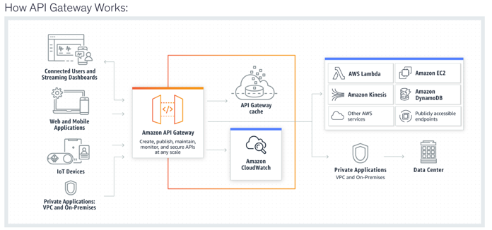

- CDK:
  - provides you with high-level components called constructs that preconfigure cloud resources with proven defaults
  - enables you to compose and share your own custom constructs that incorporate your organization's requirements, helping you start new projects faster
  - can be used with CodeDeploy for deployment
  - correct order of steps to be followed for creating an app using AWS CDK:
    - 1. Create the app from a template provided by AWS CDK -> run cdk init
    - 2. Add code to the app to create resources within stacks
    - 3. Build the app (optional) -> to check syntax errors
    - 4. Synthesize one or more stacks in the app  -> The synthesis step catches logical errors in defining your AWS resources
    - 5. Deploy stack(s) to your AWS account -> run cdk deploy
  - cdk diff: used to generate a difference report between the deployed and local stacks

- SAR (AWS Serverless Application Repository):
  - managed repository for serverless applications.
  - enables devs to store and share reusable applications, and easily assemble and deploy serverless architectures
  - using SAR you don't need to clone, build, package, or publish source code to AWS before deploying it

- SAM:
  - The AWS::Serverless transform, which is a macro hosted by AWS CloudFormation, takes an entire template written in the AWS SAM syntax and transforms and expands it into a compliant AWS CloudFormation template
  - SAM provides shorthand syntax to express functions, APIs, databases, and event source mappings. It supports the following resource types:
    - AWS::Serverless::Api -> REST API (API Gateway v1)
    - AWS::Serverless::HttpApi -> HTTP API (API Gateway v2) — a faster, cheaper, simpler alternative to REST APIs.
    - AWS::Serverless::Application -> Lets you nest another SAM or CloudFormation application.
    - AWS::Serverless::Function -> Lambda - Inline code or S3-deployed code packages
    - AWS::Serverless::LayerVersion -> Lambda Layer, which packages libraries, dependencies, or shared code.
    - AWS::Serverless::SimpleTable -> DynamoDB table with sensible defaults.
    - AWS::Serverless::StateMachine -> Step Functions state machine, optionally triggered by events (like S3 or EventBridge).
  - Mandatory sections of a SAM template: Transform and Resources
  - commands:
    - sam sync:
      - designed to enable rapid iteration by synchronizing local changes with the deployed serverless application on AWS. 
      - allows developers to quickly test incremental changes without the overhead of redeploying the entire stack
    - sam deploy - performs a full deployment of the application or updated resources:
      - zips your application artifacts, uploads them to Amazon Simple Storage Service (Amazon S3), and deploys your application to the AWS Cloud
      - AWS SAM uses AWS CloudFormation as the underlying deployment mechanism
  - SAM allows you to attach pre-built IAM policy templates to Lambda functions under the Policies: section of AWS::Serverless::Function:
    - If a Lambda reads data → ReadPolicy (S3ReadPolicy, DynamoDBReadPolicy)
    - If it writes or updates → CrudPolicy (S3CrudPolicy, DynamoDBCrudPolicy)
    - If it triggers another service → Invoke / Publish / Poller (LambdaInvokePolicy, CloudWatchPutMetricPolicy, SQSPollerPolicy)
  - When you see “AccessDenied while testing locally with SAM” in an exam question, remember:
    - Root cause - AM CLI runs your Lambda locally, but still uses AWS credentials for SDK calls → wrong or missing credentials = AccessDenied. Solution:
      - Use aws configure --profile to add credentials for the sandbox account
      - Run the function using sam local invoke with the --profile parameter

- CloudFormation:
  - Scenario: application will be deployed across multiple regions, you need to create a map of all the possible values for the base AMI:
    - !FindInMap [ MapName, TopLevelKey, SecondLevelKey ] -> TopLevelKey = region, SecondLevelKey = AMI value
  - Exported Output Values in CloudFormation must have unique names within a single Region
  - CFN template = JSON- or YAML-formatted text file that describes your AWS infrastructure. 
    - The "Resources" section is the only required section
  - Scenario: you must deploy resources to multiple AWS Regions to support the load testing of an API, without additional code:
    - Correct: Leverage the AWS CLI create-stack-set command:
      - Using an administrator account, you define and manage an AWS CloudFormation template
      - and then use the template as the basis for provisioning stacks into selected target accounts across specified AWS Regions.
  - Pseudo parameters = parameters that are predefined by AWS CloudFormation (Ex: AWS::AccountId, AWS::Region, AWS::StackName)
  - Template sections:
    - AwsTemplateFormatVersion, Description, Metadata, Parameters, Mappings, Conditions, Transform, Resources, Outputs
  - Parameter types:
    - Parameter types enable CloudFormation to validate inputs earlier in the stack creation process.
    - CloudFormation currently supports the following parameter types:
    ```  
        String – A literal string
        Number – An integer or float
        List<Number> – An array of integers or floats
        CommaDelimitedList – An array of literal strings that are separated by commas
        AWS::EC2::KeyPair::KeyName – An Amazon EC2 key pair name
        AWS::EC2::SecurityGroup::Id – A security group ID
        AWS::EC2::Subnet::Id – A subnet ID
        AWS::EC2::VPC::Id – A VPC ID
        List<AWS::EC2::VPC::Id> – An array of VPC IDs
        List<AWS::EC2::SecurityGroup::Id> – An array of security group IDs
        List<AWS::EC2::Subnet::Id> – An array of subnet IDs
    ```
  - Parameter AllowedValues:
    - refers to an array containing the list of values allowed for the parameter.
    - When applied to a parameter of type String, the parameter value must be one of the allowed values
    - When applied to a parameter of type CommaDelimitedList, each value in the list must be one of the specified allowed values.
  - To declare Lambda in CloudFormation:
    - INLINE: “Simple inline code” or “Hello World function” → Use ZipFile
    - MANUAL S3 UPLOAD: “Function uses third-party libraries” → Use S3 zip package 
    - S3 UPLOAD: “How to deploy updated Lambda code via CloudFormation?” → Use aws cloudformation package or sam package to upload to S3 automatically
  - asw cloudformation package:
    - Packages the local artifacts (local paths) that your AWS CloudFormation template references.
    - The command uploads local artifacts, such as source code for an AWS Lambda function or a Swagger file for an AWS API Gateway REST API, to an S3 bucket.
    - The command returns a copy of your template, replacing references to local artifacts with the S3 location where the command uploaded the artifacts.
    - After you package your template’s artifacts, run the aws cloudformation deploy command to deploy the returned template.
  - Built-in functions:
    - !GetATT - returns value of an attribute from a resource in the template: !GetAtt myELB.DNSName
    - !Sub - substitutes variables in an input string with values that you specify
    - !Ref - returns the value of the specified parameter or resource.
    - !FindInMap - returns the value corresponding to keys in a two-level map that is declared in the Mappings section
  - To create a cross-stack reference:
    - use the Export Output field to flag the value of a resource output for export. 
    - then, use the Fn::ImportValue intrinsic function to import the value.

- Security tools:
  - IAM Access Analyzer:
    - simplifies inspecting unused access to guide you toward least privilege
    - unused roles, unused access keys for IAM users, and unused passwords for IAM users. For active IAM roles and users, the findings provide visibility into unused services and actions.
  - AWS Trusted Advisor:
    - best practices on cost optimization, security, fault tolerance, service limits, and performance improvement
  - Amazon Inspector: 
    - assesses applications for exposure, vulnerabilities, and deviations from best practices.
  - AWS Security Hub:
    - assesses your AWS environment against security industry standards and best practices.
  - AWS Certificate Manager:
    - referred tool to provision, manage, and deploy server certificates
    - automatically renews certificates
    - NOTE: IAM can also be used as a Certificate manager if ACM not supported
  - AWS Systems Manager:
    - unified user interface so you can view operational data from multiple AWS services
    - allows you to automate operational tasks such as running commands, managing patches, and configuring servers

  - AWS Secrets Manager:
    - enables you to easily rotate, manage, and retrieve database credentials, API keys
  - AWS SSM (Systems Manager Parameter Store):
    - Scenario: when and who has issued API calls against SSM Parameter Store?
      - Correct: Use AWS CloudTrail to get a record of actions taken by a user
    - provides secure, hierarchical storage for configuration data management and secrets management
    - SSM Parameter Store cannot be used to automatically rotate the secrets. -> For automatic rotation, use AWS Secrets Manager.
    - Parameter hierarchy example:
      - Dev/dbServer/MySQL/db-string
      - Prod/dbServer/MySQL/db-string
    - Secrets can be stored as SecureString in SSM Parameter store:
      - Parameter Store uses AWS KMS to encrypt and decrypt the parameter values of Secure String parameters.

- Security:
  - Scenario: Reuse SSH keys in your AWS Regions:
    - Correct:
      - 1. Generate a public SSH key (.pub) file from the private SSH key (.pem) file. 
      - 2. Set the AWS Region you wish to import to. 
      - 3. Import the public SSH key into the new Region.
      - Memory hook: Public key travels safely — private key stays local.
      - Incorrect: Encrypt the private SSH key and store it in the S3 bucket to be accessed from any AWS Region - Storing private key to Amazon S3 is possible. But, this will not make the key accessible for all AWS Regions
  - Scenario: You are not authorized to perform this operation. Encoded authorization failure message: 6h34GtpmGjJJUm946eDVBfzWQJk6z5....
    - Correct: Use AWS STS decode-authorization-message
      - To decode an authorization status message, a user must be granted permissions via an IAM policy to request the DecodeAuthorizationMessage (sts:DecodeAuthorizationMessage) action.

- KMS:
  - Simple encryption flow:
    - you create a CMK (customer master key) in KMS -> you never see the raw key — AWS manages it for you.
    - KMS uses the CMK to encrypt your data -> it returns the encrypted data -> use Encrypt API
  - Envelope encryption flow:
    - KMS creates a Data Key (a temporary key) - use **GenerateDataKey** to get the data key. 
    - Your app uses the plaintext Data Key to encrypt large data (e.g., a file). 
    - KMS only encrypts the Data Key with the CMK. 
    - You store:
      - Encrypted file (encrypted with Data Key). 
      - Encrypted Data Key (encrypted with CMK).
    - Later, to decrypt, you send the Encrypted Data Key to KMS → it gives you back the Data Key → you decrypt the file.
  - GenerateDataKeyWithoutPlaintext is identical to the GenerateDataKey operation except that returns only the encrypted copy of the data key
    - useful for systems that need to encrypt data at some point, but not immediately
    - When you need to encrypt the data, you call the Decrypt operation on the encrypted copy of the key
  - Scenario: over 1MB of data should be passed to a Lambda function and should be encrypted and decrypted at runtime.
    - Correct: Use Envelope Encryption and reference the data as file within the code
    - Incorrect: Use KMS direct encryption and store as file - You can only encrypt up to 4 kilobytes
    - Incorrect: Use Envelope Encryption and store as an environment variable - Environment variables must not exceed 4 KB
  - Data key caching:
    - When you encrypt or decrypt data, the AWS Encryption SDK looks for a matching data key in the cache
    - Data key caching is an optional feature of the AWS Encryption SDK that you should use cautiously

- CLI: Your default region is us-east-1. You want to execute a command to stop an EC2 instance in the us-east-2 region. You have permissions already:
  - Correct: Use the --region parameter -> otherwise the default region is used
  - Incorrect: override the default region by using aws configure -> not optimal as you will need to change it back

- SQS:
  - You can't change the queue type after you create it -> if you want to change to FIFO, then delete + create
  - Visibility timeout = defaults to 30 seconds. Valid values are: An integer from 0 to 43,200 (12 hours)
  - Delay Seconds = The default (minimum) delay for a queue is 0 seconds. The maximum is 15 minutes => Delay queue
  - the DLQ must be the same type as the initial queue (standard or FIFO)
  - Queue tags are case-sensitive. 
    - A new tag with a key identical to that of an existing tag overwrites the existing tag. 
    - To be able to tag a queue on creation, you must have the sqs:CreateQueue and sqs:TagQueue permissions.
  - SQS API methods:
    - DeleteQueue = deletes queue + contents in max 60 seconds (you must wait at least 60 seconds before creating a queue with the same name.)
    - PurgeQueue - Deletes the messages in a queue
    - RemovePermission - Revokes any permissions in the queue policy that matches the specified Label parameter.
  - SQS is highly scalable and does not need any intervention to handle the expected high volumes:
    - For most standard queues - max of approx. 120,000 inflight messages (received from a queue by a consumer, but not yet deleted from the queue).
    - For FIFO queues - max of approx 20.000 inflight messages
  - Long polling:
    - set a wait time for the ReceiveMessage API >0  (max 20 sec)  
  - Amazon SQS Extended Client Library for Java - especially useful for storing and consuming messages up to 2 GB
  - SQS KMS encryption:
    - Server-side encryption (SSE) lets you transmit sensitive data in encrypted queues
    - When you use Amazon SQS with AWS KMS, the data keys that encrypt your message data are also encrypted and stored with the data they protect.
    - You can choose to have SQS encrypt messages stored in both Standard and FIFO queues using an encryption key provided by AWS Key Management Service (KMS).
  - The minimum message size is 1 byte (1 character). The maximum is 262,144 bytes (256 KB).
  - SQS FIFO:
    - MessageGroupId - tag that specifies that a message belongs to a specific message group => ORDERED
    - MessageDeduplicationId - If a message with a particular message deduplication ID is sent successfully, any messages sent with the same message deduplication ID are accepted successfully but aren't delivered during the 5-minute deduplication interval.
    - ReceiveRequestAttemptId - The token is used for deduplication of ReceiveMessage calls
  - You can specify max number of messages to retrieve = 10

- Kinesis DataStream:
  - Scenario: ProvisionedThroughputExceededException on a PutRecords API call to write multiple data records into a Kinesis data stream in a single call:
    - Correct options:
      - Reshard your stream to increase the number of shards in the stream. 
      - Reduce the frequency or size of your requests. 
      - Distribute read and write operations as evenly as possible across all the shards in Data Streams. 
      - Use an error retry and exponential backoff mechanism.
  - KDS can continuously capture gigabytes of data per second from hundreds of thousands of sources such as website clickstreams, database event streams, financial transactions, social media feeds, IT logs, and location-tracking events
  - Kinesis Data Streams enables real-time processing of streaming big data. It provides ordering of records, as well as the ability to read and/or replay records in the same order to multiple Amazon Kinesis Applications
  - Amazon Kinesis Client Library (KCL):
    - delivers all records for a given partition key to the same record processor
    - for example, to perform counting, aggregation, and filtering
  - Data Streams also provide greater flexibility in integrating downstream applications than Firehose
  - KDS provides the ability to consume records in the same order a few hours later
  - By default, records of a stream are accessible for up to 24 hours from the time they are added to the stream. You can raise this limit to a maximum of 365 days
  - Kinesis Agent:
    - lightweight software that helps send log and event data from on-premises servers to Amazon Kinesis Data Streams or Data Firehose. 
      - However, it’s not a service for data streaming itself. It is only used for pushing data to a stream or Firehose from local sources but does not provide the real-time stream processing capabilities that Kinesis Data Streams does
    - is a stand-alone Java software application that offers an easy way to collect and send data to Kinesis Data Streams
    - The agent continuously monitors a set of files and sends new data to your stream. 
    - the agent handles file rotation, checkpointing, and retry upon failures.
    - The agent can also pre-process the records parsed from monitored files before sending them to your stream
  - A Kinesis data stream is a set of shards:
    - A shard is a uniquely identified sequence of data records in a stream. A stream is composed of one or more shards, each of which provides a fixed unit of capacity.
    - The partition key is used by Kinesis Data Streams to distribute data across shards

- Amazon Kinesis Data Firehose:
  - is a fully managed service for delivering real-time streaming data to destinations such as:
    - Amazon Simple Storage Service (Amazon S3), 
    - Amazon Redshift, 
    - Amazon Elasticsearch Service (Amazon ES), 
    - Splunk. 
  - fully managed service that automatically scales to match the throughput of your data and requires no ongoing administration.
    
- AWS Kinesis Data Analytics:
  - easiest way to analyze streaming data in real-time
  - enables you to easily and quickly build queries and sophisticated streaming applications in three simple steps: 
    - setup your streaming data sources, 
    - write your SQL queries or sophisticated streaming applications
    - and set up your destination for processed data

- Elastic Beanstalk:
  - Scenario: After a test deployment in ElasticBeanstalk environment, a developer noticed that all accumulated Amazon EC2 burst balances were lost.
    - Burst balance is tied to the life of an individual EC2 instance. Any strategy that replaces the instance resets the balance, while updates that keep the same instance alive retain it.
    - Immutable updates and traffic splitting mode (Ex: canary) create NEW instances -> burst balance lost
    - All-at-once -> same instances UPDATED -> no burst balance lost
    - Rolling -> updated in batches -> some burst balance still kept
  - Configuration files:
    - .ebextensions/<mysettings>.config
    - YAML or JSON formatted documents with a .config file extension that you place in a folder named .ebextensions and deploy in your application source bundle.
  - Scenario: You need to deploy a new version using Beanstalk while making sure that performance and availability are not affected (plus cost-effective).
    - Correct: Deploy using 'Rolling with additional batch' deployment policy
  - Environment categories:
    - Web server env:
      - Runs your app (usually behind load balancer, auto scaling). 
      - Handles HTTP(S) requests directly. 
      - Good for responsive APIs or websites.
    - Worker Environment 
      - Designed for asynchronous/background jobs. 
      - Connects to an Amazon SQS queue. 
      - When you make a worker environment in Elastic Beanstalk, AWS automatically:
        - Creates an SQS queue (unless you already have one). 
        - Runs a daemon (a small helper program) on each EC2 instance -> polls the SQS and calls a localhost endpoint you define to process the messages
      - Ideal for long-running tasks (e.g., video transcoding, report generation).
      - for a worker env, you need a cron.yaml file to define the jobs
  - You can deploy multiple environments when you need to run multiple versions of an application
  - the only way to recover the database data before it gets deleted by Elastic Beanstalk -> make a snapshot
  - Lifecycle policy:
    - Each time you upload a new version of your application, Elastic Beanstalk creates an application version.
    - A lifecycle policy tells Elastic Beanstalk to delete old application versions or to delete application versions when the total number of versions for an application exceeds a specified number
  - Scenario: EC2 instances are added into an ASG, each EC2 instance should be running 3 different Docker Containers simultaneously.
    - Correct: Docker multi-container platform
      - The multi-container Docker platform uses Amazon ECS (Elastic Container Service) under thex hood.
      - allows you to Run multiple containers per EC2 instance, and handle orchestration, logging, scaling
  - The simplest way to use HTTPS with an Elastic Beanstalk environment is to assign a server certificate to your environment's load balancer.
    - Example .ebextensions/securelistener-alb.config
  - Health check type must be ELB if you want automatic instance replacement for app-level failures.
    - Always use .ebextensions to persist environment-level settings (like scaling, health checks, instance types, etc.
    - EC2 health check (default) → checks instance status only (infra-level). 
    - ELB health check → checks app endpoint (HTTP 200). 
    - ✅ Use ELB for automatic replacement on app-level failure.
  - Scenario: migrate the Elastic Beanstalk environment from Team A's AWS account into Team B's AWS account
    - Correct: Create a saved configuration in Team A's account and download it to your local machine. Make the account-specific parameter changes and upload to the S3 bucket in Team B's account. From Elastic Beanstalk console, create an application from 'Saved Configurations'
      - A Saved Configuration captures the Elastic Beanstalk environment configuration (settings, option settings, scaling, health check, env vars, etc.) as a JSON file you can download.
      - Saved configuration is not a full account migration. It’s config only. You must move source bundles and external resources.
        - IAM roles: replace ARNs in JSON with roles created in Account B.
        - Secrets and credentials must be stored/rotated in Account B (don’t copy raw secrets). 
        - RDS data requires snapshot + sharing/restore across accounts.
    - Incorrect: use Export / Import -> no such options in beanstalk
  - Elastic Beanstalk + X-Ray:
    - Enable Active Tracing in EB console. 
    - Install X-Ray daemon via .ebextensions/xray-daemon.config 
    - Always remember: Application → sends trace → X-Ray daemon → AWS X-Ray console

- EC2:
  - T3, T3a, and T2 instances = Burstable performance instances -> t2.micro can be used for free in first 12 months
  - User data scripts:
    - By default, user data runs only during the boot cycle when you first launch an instance
    - By default, scripts entered as user data are executed with root user privileges
  - Reserved instances:
    - Regional reserved instance - discount applied to all AZs
    - Zonal reserved instance - discount applied to specified AZ ++++ capacity reservation possibility (extra confidence for critical apps)
  - Enable EC2 detailed monitoring:
    - to send metric data each 1-minute periods (instead of the standard 5 minutes)
    - Enable detailed monitoring for a running instance:
      - aws ec2 monitor-instances --instance-ids i-1234567890abcdef0
    - Enable detailed monitoring when launching an instance:
      - aws ec2 run-instances --image-id ami-09092360 --monitoring Enabled=true
  - Cloudwatch monitoring:
    - By default, Amazon CloudWatch provides a limited set of EC2 instance metrics — things like:
      - CPUUtilization 
      - DiskReadOps, DiskWriteOps 
      - NetworkIn, NetworkOut 
      - StatusCheckFailed
      - But memory (RAM) usage is NOT included in the standard EC2 metrics.

- ASG (Auto scaling groups):
  - An Auto Scaling group can contain EC2 instances in one or more Availability Zones within the same Region
  - Auto Scaling groups are regional -> cannot span across multiple Regions.
  - Amazon EC2 Auto Scaling attempts to distribute instances evenly between the Availability Zones that are enabled for your Auto Scaling group
  - For Auto Scaling groups in a VPC, the EC2 instances are launched in subnets
  - Auto Scaling groups can be configured to launch an instance to replace an instance that is undergoing maintenance
    - In the absence of Auto Scaling Group, an ALB cannot launch instances by itself
  - For EC2 Auto Scaling Groups that need both Spot and On-Demand instances::
    - Use Launch Templates (not Launch Configurations) -> supports Spot + On-Demand mix.
    - Use User Data to bootstrap configuration (install agents, dependencies, etc.).
  - Amazon EC2 Auto Scaling works with:
    - Application Load Balancers (Layer 7 (HTTP/HTTPS)) 
    - Network Load Balancers (Layer 4 (TCP/UDP))
    - Classic Load Balancer (legacy).
  - Auto Scaling can do its own EC2 status checks, independent of any Load Balancer. 
    - It replaces instances that fail EC2 system or instance status checks.
  - When creating an ASG from an existing instance, you can choose to launch from the instance’s configuration (launch template or configuration), but AWS does not automatically create a new AMI
    - If the question mentions custom configuration that must persist → create a custom AMI first.

- ELB:
  - Cross zone load balancing:
    - enabled => each load balancer node distributes traffic across the registered targets in all enabled Availability Zones
    - disabled => each load balancer node distributes traffic only across the registered targets in its Availability Zone
    - With ALB, cross-zone load balancing is always ENABLED
    - EX Scenario: AZ1 has two instances and AZ2 has 8 instances:
      - Cross zone enabled -> each instance = 10%
      - Cross zone disabled -> each instance in AZ1 = 25%, each instance in AZ2 = 6.25%
  - ELB characteristics:
    - Separate public traffic from private traffic -> Load balancers route requests to your targets using private IP addresses
    - Build a highly available system -> automatically balances traffic across targets – EC2 instances, containers, IP addresses, and Lambda functions – in multiple AZ while ensuring only healthy targets receive traffic.
    - A Load Balancer can target EC2 instances only within an AWS Region.
  - ALB access logs:
    - information such as the time the request was received, the client's IP address, latencies, request paths, and server responses
    - Access logging is an optional feature of Elastic Load Balancing that is disabled by default.
  - ALB request tracing - You can use request tracing to track HTTP requests. The load balancer adds a header with a trace identifier to each request it receives
  - Scenario: ELB marked all the EC2 instances in the target group as unhealthy, but they work fine:
    - Possible issue: the security group of the EC2 instance does not allow for traffic from the security group of the Application Load Balancer
    - Possible issue: The route for the health check is misconfigured
  - Port mapping to support multiple tasks from a single service on the same container instance:
    - Classic Load balancer -> does not allow you to run multiple copies of a task on the same instance -> you must statically map port numbers on a container instance
    - Application Load balancer -> uses dynamic port mapping to run multiple tasks from a single service on the same container instance
  - Scenario: ELB routes more traffic to one instance or AZ than others (although configured to route equally):
    - Sticky sessions are enabled for the load balancer
    - Instances of a specific capacity type aren’t equally distributed across Availability Zones
      - A Classic Load Balancer with HTTP or HTTPS listeners might route more traffic to higher-capacity instance types
  - ALB routing options:
    - | Condition Type          | Field                   | Config Object               | Example                                                                   |
      | ----------------------- | ----------------------- | --------------------------- | ------------------------------------------------------------------------- |
      | **Host header**         | `"host-header"`         | `"HostHeaderConfig"`        | `"Values": ["example.com", "*.example.org"]`                              |
      | **Path pattern**        | `"path-pattern"`        | `"PathPatternConfig"`       | `"Values": ["/api/*", "/img/*"]`                                          |
      | **Query string**        | `"query-string"`        | `"QueryStringConfig"`       | `"Values": [ {"Key": "version", "Value": "v1"}, {"Value": "*example*"} ]` |
      | **HTTP header**         | `"http-header"`         | `"HttpHeaderConfig"`        | `"HttpHeaderName": "User-Agent", "Values": ["*Chrome*"]`                  |
      | **HTTP request method** | `"http-request-method"` | `"HttpRequestMethodConfig"` | `"Values": ["GET", "POST"]`                                               |
      | **Source IP**           | `"source-ip"`           | `"SourceIpConfig"`          | `"Values": ["203.0.113.0/24"]`                                            |
    - In ALB rule configurations:
      - Conditions use "Field" and a config object (e.g., "QueryStringConfig", "PathPatternConfig", "HostHeaderConfig"). 
      - Actions use "Type" (like forward, redirect, or fixed-response).
  - ALB target types (when creating a target group):
    - Instance - The targets are specified by instance ID 
    - IP - The targets are IP addresses -> only from CIDR blocks, You can't specify publicly routable IP addresses
    - Lambda - The target is a Lambda function
  - The Load Balancer generates the HTTP 503: Service unavailable error when the target groups for the load balancer have no registered targets.
  - Scenario: Beanstalk env wants to export HTTP and HTTPS endpoints. HTTPS should be used to get in-flight encryption
    - Assign an SSL certificate to the Load Balancer - This ensures that the Load Balancer can expose an HTTPS endpoint.
    - Open up port 80 (HTTP) & port 443 (HTTPS)
  - Scenario: EC2 servers running on high CPU - root cause: handling HTTPS encryption / decryption:
    - Solution:
      - Configure an SSL/TLS certificate on an Application Load Balancer via AWS Certificate Manager (ACM)
        - To use an HTTPS listener, you must deploy at least one SSL/TLS server certificate on your load balancer.
      - Create an HTTPS listener on the Application Load Balancer with SSL termination
        - the load balancer will use the server certificate to terminate the front-end connection and then decrypt requests from clients before sending them to the EC2 instances
    - Incorrect: Create an HTTPS listener on the Application Load Balancer with SSL pass-through
      - If you use an HTTPS listener with SSL pass-through, then the EC2 instances would continue to be under heavy CPU load as they would still need to decrypt the secure traffic
  - Errors:
    - HTTP 503 indicates 'Service unavailable' error. This error in ALB is an indicator of the target groups for the load balancer having no registered targets.
    - HTTP 500 - HTTP 500 indicates 'Internal server' error. There are several reasons for their error: A client submitted a request without an HTTP protocol, and the load balancer was unable to generate a redirect URL, there was an error executing the web ACL rules.
    - HTTP 504 - HTTP 504 is 'Gateway timeout' error. Several reasons for this error, to quote a few: The load balancer failed to establish a connection to the target before the connection timeout expired, The load balancer established a connection to the target but the target did not respond before the idle timeout period elapsed.
    - HTTP 403 - HTTP 403 is 'Forbidden' error. You configured an AWS WAF web access control list (web ACL) to monitor requests to your Application Load Balancer and it blocked a request.

NLB:
  - functions at the 4th layer (Transport) of the Open Systems Interconnection (OSI) model
    - Layers: 1. Physical → 2. Data Link → 3. Network → 4. Transport → 5. Session → 6. Presentation → 7. Application
    - CLB is both 4 and 7
    - ALB is layer 7
  - It can handle millions of requests per second
  - It deals with IP addresses and TCP/UDP ports
  - It forwards the raw connection (packets) to backend targets without inspecting application data (like HTTP headers or URLs).
  - The client’s original source IP address and port are preserved all the way to the backend.
    - Your app doesn’t need to read an X-Forwarded-For header (which ALB adds to preserve the client IP in HTTP). 
    - You can directly see the client’s IP in the TCP connection itself.

- EBS:
  - EBS volumes are AZ locked
    - When you create an EBS volume, it is automatically replicated within its Availability Zone to prevent data loss
    - You can attach an EBS volume to an EC2 instance in the same Availability Zone
  -  General Purpose SSD (gp2) volumes -> max IOPs hit at 5.3 TiB volume size
  - Quick recap:
    - gp2 maxes out at ~5.3 TiB → 16k IOPS cap. 
    - gp3 always 3,000 IOPS baseline, up to 16k configurable. 
    - io1/io2 = provisioned IOPS, up to 50 IOPS per GiB, max 64k/256k. 
      - So, for a 200 GiB volume size, max IOPS possible is 200*50 = 10000 IOPS.
    - Only SSD (gp2, gp3, io1, io2) can be boot volumes. 
    - st1/sc1 never boot volumes.
  - EBS volumes support both in-flight encryption and encryption at rest using KMS
    - When you create an encrypted EBS volume and attach it to a supported instance type, the following types of data are encrypted:
      - Data at rest inside the volume
      - All data moving between the volume and the instance
      - All snapshots created from the volume
      - All volumes created from those snapshots
  - Encryption:
    - by default is a Region-specific setting. If you enable it for a Region, you cannot disable it for individual volumes or snapshots in that Region
    -  A volume restored from an encrypted snapshot, or a copy of an encrypted snapshot, is always encrypted:
      - By default, the CMK that you selected when creating a volume encrypts the snapshots that you make from the volume
  - AWS CloudTrail event logs for 'CreateVolume' aren't available for EBS volumes created during an Amazon EC2 launch
  - DeleteOnTermination - determines whether to preserve or delete the EBS volume when EC2 instance terminates
    - Default: TRUE for root volume, FALSE for all other volume types
    - If the instance is already running, you can set DeleteOnTermination to False using the command line.
 
- RDS:
  - Scenario: application has RDS for PostgreSQL with read-heavy workloads. how to refactor the code to achieve optimum read performance for SQL queries?
    - Correct: Set up Amazon RDS with one or more read replicas. Refactor the application code so that the queries use the endpoint for the read replicas
    - Incorrect: Use Elasticache for Redis or Memcached as a caching layer: These are not relational databases and cannot be used to run SQL queries
  - Scenario: App that uses RDS as main data storage and ElastiCache for user session storage. Deployed using Elastic Beanstalk -> every new deployment should allow the appto reuse the RDS database, but data stored in ElastiCache can be re-created for every deployment.
    - Correct: 
      - RDS database defined externally and referenced through environment variables => To decouple your database instance from your environment
      - ElastiCache defined in .ebextensions/ => Any resources created as part of your .ebextensions is part of your Elastic Beanstalk template and will get deleted if the environment is terminated.
    - Incorrect:
      - ElastiCache bundled with the application source code => ElastiCache is an AWS service and cannot be bundled with the source code.
  - Scenario: monthly RDS automatic database backups must be retained for the duration of the contract
    - Correct: Create a cron event in CloudWatch, which triggers an AWS Lambda function that triggers the database snapshot
      - create a CloudWatch Rule and select “Schedule” as the Event Source
      - select “Lambda Function” as the Target
    - Incorrect: Enable RDS automatic backups - You can enable automatic backups but as of 2020, the retention period is 0 to 35 days.
  - Scenario: RDS - prepare for database disaster recovery:
    - Correct: Use cross-Region Read Replicas:
      - If the source DB instance fails, you can promote your Read Replica to a standalone source server
    - Correct: Enable the automated backup feature of Amazon RDS in a multi-AZ deployment that creates backups in a single AWS Region
      - The automated backup feature of Amazon RDS enables point-in-time recovery for your database instance
      - Automated backups are limited to a single AWS Region
      - manual snapshots and Read Replicas are supported across multiple Regions.
  -  Enable storage auto-scaling for RDS MySQL:
    - Amazon RDS detects that you are running out of free database space it automatically scales up your storage
  - RDS Multi-AZ:
    - Amazon RDS automatically initiates a failover to the standby, in case primary database fails for any reason
    - RDS applies OS updates by performing maintenance on the standby, then promoting the standby to primary and finally performing maintenance on the old primary, which becomes the new standby
    - A Multi-AZ standby cannot serve read requests -> only used for HA
    - Updates to your DB Instance are synchronously replicated across the Availability Zone to the standby in order to keep both in sync
  - RDS Proxy:
    - helps you manage a large number of connections from Lambda to an RDS database by establishing a warm connection pool
    - This allows your Lambda applications to reuse existing connections, rather than creating new connections for every function invocation.


- Elasticache:
  - Scenario: highly reliable fully-managed caching layer has to be configured in front of RDS.
    - Correct: Implement Amazon ElastiCache Redis in Cluster Mode
      - Cluster mode comes with the primary benefit of horizontal scaling of your Redis cluster
      - Cluster Mode can scale to very large amounts of storage (potentially 100s of terabytes) across up to 90 shards, whereas a single node can only store as much data in memory as the instance type has capacity for.
    - Incorrect: Implement Amazon ElastiCache Memcached:
      - Memcached is designed for simplicity while Redis offers a rich set of features that make it effective for a wide range of use cases
      - Memcached does not offer snapshots, replication, transactions
  - Redis:
    - All the nodes in a Redis cluster (cluster mode enabled / disabled) must reside in the same region
    - While using Redis with cluster mode enabled, there are some limitations:
      - You cannot manually promote any of the replica nodes to primary.
      - Multi-AZ is required.
      - You can only change the structure of a cluster, the node type, and the number of nodes by restoring from a backup.
  - ElastiCache is a popular choice for real-time use cases like Caching, Session Stores, Gaming, Geospatial Services, Real-Time Analytics, and Queuing.
  - Scenario: cache frequently accessed data and adding the ability to sort or rank the cached datasets?
    - Correct: Redis:
      - In addition to strings, Redis supports lists, sets, sorted sets, hashes, bit arrays, and hyperlog logs
      - For example, you can use Redis Sorted Sets to easily implement a game leaderboard that keeps a list of players sorted by their rank.
    - Incorrect: Memcached - Memcached is designed for simplicity and it does not offer support for advanced data structures and operations such as sort or rank
  - Two types of strategies:
    - Lazy Loading - loads data in cache only when necessary
    - Write-Through
  - You can choose Memcached over Redis if you have the following requirements:
    - You need the simplest model possible.
    - You need to run large nodes with multiple cores or threads -> MULTITHREADING
    - You need the ability to scale out and in, adding and removing nodes as demand on your system increases and decreases
    - You need to cache objects, such as a database.


- DynamoDB:
  - Scenario: Lambda based REST App with a unique ID per API request. In case of throttling, need to address duplicate requests if retried:
    - Correct: Persist the unique identifier for each request in a DynamoDB table. Change the Lambda function to check the table for the identifier before processing the request
    - Incorrect: Memcached is used for simple purposes, does not offer replication and can lead to data loss
    - Incorrect: RDS does not have the same performance as DynamoDB
  - Scenario: how to backup a particular DynamoDB table data on Amazon S3, so you can download the S3 backup locally?
    - Correct: Use AWS Data Pipeline to export your table to an S3 bucket in the account of your choice and download locally -> ata Pipeline uses Amazon EMR to create the backup, and the scripting is done for you
    - Correct: Use Hive with Amazon EMR to export your data to an S3 bucket and download locally -> more control than the Data Pipeline method.
    - Correct: Use AWS Glue to copy your table to Amazon S3 and download locally -> best practice to use if you want automated, continuous backups that you can also use in another service, such as Amazon Athena.
    - Incorrect: Use the DynamoDB on-demand backup capability to write to Amazon S3 and download locally --> DynamoDB has two built-in backup methods (On-demand, Point-in-time recovery) that write to Amazon S3, but you will not have access to the S3 buckets that are used for these backups.
  - UpdateItem -> edits an existing item's attributes or adds a new item to the table if it does not already exist
  - Time To Live (TTL) for DynamoDB:
    - allows you to define when items in a table expire so that they can be automatically deleted from the database
    - no extra cost
    - will appear as an event in DynamoDB Streams
  - DynamoDB Streams:
    - captures a time-ordered sequence of item-level modifications (create, update, delete) in any DynamoDB table
    - stores this info in a log for up to 24h
    - StreamViewType determines what information are written to the stream for this table. Valid values for StreamViewType are KEYS_ONLY, NEW_IMAGE, OLD_IMAGE, and NEW_AND_OLD_IMAGES.
  - easiest way to empty a table -> DELETE + recreate
  - Scan operations:
    - By default, the Scan operation processes data sequentially
    - DynamoDB returns data to the application in 1 MB increments
    - Parallel scan -> multiple worker threads that scan different partitions of a table
    - How to minimize impact of scan operations on throughput:
      - Reduce page size (using LIMIT) -> Each Query or Scan request that has a smaller page size uses fewer read operations and creates a “pause” between each request
      - Isolate scan operations -> you want to perform scans on a table that is not taking “mission-critical” traffic (ex: performing every write on two tables: a “mission-critical” table, and a “shadow” table.)
  - DynamoDB Accelerator (DAX):
    - is a fully managed, highly available, in-memory cache for Amazon DynamoDB that delivers up to a 10 times performance improvement
    - DAX is tightly integrated with DynamoDB—you simply provision a DAX cluster, use the DAX client SDK to point your existing DynamoDB API calls at the DAX cluster, and let DAX handle the rest
  - Secondary indexes:
    - LSI: 
      - Shares the same partition key as the base table. 
      - Uses the same provisioned throughput (RCUs/WCUs). 
      - Indexes are updated whenever the base table is updated.
    - GSI:
      - Has its own partition key and sort key (independent of base table). 
      - Has its own provisioned throughput (separate RCUs and WCUs). =>> you must provision separate capacity
      - Is updated asynchronously from the base table. => if the GSI's provisioned capacity is too low, it can get throttled
  - --project-expression -> to get only a part of attributes
  - --filter-expression -> to filter the Query results
  - --page-size -> to get smaller nr of items per API call
  - --max-items -> total items to return (even across multiple pages)
    - ex: --page-size 50 --max-items 100 ==> 50 items per call, 2 API calls
  - Tips to reduce latency:
    - Consider using Global tables if your application is accessed by globally distributed users
    - Use eventually consistent reads in place of strongly consistent reads whenever possible
    - When you're not making requests, consider having the client send dummy traffic to a DynamoDB table. Alternatively, you can reuse client connections or use connection pooling. All of these techniques keep internal caches warm, which helps keep latency low

- S3: 
  - Scenario: PutObject API must encrypt objects at rest by using server-side encryption with Amazon S3-managed keys (SSE-S3)
    - Correct:  set the x-amz-server-side-encryption header as AES256. Use an S3 bucket policy to deny permission to upload an object unless the request has this header
  - Scenario: make publicly accessible S3 buckets private, and enable access to objects with a time-bound constraint
    - Correct: Share pre-signed URLs with resources that need access
      - When you create a pre-signed URL for your object, you must provide your security credentials, specify a bucket name, an object key, specify the HTTP method (GET to download the object), and expiration date and time
  - NEVER push S3 access logs about a bucket to the same bucket -> INFINITE LOOP
  - CORS:
    - defines a way for client web applications that are loaded in one domain to interact with resources in a different domain
    - To configure your bucket to allow cross-origin requests, you create a CORS configuration, which is an XML document with:
      - rules that identify the origins that you will allow to access your bucket 
      - and the operations (HTTP methods) that will support for each origin
  - S3 bucket uses server-side encryption with AWS KMS managed keys (SSE-KMS) -> Error access denied on PutObject API (although having IAM permission):
    - Correct: Correct the policy of the IAM user to allow the kms:GenerateDataKey action:
      - This permission is required for buckets that use default encryption with a custom AWS KMS key.
  - S3 Object Ownership:
    -  S3 bucket setting that you can use to control ownership of new objects that are uploaded to your buckets
    - By default, when other AWS accounts upload objects to your bucket, the objects remain owned by the uploading account
    - Has two settings:
      - 1. Object writer – The uploading account will own the object
      - 2. Bucket owner preferred – The bucket owner will own the object if the object is uploaded with the bucket-owner-full-control canned ACL:
        - Without this setting and canned ACL, the object is uploaded and remains owned by the uploading account.
  - Mechanisms to control access to S3 resources:
    - Identity and Access Management (IAM) policies, 
    - bucket policies
    - Access Control Lists (ACLs) -> specific permissions (READ, WRITE, FULL_CONTROL) to specific users for a bucket / object
    - and Query String Authentication -> presigned URL
  - S3 Replication:
    - Same-Region Replication (SRR) and Cross-Region Replication (CRR) can be configured at the S3 bucket level, a shared prefix level, or an object level using S3 object tags
      - You add a replication configuration on your source bucket by specifying a destination bucket in the same or different AWS region for replication.
      - S3 lifecycle actions are not replicated with S3 replication
      - Replication only replicates the objects added to the bucket after replication is enabled on the bucket
      - You can use replication to make copies of your objects that retain all metadata, such as the original object creation time and version IDs
  - Ways to share S3 buckets accross accounts:
    - Same Partition (ex: both in aws standard commercial:
      - Use IAM roles (best for console + programmatic):
        - Finance creates role with S3 permission + trusts HR account to assume it
      - Use bucket policies:
        - Finance bucket policy allows HR account's IAM users / roles
      - ACLs:
        - Finance can grant access to HR's user ID
    - Different partition (ex: aws standard and aws-us-gov):
      - ❌ Not possible at all
  - Scenario: you want to insert vendor records into an Amazon DynamoDB table as soon as the vendor uploads a new file into an Amazon S3 bucket.
    - Correct: Create an S3 event to invoke a Lambda function that inserts records into DynamoDB
  - Using HTTP vs HTTPS with encryption:
    - SSE-C: Amazon S3 will reject any requests made over HTTP when using SSE-C
    - SSE-KMS: not mandatory to use HTTPS
    - SSE-S3: not mandatory to use HTTPS
    - Client side encryption: not mandatory to use HTTPS
  - Fastest way to upload large files: Multipart upload with S3 transfer acceleration
    - Transfer Acceleration takes advantage of Amazon CloudFront’s globally distributed edge locations
    - Multipart upload:
      - allows you to upload a single object as a set of parts.
      - You can upload these object parts independently and in any order.
      - If transmission of any part fails, you can retransmit that part without affecting other parts
      - After all parts of your object are uploaded, Amazon S3 assembles these parts and creates the object
  - Create a Static website hosting:
    - 1. Create an S3 Bucket -> name it as your domain name (required for Route 53)
    - 2. Upload index.html, error.html, and any static assets (CSS, JS, images) with case-sensitive name -> at the root level of the bucket
    - 3. Enable Static website hosting -> you'll get an endpoint URL to use in Route 53
    - 4. Configure permissions (by default S3 buckets block all public access):
         - Disable block public access
         - add public read bucket policy
    - 5. Set up custom domain with Route 53 - create an A record (Alias): www.mycompany.com → s3-website-eu-west-1.amazonaws.com
    - Optional: add HTTPS via Cloudfront:
        - Create a distribution with Origin = S3 website and Viewer Protocol policy = Redirect HTTP->HTTPS
        - Request a SSL / TLS certificate from ACM and attach it to Cloudfront distribution
  - S3 Select - enables applications to retrieve only a subset of data from an object by using simple SQL expressions
  - S3 Inventory - to help manage your storage, audit on the replication and encryption status of your objects
  - S3 Analytics - to help analyze storage patterns (when to move from STANDARD to STANDARD IA for example)
  - S3 Access Logs - detailed records for the requests that are made to a bucket
  - Pagination:
    - --max-items - How many items you want to show (for user pagination)
    - --page-size - how many items to request from AWS per API call -> for fine-tuning, not for user pagination
    - --starting-token - which page to start from (bookmark)
  - S3 delivers strong read-after-write consistency automatically:
    - all S3 GET, PUT, and LIST operations, as well as operations that change object tags, ACLs, or metadata, are strongly consistent
    - What you write is what you will read, and the results of a LIST will be an accurate reflection of what’s in the bucket.
    - NOTE: Bucket configurations have an eventual consistency model. If you delete a bucket and immediately list all buckets, the deleted bucket might still appear in the list.
  - S3 events:
    - If two writes are made to a single non-versioned object at the same time, it is possible that only a single event notification will be sent
    - With versioning, every successful write will create a new version of your object and will also send event notification.
  - x-amz-server-side-encryption header requesting server-side encryption with SSE-KMS:
    - When you upload an object, you can specify the KMS key using the x-amz-server-side-encryption-aws-kms-key-id header which you can use to require a specific KMS key for object encryption. 
    - If the header is not present in the request, Amazon S3 assumes the default KMS key.
  - S3 Object Lambda:
    -  allows you to add your own code to S3 GET requests to modify and process data as it’s being returned to an application
    - use cases where data needs to be transformed on-the-fly without the need to store a transformed copy of the data: redacting PII data, resize images etc

- API Gateway:
  - Stages: used to manage and optimize a particular deployment (you can configure stage settings to enable caching, customize request throttling, configure logging, define stage variables, or attach a canary release)
  - Handle multiple stages (dev, prod) -> use stage variables to configure different settings for each stage API
  - Scenario: how to improve the performance of a popular API service?
    - Correct: Enable API caching in API Gateway
    - Incorrect: Set up usage plans and API keys in API Gateway -> to allow customers to access selected APIs, and send throttling requests to those APIs based on defined limits and quotas
    - Incorrect: Configure API Gateway to use Elasticache for Memcached -> Elasticache for Memcached cannot be used with API Gateway
    - Incorrect: Configure API Gateway to use Gateway VPC Endpoint -> provide reliable connectivity to Amazon S3 and DynamoDB without requiring an internet gateway or a NAT device for your VPC
  - Format the response from an API Gateway REST API? -> Use API Gateway Mapping Templates
  - Mechanisms for controlling access:
    - Resource policies - allow / deny access to the API from specified IP addresses or VPC endpoints
    - Standard AWS IAM roles and policies - controls who can create, manage, invoke the API
    - IAM tags - used with IAM policies
    - Endpoint policies for interface VPC endpoints - improve security of private APIs
    - Lambda authorizers - control access to REST API using bearer token auth
    - Amazon Cognito user pools
  - Scenario: application needs to send real-time alerts and notifications based on any updates from the backend services
    - Correct: WebSocket APIs:
      - WebSocket API use cases: 
        - Chat applications 
        - Real-time dashboards such as stock tickers 
        - Real-time alerts and notifications
      - API Gateway provides WebSocket API management functionality such as the following:
        - Monitoring and throttling of connections and messages
        - Using AWS X-Ray to trace messages as they travel through the APIs to backend services
        - Easy integration with HTTP/HTTPS endpoints
  - MOCK integration:
    - useful for API testing because it can be used to test the integration setup without incurring charges for using the backend
    - It is also used to return CORS-related headers to ensure that the API method permits CORS access. In fact, the API Gateway console integrates the OPTIONS method to support CORS with a mock integration.
  - API Gateway does not use security groups but uses resource policies, which are JSON policy documents that you attach to an API to control whether a specified principal (typically an IAM user or role) can invoke the API
    - You can restrict IP address using this, the downside being, an IP address can be changed by the accessing user
  - API Gateway Caching:
    - The default TTL value for API caching is 300 seconds
    - The maximum TTL value is 3600 seconds. 
    - TTL=0 means caching is disabled.
    - Invalidate cache: request with Header Cache-Control: max-age=0
    - Ticking the Require authorization checkbox ensures that not every client can invalidate the API cache. If most or all of the clients invalidate the API cache, this could significantly increase the latency of your API.
  - Scenario: You integrated API Gateway → Lambda, and now you want to enable CloudWatch logging at the method level to troubleshoot errors.
    - 1️⃣ STS (AWS Security Token Service) must be enabled - API Gateway uses AWS STS to obtain temporary credentials that allow it to write logs to CloudWatch Logs.
    - 2️⃣ You must provide an IAM role ARN with the correct trust relationship - API Gateway does not automatically create permissions to write to CloudWatch Logs.
  - Metrics provided by API Gateway to Cloudwatch:
    - Monitor the IntegrationLatency metrics to measure the responsiveness of the backend. 
    - Monitor the Latency metrics to measure the overall responsiveness of your API calls. 
    - Monitor the CacheHitCount and CacheMissCount metrics to optimize cache capacities to achieve a desired performance.
  - API Keys:
    - In Amazon API Gateway, API keys by themselves do not grant access to execute an API. They need to be associated with a usage plan, and that usage plan then determines which API stages and methods the API key can access.
    - If the API key is not associated with a usage plan, it will not have permission to access any of the resources, which will result in a “403 Forbidden” error.
      - => after generating an API key, it must be added to a usage plan by calling the CreateUsagePlanKey method.
  - Integration types:
    - | Integration Type             | Backend                                           | Request/Response Mapping                                              | Use Case / Exam Tip                                                                                      |
      | ---------------------------- | ------------------------------------------------- | --------------------------------------------------------------------- | -------------------------------------------------------------------------------------------------------- |
      | **HTTP**                     | Custom HTTP microservice (EC2, ECS, external API) | ✅ Supports **custom mapping templates** for both request and response | Use when you need to transform data between API Gateway and your backend.                                |
      | **HTTP_PROXY**               | Custom HTTP microservice                          | ❌ No mapping (passes everything as-is)                                | Use when backend handles all request/response logic. Fast setup, no transformations.                     |
      | **AWS**                      | AWS service (Lambda, SQS, DynamoDB, etc.)         | ✅ Supports **custom mapping templates**                               | Use when you need fine-grained control over request/response mapping to AWS services.                    |
      | **AWS_PROXY (Lambda Proxy)** | Lambda function                                   | ❌ No mapping (entire request passed as event)                         | Use when Lambda handles parsing and response formatting. Quick, no transformations at API Gateway level. |
  - Scenario: Analysts from a separate AWS account must interact with your REST API through an IAM role. The IAM role already has a policy that grants permission to invoke the API.
    - Set Method Authorization to AWS_IAM 
      - API Gateway will require requests to be signed with IAM credentials (SigV4). 
      - No custom authorizer or Cognito needed. 
    - Attach a Resource Policy to the API 
      - Grant execute-api:Invoke permission to the cross-account IAM role.


  - | **Status Code**                 | **Meaning**                                | **Root Cause / Common Scenario**                                                          | **Fix / What to Know for the Exam**                                                             |
    | ------------------------------- | ------------------------------------------ | ----------------------------------------------------------------------------------------- | ----------------------------------------------------------------------------------------------- |
    | **400 – Bad Request**           | The client sent a malformed request.       | Missing or invalid parameters, bad JSON body, wrong input mapping.                        | Fix the request or integration mapping template.                                                |
    | **403 – Forbidden**             | Access denied.                             | Missing or invalid API key, Cognito user not authorized, or IAM policy denies access.     | Check authorizers (Cognito, IAM, Lambda) or API key settings.                                   |
    | **429 – Too Many Requests**     | Throttling limit reached.                  | You hit the **rate or burst limit** on API Gateway.                                       | Use throttling or increase limits via usage plan.                                               |
    | **500 – Internal Server Error** | Backend failed unexpectedly.               | Lambda function threw an exception or integration returned invalid JSON.                  | Check **CloudWatch Logs** for Lambda or integration responses.                                  |
    | **502 – Bad Gateway**           | Invalid response from backend integration. | Lambda didn’t return the expected JSON format or missing `statusCode`.                    | Fix Lambda integration response template or output format.                                      |
    | **503 – Service Unavailable**   | Backend temporarily unavailable.           | Target service (VPC link, HTTP endpoint, or private integration) is down or overloaded.   | Check the **integration endpoint health**; retry later or add retries with exponential backoff. |
    | **504 – Gateway Timeout**       | Integration didn’t respond in time.        | Backend (e.g., Lambda, HTTP service, VPC target) took too long (> 29 seconds for Lambda). | Optimize backend performance or use **asynchronous processing** (SNS, SQS, Step Functions).     |


  

- Lambda:
  - Scenario: Lambda invoked via API Gateway that anyone can access. How can you control access using 3rd party auth mechanism?
    - Correct: Lambda authorizer - uses bearer token authentication strategies, such as OAuth or SAML
    - Incorrect: Cognito User Pools - managed by AWS so it does not meet the scenario criteria
  - Scenario: how to deploy an AWS Lambda function that requires significant CPU utilization?
    - Correct: Deploy the function with its memory allocation set to the maximum amount => Lambda allocates CPU power in proportion to the amount of memory configured
  - Scenario: BIG sale incoming - how to make sure your application's Lambda function does not hit latency bottlenecks as a result of the traffic spike?
    - Correct: Configure Application Auto Scaling to manage Lambda provisioned concurrency on a schedule
      - Due to a spike in traffic, when Lambda functions scale, this causes the portion of requests that are served by new instances to have higher latency than the rest
      - To enable your function to scale without fluctuations in latency, use provisioned concurrency
      - By allocating provisioned concurrency before an increase in invocations, you can ensure that all requests are served by initialized instances with very low latency.
      - Two ways for the App auto scaling to manage provisioned concurrency:
        - based on a schedule -> when you know the peak traffic period
        - based on usage -> use the Application Auto Scaling API to register a target and create a scaling policy
  - Reserved concurrency:
    - When a function has reserved concurrency, no other function can use that concurrency. 
    - More importantly, reserved concurrency also limits the maximum concurrency for the function, and applies to the function as a whole, including versions and aliases.
    - You cannot configure Application Auto Scaling to manage Lambda reserved concurrency on a schedule.
  - Provisioned concurrency:
    - Lambda functions configured with provisioned concurrency run with consistent start-up latency, making them ideal for building interactive mobile or web backends, latency-sensitive microservices, and synchronously invoked APIs.
    - Provisioned Concurrency cannot be used with the $LATEST version, only with published versions and aliases of a function
  - Lambda cannot directly handle RESTful API requests. You can invoke a Lambda function over HTTPS by defining a custom RESTful API using Amazon API Gateway
  - best practices:
    - initialize SDK clients and database connections outside of the function handler
    - cache static assets locally in the /tmp directory (512MB temporary space)
    - don’t use the execution context to store user data, events, or other information with security implications.
  - Debugging lambda code: The developers should insert logging statements in the Lambda function code which are then available via CloudWatch logs
  - Environment variables:
    - pair of strings that are stored in a function's version-specific configuration
    - available at runtime
    - the total size of all env variables must be < 4KB
    - there is no limit on the nr of variables that can be used
  - The maximum amount of memory available to the Lambda function at runtime is 10,240 MB
  - API Gateway ---> Lambda:
    - The API Gateway must have permissions to invoke the lambda - two possible ways:
      - Option 1 – Update Lambda Resource-Based Policy (Most Common)
      - Option 2 – Use an IAM Role for API Gateway to Assume
  - A deployment package is a ZIP archive that contains your function code and dependencies
  - In the Invoke API, you have 3 options to choose from for the InvocationType:
    - RequestResponse (default) – synchronously. Keep the connection open until the function returns a response or times out. The API response includes the function response and additional data. 
    - Event – asynchronously. Send events that fail multiple times to the function’s dead-letter queue (if it’s configured). The API response only includes a status code. 
    - DryRun – Validate parameter values and verify that the user or role has permission to invoke the function.
  - Scenario: Lambda function takes a maximum of 50 seconds for every execution with 10 requests per second
    - = (10 events per second) x (50 seconds average execution duration) = 500 concurrent executions -> well within the default concurrency limit, so Lambda will scale automatically without any intervention
  - Scenario: Lambda function takes an average of 100 seconds for every execution with 50 requests per second:
    - = (50 events per second) x (100 seconds average execution duration) =  5,000 concurrent executions -> request for AWS to increase the limit of your concurrent executions.
  - Whenever you see InvalidParameterValueException in a Lambda create-function or update-function-configuration question → immediately check the IAM role’s trust policy or role ARN — that’s almost always the root cause.
  - Lambda in VPC needs internet access:
    - add a NAT gateway to your VPC. 
    - ensure that the associated security group of the Lambda function allows outbound connections.
  - Traffic shifting:
    - sending a percentage of invocations to the new version gradually.
    - This is built into Lambda Aliases using CodeDeploy integration.
    - Automatic rollback if metrics cross thresholds.
    - you can implement the routing-config parameter of the Lambda alias that allows you to point to two different versions of the Lambda function and dictate what percentage of incoming traffic is sent to each version.
  
- Route53:
  - Scenario: Route www.mydomain.com to an application hosted by a 3rd party and exposed at yourapp.3rdparty.com
    - Correct: create a CNAME record
    - Note: You cannot create a CNAME record for example.com, but you can create CNAME records for www.example.com, newproduct.example.com, and so on.
    - Note: Alias records let you route traffic to selected AWS resources, such as CloudFront distributions and Amazon S3 buckets

- VPC:
  - Security Groups are stateful, so allowing inbound traffic to the necessary ports enables the connection. 
  - Network ACLs are stateless, so you must allow both inbound and outbound traffic
  - To enable the connection to a service running on an instance, the associated network ACL must allow both: 
    - 1. Inbound traffic on the port that the service is listening on 
    - 2. Outbound traffic to ephemeral ports (When a client connects to a server, a random port from the ephemeral port range (1024-65535) becomes the client's source port)
  - VPC Flow Logs: 
    - capture information about the IP traffic going to and from network interfaces in your VPC
    - Flow log data can be published to Amazon CloudWatch Logs or Amazon S3
    - You can create a flow log for a VPC, a subnet, or a network interface. 
      - If you create a flow log for a subnet or VPC, each network interface in that subnet or VPC is monitored
    - To create a flow log, you specify:
      - The resource for which to create the flow log 
      - The type of traffic to capture (accepted traffic, rejected traffic, or all traffic)
      - The destinations to which you want to publish the flow log data
  - Scenario: providing communication between EC2 instances and DynamoDB without using the public internet?
    - Correct: Configure VPC endpoints for DynamoDB that will provide required internal access without using public internet
    - Incorrect: Create a NAT Gateway -> You can use a network address translation (NAT) gateway to enable instances in a private subnet to connect to the internet or other AWS services, but prevent the internet from initiating a connection with those instances
  - Scenario: Amazon EC2 instance is unable to connect to the Internet using the Internet Gateway
    - The network ACLs associated with the subnet must have rules to allow inbound and outbound traffic
    - The route table in the instance’s subnet should have a route to an Internet Gateway
  - VPC Endpoint types:

  -  | Endpoint Type          | Description                                                                   | Traffic Direction                                 | Example Use                                                  |
     | ---------------------- | ----------------------------------------------------------------------------- | ------------------------------------------------- | ------------------------------------------------------------ |
     | **Gateway Endpoint**   | A gateway target that you attach to a **route table** for supported services. | Traffic goes directly from VPC → AWS service      | ✅ **S3** and **DynamoDB**                                    |
     | **Interface Endpoint** | An **Elastic Network Interface (ENI)** with a private IP inside your subnet.  | Traffic goes through a **private IP + DNS entry** | ✅ Many services (e.g., SSM, CloudWatch, SNS, SQS, KMS, etc.) |
  - Note: S3 supports both
  - Elastic IP = static IP address for high availability 
    - Used when you must replace or failover instances without DNS propagation delay.

- CloudFront:
  - Key pairs:
    - used to create signed URLs for private content, such as when you want to distribute restricted content that someone paid for
    - To create signed URLs or signed cookies, you need a signer:
      - A signer is either a trusted key group that you create in CloudFront (recommended), or an AWS account that contains a CloudFront key pair
    - IAM users can't create CloudFront key pairs. You must log in using root credentials to create key pairs.
    - When you create a signer, the public key is with CloudFront and private key is used to sign a portion of URL:
      - The signer uses its private key to sign the URL or cookies, and CloudFront uses the public key to verify the signature.
    - you can only have up to two active CloudFront key pairs per AWS account
  - Scenario: EC2 instances via CloudFront. A file has to be shared with a team that is spread across the world.
    - Correct: Use CloudFront signed URL feature to control access to the file
    - Incorrect: Use CloudFront signed cookies:
      - CloudFront signed cookies allow you to control who can access your content when you don't want to change your current URLs or when you want to provide access to multiple restricted files
      - Signed URLs take precedence over signed cookies
  - Scenario: static content hosted on the EC2 instances takes too long to loadx
    - Correct:
      - 1. Transfer the application’s static content hosted on EC2 instances to Amazon S3
      - 2. Set up an Amazon CloudFront distribution to cache the static content with Amazon S3 configured as the origin
  - You can configure a single CloudFront web distribution to serve different types of requests from multiple origins.
  - Global Accelerator:
    - With Global Accelerator, you are provided two global static public IPs that act as a fixed entry point to your application, improving availability
    - Global Accelerator automatically re-routes your traffic to your nearest healthy available endpoint to mitigate endpoint failure.
    - is a good fit for non-HTTP use cases, such as gaming (UDP), IoT (MQTT), or Voice over IP, as well as for HTTP use cases that specifically require static IP addresses or deterministic, fast regional failover.
  - Origin groups - used for origin failure scenarios and not for request routing.
  - Scenario: website supports multiple languages via query string — e.g. ?lang=en, ?lang=fr.
    - We need CloudFront to cache different versions of the same path (/index.html) based on the lang query string.
    - Solution:
      - Create a new cache policy that includes query strings, and
      - Attach it to your CloudFront distribution’s behavior.
    - CloudFront caches by path by default. To serve different versions (language, user type, etc.), you must explicitly tell CloudFront what parameters to include in the cache key:
      - Query Strings → use Whitelist or All 
      - Headers → choose specific ones (e.g., Accept-Language)
      - Cookies → whitelist if needed
  - Cache behavior:
    - describes how CloudFront processes requests
    - You must create at least as many cache behaviors (including the default cache behavior) as you have origins
    - The pattern (for example, images/*.jpg) specifies which requests to apply the behavior to
      - When CloudFront receives a viewer request, the requested path is compared with path patterns in the order in which cache behaviors are listed in the distribution
    - The path pattern for the default cache behavior is * and cannot be changed
  - Scenario: add auth to EC2 server fleet running behind an Application Load Balancer where the traffic is fronted by a CloudFront distribution
    - Correct: Use Cognito Authentication via Cognito User Pools for your Application Load Balancer
      - Note: make sure CloudFront does not cache responses for authenticated requests
      - Note: ensure CloudFront forwards all auth cookies to the load balancer
      - Note: You CANNOT directly integrate Cognito User Pools with CloudFront distribution as you have to create a separate Lambda@Edge function to accomplish the authentication
  - Scenario: CloudFront domain serves stale content after S3 files were updated:
    - Correct: Invoke an Amazon CloudFront invalidation for the changed paths
      - You can target just the files you updated or use wildcards (e.g., /images/, /app/.js) to invalidate a whole folder or a set of files sharing a pattern
      - This approach forces updates to appear right away, independent of the objects’ cache TTLs
  - CloudFront with Origin Failover, also called Origin Groups, to achieve high availability (HA):
    - You configure:
      - Primary origin (main source of content, e.g., S3 bucket or EC2 web server)
      - Secondary origin (backup if the primary fails)
    - CloudFront routes all incoming requests to the primary origin, even when a previous request failed over to the secondary origin.
    - CloudFront Origin failover is designed for read operations only (GET, HEAD, OPTIONS) — not for write requests.
      - Why? Because failover could cause data inconsistency or duplicate writes, so CloudFront limits it to safe read-type requests.
    - If there’s a cache hit, CloudFront doesn’t contact any origin at all. It simply serves the cached object directly from the edge location.
  - Scenario: When there’s a cache miss, automatically redirect users to the nearest regional S3 bucket to reduce latency.
    - Correct: 
      - Use Lambda@Edge - Lambda@Edge runs at CloudFront edge locations — closest to your users.
      - Use the CloudFront-Viewer-Country header - user’s 2-letter country code
      - Attach the function to the Origin Request event: - Why “Origin Request” event? x
        - “Viewer request” runs before cache lookup. 
        - “Origin request” runs after CloudFront determines it needs to fetch content from the origin (i.e., cache miss). 
        - You only want to reroute the origin fetch, not every viewer request.
  - You can configure CloudFront to add specific HTTP headers to the requests that CloudFront receives from viewers and forwards to your origin or edge function:
    - The headers provide information about the viewer’s device type, IP address, geographic location, request protocol (HTTP or HTTPS), HTTP version, TLS connection details, and JA3 fingerprint.
    - By using a CloudFront function triggered on “Viewer request” events, you can assess and act upon incoming requests even before they reach the origin or CloudFront retrieves a cached response.
  - When CloudFront + HTTPS questions mention:
    - Secure communication between viewers and CloudFront → Always think:
      - ACM certificate in us-east-1 from AWS Certificate Manager (ACM).
      - Viewer Protocol Policy = Redirect HTTP to HTTPS or HTTPS Only 
    - Secure communication between CloudFront and origin (e.g., ALB, S3, API Gateway) → Use Origin Protocol Policy = HTTPS Only or Match Viewer.

- ECS:
  - Scenario: API hosted in ECS. App processes messages using SQS. ApproximateNumberOfMessagesVisible metric spikes but all other metrics are ok.
    - Correct: Use backlog per instance metric with target tracking scaling policy
      - the other metrics are fine (CPU, etc) => the problem isn’t that the API servers are busy, it’s that there aren’t enough workers to process the messages in SQS fast enough during spikes
      - Backlog per instance = “messages per worker (container)”
      - Target tracking scaling policy = “each ECS task should ideally process 50 messages at a time.” => Cloudwatch automatically adds / removes ECS tasks
  - Scenario: ECS Fargate container tasks need persistent cross-AZ shared access to the data volumes configured for the container tasks:
    - Correct: Amazon EFS volumes:
      - EFS storage capacity is elastic, growing and shrinking automatically as you add and remove files. 
      - EFS volumes are supported for tasks hosted on Fargate or Amazon EC2 instances.
      - You can use EFS file systems with Amazon ECS to export file system data across your fleet of container instances, so other instances can use it
  - ECS Task definition:
    - Blueprint for your application - specifies various parameters for your application. 
      - Ex: which containers to use, which launch type to use, which ports should be opened for your application, and what data volumes should be used
    - The task definition is a text file, in JSON format, that describes one or more containers, up to a maximum of ten, that form your application
    - Environment variables specified in the task definition are readable by all users and roles that are allowed the DescribeTaskDefinition action for the task definition
  - Terminating a container in STOPPED state -> NOT automatically removed from the cluster
  - Terminating a container in RUNNING state -> automatically removed from the cluster
  - ecs.config file:
    - agent configuration data
    - you have to configure ECS_CLUSTER='cluster' name to register the container instance with a cluster
  - Script to create a service where at least ten instances of a task definition are kept running under the default cluster:
    - aws ecs create-service --service-name ecs-simple-service --task-definition ecs-demo --desired-count 10
  - ConfigS:
    - ECS_ENABLE_TASK_IAM_ROLE - used to enable IAM roles for tasks for containers with the bridge and default network modes
    - ECS_ENGINE_AUTH_DATA - authentication data within a Docker configuration file
    - ECS_AVAILABLE_LOGGING_DRIVERS - the ECS container agent running on a container instance must register the logging drivers available on that instance with this variable
    - ECS_CLUSTER - refers to the ECS cluster that the ECS agent should check into
  - When an ECS container (via the awslogs driver) sends logs to CloudWatch Logs, the client typically:
    - Ensure the log group exists — may call CreateLogGroup (if you allow it). 
    - Check whether a log stream exists within that group — that requires DescribeLogStreams. 
    - If the stream does not exist, call CreateLogStream. 
    - Send log events with PutLogEvents.
  - Task placement strategy:
    - binpack – Place tasks based on the least available amount of CPU or memory. This minimizes the number of instances in use. 
    - random – Place tasks randomly. 
    - spread – Place tasks evenly based on the specified value. Accepted values are attribute key-value pairs, instanceId, or host

- AWS Fargate:
  - serverless compute engine for containers that works with both Amazon Elastic Container Service (ECS) and Amazon Elastic Kubernetes Service (EKS
  - Fargate makes it easy for you to focus on building your applications:
    - removes the need to provision and manage servers, 
    - lets you specify and pay for resources per application, 
    - and improves security through application isolation by design.
  - Scenario: app running on ECS on AWS Fargate - how to configure logging and storing of application log data to be done centrally on AWS?
    - Correct: Use the awslogs log driver to configure the containers in your tasks to send log information to CloudWatch Logs. Add the required logConfiguration parameters to your task definition
      - Fargate is serverless — you don’t have access to the underlying hosts. 
      - To centrally collect container logs you must configure the container log driver in your task definition
      - The supported, simplest choice is the awslogs log driver to send container stdout/stderr directly to CloudWatch Logs. That is done via the logConfiguration section of the task definition.
    - Note: Install unified CloudWatch agent on ECS instances -> NOT POSSIBLE on Fargate because you don’t have access to the host OS to install agents. 
  - You should put multiple containers in the same task definition if:
    - containers share common lifecycle, resources or data volumes
    - containers need to be run on the same underlying host (one container calls the other on localhost)
    - otherwise -> separate tasks definitions to scale, provision them separately

- ECR (Amazon Elastic Container Registry):
  - Scenario: you want to package the code and dependencies for the app-specific Lambda functions as container images to be hosted on Amazon Elastic Container Registry (ECR).
    - Correct: To deploy a container image to Lambda, the container image must implement the Lambda Runtime API
      - You can add a runtime interface client to your preferred base image to make it compatible with Lambda
    - CorrecT: AWS Lambda service does not support Lambda functions that use multi-architecture container images
    - Correct: Lambda currently supports only Linux-based container images.
    - Correct: You can test the containers locally using the Lambda Runtime Interface Emulator.
    - Correct: You can deploy Lambda function as container image with the maximum size of 10GB.
  - Amazon ECR users require permission to call ecr:GetAuthorizationToken before they can authenticate to a registry and push or pull any images from any Amazon ECR repository
  - Authenticate Docker with ECR:
    - $(aws ecr get-login --no-include-email) => receives auth token and runs docker login automatically with the token
  - Pull Docker Image from ECR:
    - docker pull 1234567890.dkr.ecr.eu-west-1.amazonaws.com/demo:latest
  - Create a new image to push to ECR:
    - docker push 1234567890.dkr.ecr.eu-west-1.amazonaws.com/demo:latest
  - Run image:
    - docker run -d demo:latest

- IAM:
  - Which is the only resource-based policy that the IAM service supports? ---> Trust policy
  - AWS Organizations Service Control Policies (SCP):
    - define what services and actions are allowed or denied across all IAM users and roles in an account.
    - If SCP allows ✅ and IAM policy allows ✅ → Action is allowed. 
    - If SCP denies ❌ → Action is denied, even if IAM policy allows it.
  - Access control list (ACL) = service policies that allow you to control which principals in another account can access a resource (ex: S3 supports ACL)
  - Permissions boundary = AWS supports permissions boundaries for IAM entities (users or roles)
  - IAM policy variables => create a single policy that applies to multiple users (a group policy). ex: ${aws:username}
  - IAM policy principal => cannot be used in an IAM identity-based policy. You can use it in the trust policies for IAM roles and in resource-based policies
  - Scenario: users are unable to see AWS Billing and Cost Management service in the AWS console, although having correct IAM policy:
    - Correct: You need to activate IAM user access to the Billing and Cost Management console for all the users who need access
  - Scenario: give EC2 instances in one account ("account A") permissions to assume a role from another account ("account B") to access resources such as S3 buckets:
    - 1. create an IAM role in Account B and set Account A as a trusted entity
    - 2. attach a policy to this IAM role such that it delegates access to Amazon S3: 
        ```  
         "Version": "2012-10-17",
         "Statement": [
         {
            "Effect": "Allow",
            "Action": "s3:*",
            "Resource": [
               "arn:aws:s3:::awsexamplebucket1",
               "arn:aws:s3:::awsexamplebucket1/*",
            ]
         }
       ```  
    - 3. create another role (instance profile) in Account A and attach it to the EC2 instances in Account A
    - 4. add an inline policy to this role to assume the role from Account B:
        ```  
        "Version": "2012-10-17",
        "Statement": [
        {
           "Effect": "Allow",
           "Action": "sts:AssumeRole",
           "Resource": "arn:aws:iam::AccountB_ID:role/ROLENAME"
        }
        ``` 
  - --dry-run option: The --dry-run option checks whether you have the required permissions for the action, without actually making the request, and provides an error response:
    -  If you have the required permissions, the error response is DryRunOperation, otherwise, it is UnauthorizedOperation.
  - IAM database authentication
    - you don't use password -> you use auth token generated on request, each token lasts 15 mins
    - Aurora: IAM database authentication works with MySQL and PostgreSQL engines
    - RDS: IAM database authentication works with MySQL, MariaDB and RDS PostgreSQL
  - If you have multiple ALLOW policies and an explicit DENY -> result is DENY
  - Scenario: application running on-prem (outside AWS) needs to call S3, DynamoDB etc
    - applications running outside of an AWS environment will need access keys for programmatic access to AWS resources
    - Access keys are long-term credentials for an IAM user or the AWS account root user. You can use access keys to sign programmatic requests to the AWS CLI or AWS API (directly or using the AWS SDK).
    - In order to use the AWS SDK for your application, you have to create your credentials file first at ~/.aws/credentials for Linux servers or at C:\Users\USER_NAME\.aws\credentials for Windows users and then save your access keys.

- AWS STS:
  - web service that enables you to request temporary, limited-privilege credentials for AWS Identity and Access Management (IAM) users or for users that you authenticate (federated users)
  - Credentials that are created by using account credentials can range from 900 seconds (15 minutes) up to a maximum of 3,600 seconds (1 hour), with a default of 1 hour

- AWS Budgets:
  - lets customers set custom budgets and receive alerts if their costs or usage exceed (or are forecasted to exceed) their budgeted amount.
  - AWS requires approximately 5 weeks of usage data to generate budget forecasts 
  - If you set a budget to alert based on a forecasted amount, this budget alert isn't triggered until you have enough historical usage information.

- EventBridge:
  - You can create a Lambda function and direct EventBridge to execute it on a regular schedule
    - ou can specify a fixed rate (for example, execute a Lambda function every hour or 15 minutes), or you can specify a Cron expression.

- X-Ray:
  - X-Ray sampling = Sampling rules tell the X-Ray SDK how many requests to record for a set of criteria
    - By default, X-Ray SDK records:
      - the first request each second (reservoir), 
      - and 5% of any additional requests (rate)
  - EC2 X-Ray Daemon = listens for traffic on UDP port 2000, gathers raw segment data, and relays it to the AWS X-Ray API
    - To run the X-Ray daemon locally, on-premises, or on other AWS services, download it, run it, and then give it permission to upload segment documents to X-Ray.
  - EC2 Instance Role = The X-Ray daemon uses the AWS SDK to upload trace data to X-Ray, and it needs AWS credentials with permission to do that. On Amazon EC2, the daemon uses the instance's instance profile role automatically
  - You can use AWS Identity and Access Management (IAM) to grant X-Ray permissions to users and compute resources in your account
  - AWS_XRAY_DAEMON_ADDRESS -> Set the host and port of the X-Ray daemon listener (by default the SDK uses 127.0.0.1:2000)
  - AWS_XRAY_TRACING_NAME -> sets service name for trace segments (appears in console). Not standard env variable for Lambda
  - AWS_XRAY_CONTEXT_MISSING -> Defines behavior when a trace context is missing (LOG_ERROR or RUNTIME_ERROR).
  - AWS_XRAY_DEBUG_MODE -> Enables verbose logging for debugging the SDK (optional, for local testing).
  - AWS Lambda uses environment variables to facilitate communication with the X-Ray daemon and configure the X-Ray SDK:
    - _X_AMZN_TRACE_ID -> Holds the trace header that identifies the current segment/subsegment for the invocation. Automatically injected by Lambda during invocation
    - AWS_XRAY_CONTEXT_MISSING=LOG_ERROR -> Defines the behavior of the X-Ray SDK when trace context is missing.
  - The X-Ray agent can assume a role to publish data into an account different from the one in which it is running
    - This enables you to publish data from various components of your application into a central account.
  - Scenario: run the X-Ray daemon for your Docker containers deployed using AWS Fargate
    - Deploy the X-Ray daemon agent as a sidecar container:
      - In Amazon ECS, create a Docker image that runs the X-Ray daemon, upload it to a Docker image repository, and then deploy it to your Amazon ECS cluste
      - use port mappings and network mode settings in your task definition file to allow your application to communicate with the daemon container.
    - Provide the correct IAM task role to the X-Ray container
      - For Fargate, we can only provide IAM roles to tasks, which is also the best security practice should we use EC2 instances.
  - Annotations:
    - key-value pairs that are indexed for use with filter expressions
    - Use annotations to record data that you want to use to group traces in the console, or when calling the GetTraceSummaries API.
    - X-Ray indexes up to 50 annotations per trace.
  - Metadata:
    - key-value pairs with values of any type, including objects and lists, but that are not indexed -> not used for filtering

- CloudWatch:
  - You can publish your own metrics, known as custom metrics, to CloudWatch using the AWS CLI or an API. 
    - Each metric is one of the following:
      - Standard resolution, with data having a one-minute granularity -> Metrics produced by AWS services are standard resolution by default
      - High resolution, with data at a granularity of one second
  - Scenario: critical log data published to a log group in Cloudwatch -> how to encrypt?
    - Log group data is always encrypted in CloudWatch Logs.
    - You can optionally use AWS KMS for this encryption -> using ca customer master key (CMK)
    - After you associate a CMK with a log group, all newly ingested data for the log group is encrypted using the CMK
    - To associate the CMK with an existing log group, you can use the associate-kms-key command.
  - Cloudwatch Agent:
    - abilities:
      - can collect system-level metrics from on-premises servers (not managed by AWS)
      - can collect logs from Amazon EC2 instances and on-premises servers, running either Linux or Windows Server.
      - can Retrieve custom metrics from your applications or services using the StatsD and collectd protocols.
    - To enable the CloudWatch agent to send data from an on-premises server, you must specify the access key and secret key of the IAM user that you created earlier.
  - When you create an alarm, you specify three settings to enable CloudWatch to evaluate when to change the alarm state:
    - Period - How long each metric data point represents (e.g., 60 seconds).
    - Evaluation Period - How many past periods the alarm looks at when deciding its state.
    - Datapoints to Alarm - How many of those evaluation periods must breach the threshold to trigger the alarm.

- CodeCommit:
  - Credential types supported:
    - Git credentials = IAM-generated username and password pair you can use to communicate with CodeCommit repositories over HTTPS.
    - SSH Keys = locally generated public-private key pair that you can associate with your IAM user to communicate with CodeCommit repositories over SSH.
    - AWS access keys = You can use these keys with the credential helper included with the AWS CLI to communicate with CodeCommit repositories over HTTPS.
  - Data in AWS CodeCommit repositories is encrypted in transit and at rest. 
    - When data is pushed into an AWS CodeCommit repository (for example, by calling git push), AWS CodeCommit encrypts the received data as it is stored in the repository.
    - The first time you create an AWS CodeCommit repository in a new region in your AWS account, CodeCommit creates an AWS-managed key in that same region in AWS Key Management Service (AWS KMS) that is used only by CodeCommit.
  -  CodeCommit repositories are Git-based and support the basic functionalities of Git such as Git credentials
    - AWS recommends that you use an IAM user when working with CodeCommit
    - Simplest setup: configure Git credentials for CodeCommit in the IAM console --> use them for HTTP connections
    - 

- CodeBuild:
  - buildspec.yml file in the root directory 
    - This is a file used by AWS CodeBuild to run a build.
    - You can override the default buildspec.yml -> buildspec_release.yml, buildspec_debug.yml
  - AWS CodeBuild monitors functions on your behalf and reports metrics through Amazon CloudWatch.
    - These metrics include the number of total builds, failed builds, successful builds, and the duration of builds.
    - You can monitor your builds at two levels: Project level, AWS account level.
    - You can export log data from your log groups to an Amazon S3 bucket and use this data in custom processing and analysis, or to load onto other systems.
  - CodeBuild scales automatically, the organization does not have to do anything for scaling or for parallel builds
  - CodeBuild needs permissions to put the artifacts in S3 (If you choose ProjectArtifacts and your value type is S3)
  - Best practice for lots of dependencies -> cache them on S3 as they do not change often
  - For AWS CodeBuild to encrypt its build output artifacts, it needs access to an AWS KMS customer master key (CMK)
    - You can provide a KMS key to use in the buildspec.yml -> CODEBUILD_KMS_KEY_ID
  - AWS CodeBuild agent:
    - You can use the AWS CodeBuild agent to test and debug builds on a local machine
    - t is not possible to SSH into the CodeBuild Docker container, that's why you should test and fix errors locally.

- CodeDeploy:
  - appspec.yml file in the root directory of the app's source code. 
    - Used to:
      - Map the source files in your application revision to their destinations on the instance. 
      - Specify custom permissions for deployed files. 
      - Specify scripts to be run on each instance at various stages of the deployment process.
    - During deployment, the CodeDeploy agent looks up the name of the current event in the hooks section of the AppSpec file. 
      - If the event is not found, the CodeDeploy agent moves on to the next step. 
      - If the event is found, the CodeDeploy agent retrieves the list of scripts to execute.
  - Lifecycle hooks:
    - ValidateService - last deployment event, used to verify the deployment was completed successfully.
    - AfterInstall - You can use this deployment lifecycle event for tasks such as configuring your application or changing file permissions
    - ApplicationStart - You typically use this deployment lifecycle event to restart services that were stopped during ApplicationStop
    - AllowTraffic - During this deployment lifecycle event, internet traffic is allowed to access instances after a deployment. This event is reserved for the AWS CodeDeploy agent and cannot be used to run scripts
  - Scenario: Developers now have full control over modeling the entire software delivery process, from coding to deployment. As the team lead, you are now responsible for any manual approvals needed in the process
    - Correct: Create one CodePipeline for your entire flow and add a manual approval step
      - Note: Approval actions can't be added to Source stages. Source stages can contain only source actions.
    - Correct but not efficient: Create deeply integrated AWS CodePipelines for each environment
      - use an AWS CloudFormation template in conjunction with AWS CodePipeline and AWS CodeCommit to create a test environment that deploys to your production environment when the changes to your application are approved
  - AWS CodePipeline supports Amazon Virtual Private Cloud (Amazon VPC) endpoints powered by AWS PrivateLink. 
    - This means you can connect directly to CodePipeline through a private endpoint in your VPC, keeping all traffic inside your VPC and the AWS network.
  - CodeDeploy Agent:
    - archives revisions and log files on instances.
    - cleans up these artifacts to conserve disk space
    - :max_revisions: -> option in the agent configuration file to specify the number of application revisions to the archive
  - CodeDeploy rolls back deployments by redeploying a previously deployed revision of an application as a new deployment
    - These rolled-back deployments are technically new deployments, with new deployment IDs, rather than restored versions of a previous deployment
  - CodeDeploy run order of the hooks for in-place deployments:
    - Application Stop -> Before Install -> Application Start -> ValidateService
  - Scenario: Lambda function that will send notifications for state changes within the CodePipeline pipeline
    - Set up an Amazon EventBridge rule that uses CodePipeline as an event source with the target as the Lambda function
      - You can use Amazon EventBridge to detect and react to changes in the state of a pipeline, stage, or action. 
      - Then, based on rules you create, EventBridge invokes one or more target actions when a pipeline, stage, or action enters the state you specify in a rule
  - CodeDeploy Deployment Groups
    - You can specify one or more deployment groups for a CodeDeploy application
    - It allows you to:
      - Target specific sets of EC2 instances, Lambda functions, or ECS services. 
      - Control deployment behavior (e.g., rolling updates, blue/green deployments). 
      - Use auto scaling groups, tags, or manually registered instances to define your group.
    - You want to roll out a new version of your web app gradually:
      - Create two Deployment Groups:
        - Staging → test deployment 
        - Production → live users 
      - Each group targets a different set of EC2 instances using tags or ASG. 
      - CodeDeploy handles rolling or blue/green updates.
  - CodeDeploy supports the following deployment configurations:
    - In-place (for EC2/On-premises) – the application on each instance in the deployment group is stopped, the latest application revision is installed, and the new version of the application is started and validated. 
    - Canary (for Lambda/ECS) – traffic is shifted in two increments. You can choose from predefined canary options that specify the percentage of traffic shifted to your updated Lambda function or ECS task set in the first increment and the interval, in minutes, before the remaining traffic is shifted in the second increment. 
    - Linear (for Lambda/ECS) – traffic is shifted in equal increments with an equal number of minutes between each increment. You can choose from predefined linear options that specify the percentage of traffic shifted in each increment and the number of minutes between each increment. 
    - All-at-once (for Lambda/ECS) – all traffic is shifted from the original Lambda function or ECS task set to the updated function or task set all at once.


- CodePipeline:
  - CodePipeline is a fully managed continuous delivery service
  - CodePipeline automates the build, test, and deploy phases of your release process every time there is a code change
  - Scenario: deploy app whenever there are changes to the source code
    - Correct: Source code in CodeCommit -> start AWS Pipeline whenever a change is pushed
    - Correct: Source code in S3 bucket -> start AWS Pipeline whenever a file is updated
    - When you use the console to create a pipeline that has a CodeCommit source repository or S3 source bucket, CodePipeline creates an Amazon EventBridge rule that starts your pipeline when the source changes
- 
- Step Functions:
  - AWS Step Functions is a serverless function orchestrator that makes it easy to sequence AWS Lambda functions and multiple AWS services into business-critical applications
  - The output of one step acts as an input to the next
  - Benefits of Step Functions:
    - Build and update apps quickly: AWS Step Functions lets you build visual workflows that enable the fast translation of business requirements into technical requirements.
    - Improve resiliency: AWS Step Functions manages state, checkpoints and restarts for you to make sure that your application executes in order and as expected. Built-in try/catch, retry and rollback capabilities deal with errors and exceptions automatically. 
    - Write less code: AWS Step Functions manages the logic of your application for you and implements basic primitives such as branching, parallel execution, and timeouts. This removes extra code that may be repeated in your microservices and functions.
  - Types of workflows:
    - Standard: 
      - for long-running, durable, and auditable workflows where repeating workflow steps is expensive
      - Example workloads include training and deploying machine learning models, report generation, billing, credit card processing, and ordering and fulfillment processes. 
      - Step functions also support any human approval steps.
      - maximum duration of 1 YEAR
      - support all service integrations, activities, and design patterns
    - Express:
      - for workloads with high event rates and short duration
      - maximum duration of 5 MINUTES
      - do not support activities, job-run (.sync), and Callback patterns.
  - Step Functions are based on the concepts of tasks and state machines
    - State machines:
      - defined using JSON based Amazon States language
      - a state machine is defined by the states it contains and the relationship between them
      - Individual states can make decisions based on their input, perform actions, and pass output to other states
      - within a state machine -> can have only one state that's a "start" state (StartAt field)
      - any state that has End field = true -> considered terminal state for the current branch
    - In AWS Step Functions, activities are a way to associate code running somewhere (known as an activity worker) with a specific task in a state machine:
      - Ex: an activity worker can be an application running on an Amazon EC2 instance or an AWS Lambda function
  - Scenario: Step Functions must pause until an external system responds (webhook, human approval, payment validation
    - Always choose waitForTaskToken + SendTaskSuccess:
      - Step Functions will generate a unique Task Token (like a temporary ticket ID). 
      - The workflow pauses and waits until someone calls back with that token.
      - The webhook handler in your app should call SendTaskSuccess (or SendTaskFailure if it failed) using the same task token.

- CodeStar:
  - enables you to quickly develop, build, and deploy applications on AWS
  - provides a unified user interface, enabling you to easily manage your software development activities in one place
  - With the AWS CodeStar project dashboard, you can easily track progress across your entire software development process, from your backlog of work items to teams’ recent code deployments.

- Macie:
  - Amazon Macie is a data security service that:
    - discovers sensitive data by using machine learning and pattern matching,
    - provides visibility into data security risks, 
    - and enables automated protection against those risks
  - S3 integration:
    - Macie generates a sensitive data finding when it detects sensitive data in an S3 object that it analyzes
    - Findings types:
      - SensitiveData:S3Object/Credentials
      - SensitiveData:S3Object/CustomIdentifier
      - SensitiveData:S3Object/Financial
      - SensitiveData:S3Object/Personal
      - SensitiveData:S3Object/Multiple
